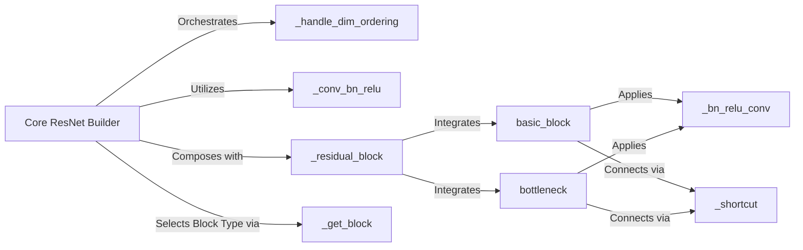

## Details

The `keras_resnet` subsystem is primarily designed around the `Core ResNet Builder` component, which acts as a central factory for generating various ResNet architectures. This component leverages a set of helper functions to construct the network layer by layer. The `ResnetBuilder.build` method orchestrates the entire process, taking high-level parameters such as input shape, number of outputs, the type of residual block (`basic_block` or `bottleneck`), and the repetition counts for these blocks. The construction flow begins with `_handle_dim_ordering` to ensure correct tensor dimension handling based on the Keras backend. Initial convolutional and pooling layers are then added using `_conv_bn_relu`. The core of the ResNet, the residual blocks, are iteratively built by `_residual_block`, which in turn utilizes either `basic_block` or `bottleneck` functions. These block functions incorporate `_bn_relu_conv` for batch normalization, ReLU activation, and convolution, and `_shortcut` for creating the skip connections essential to ResNet architecture. Finally, a classifier block with average pooling, flattening, and a dense softmax layer is appended to complete the model. This modular design allows for flexible and configurable generation of ResNet models, adhering to the "Model Builders/Factories" pattern and facilitating a clear "Flow of Model Construction".

### Core ResNet Builder [[Expand]](./Core_ResNet_Builder.md)
This component is the central orchestrator for constructing the entire ResNet model. It encapsulates the complex process of assembling various layers and blocks into a complete network. Following the Builder Pattern, `ResnetBuilder.build` takes high-level configuration parameters (input shape, number of outputs, block type, repetition counts) and systematically coordinates the integration of initial convolutional layers, pooling, residual blocks, and the final classification head. Its role is crucial for enabling the Configuration and Customization of different ResNet variants, a key aspect of an ML Toolkit/Library. This component exemplifies the "Model Builders/Factories" expected component type. Its design promotes modularity and reusability by abstracting the model construction logic, allowing users to easily generate diverse ResNet architectures without delving into the intricate details of layer-by-layer assembly. This aligns with the "Flow of Model Construction" architectural bias, providing a clear and configurable pathway for model generation.

**Related Classes/Methods**:

- <a href="https://github.com/raghakot/keras-resnet/blob/master/resnet.py" target="_blank" rel="noopener noreferrer">`keras_resnet.resnet.ResnetBuilder:build`</a>
- <a href="https://github.com/raghakot/keras-resnet/blob/master/resnet.py" target="_blank" rel="noopener noreferrer">`keras_resnet.resnet._conv_bn_relu`</a>
- <a href="https://github.com/raghakot/keras-resnet/blob/master/resnet.py" target="_blank" rel="noopener noreferrer">`keras_resnet.resnet._get_block`</a>
- <a href="https://github.com/raghakot/keras-resnet/blob/master/resnet.py" target="_blank" rel="noopener noreferrer">`keras_resnet.resnet._residual_block`</a>
- <a href="https://github.com/raghakot/keras-resnet/blob/master/resnet.py" target="_blank" rel="noopener noreferrer">`keras_resnet.resnet._handle_dim_ordering`</a>

### _handle_dim_ordering
Handles tensor dimension ordering based on Keras backend.

**Related Classes/Methods**:

- <a href="https://github.com/raghakot/keras-resnet/blob/master/resnet.py" target="_blank" rel="noopener noreferrer">`keras_resnet.resnet._handle_dim_ordering`</a>

### _conv_bn_relu
Adds initial convolutional and pooling layers with batch normalization and ReLU activation.

**Related Classes/Methods**:

- <a href="https://github.com/raghakot/keras-resnet/blob/master/resnet.py" target="_blank" rel="noopener noreferrer">`keras_resnet.resnet._conv_bn_relu`</a>

### _residual_block
Constructs iterative residual blocks for the ResNet.

**Related Classes/Methods**:

- <a href="https://github.com/raghakot/keras-resnet/blob/master/resnet.py" target="_blank" rel="noopener noreferrer">`keras_resnet.resnet._residual_block`</a>

### _get_block
Dynamically selects the appropriate residual block type (basic or bottleneck).

**Related Classes/Methods**:

- <a href="https://github.com/raghakot/keras-resnet/blob/master/resnet.py" target="_blank" rel="noopener noreferrer">`keras_resnet.resnet._get_block`</a>

### basic_block
Implements the basic residual unit.

**Related Classes/Methods**:

- <a href="https://github.com/raghakot/keras-resnet/blob/master/resnet.py" target="_blank" rel="noopener noreferrer">`keras_resnet.resnet.basic_block`</a>

### bottleneck
Implements the bottleneck residual unit.

**Related Classes/Methods**:

- <a href="https://github.com/raghakot/keras-resnet/blob/master/resnet.py" target="_blank" rel="noopener noreferrer">`keras_resnet.resnet.bottleneck`</a>

### _bn_relu_conv
Performs batch normalization, ReLU activation, and convolution.

**Related Classes/Methods**:

- <a href="https://github.com/raghakot/keras-resnet/blob/master/resnet.py" target="_blank" rel="noopener noreferrer">`keras_resnet.resnet._bn_relu_conv`</a>

### _shortcut
Creates skip connections for residual blocks.

**Related Classes/Methods**:

- <a href="https://github.com/raghakot/keras-resnet/blob/master/resnet.py" target="_blank" rel="noopener noreferrer">`keras_resnet.resnet._shortcut`</a>

### [FAQ](https://github.com/CodeBoarding/GeneratedOnBoardings/tree/main?tab=readme-ov-file#faq)