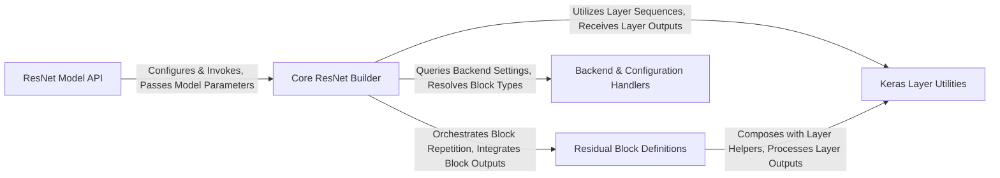

## Details

The keras-resnet architecture is designed for modular and flexible ResNet model construction. The ResNet Model API serves as the initial entry point, allowing users to select and configure specific ResNet variants. This API then directs the flow to the Core ResNet Builder, which is the central component responsible for orchestrating the entire model assembly process. The Core ResNet Builder dynamically integrates various Residual Block Definitions (basic or bottleneck) to form the network's core, while extensively utilizing Keras Layer Utilities for common layer patterns and shortcut connections. Additionally, the Backend & Configuration Handlers component provides essential support by managing Keras backend specifics and resolving the correct block implementations, ensuring the generated models are compatible and correctly structured across different environments. This clear separation of concerns facilitates a straightforward data and control flow, making the architecture easy to understand, extend, and visualize.

### ResNet Model API
Provides high-level, user-facing functions to construct specific ResNet architectures (e.g., ResNet-18, ResNet-50). These functions act as a facade, encapsulating the configuration details for each standard model variant and delegating the actual building process.

**Related Classes/Methods**:

- <a href="https://github.com/raghakot/keras-resnet/blob/master/resnet.py" target="_blank" rel="noopener noreferrer">`ResnetBuilder:build_resnet_18`</a>
- <a href="https://github.com/raghakot/keras-resnet/blob/master/resnet.py" target="_blank" rel="noopener noreferrer">`ResnetBuilder:build_resnet_34`</a>
- <a href="https://github.com/raghakot/keras-resnet/blob/master/resnet.py" target="_blank" rel="noopener noreferrer">`ResnetBuilder:build_resnet_50`</a>
- <a href="https://github.com/raghakot/keras-resnet/blob/master/resnet.py" target="_blank" rel="noopener noreferrer">`ResnetBuilder:build_resnet_101`</a>
- <a href="https://github.com/raghakot/keras-resnet/blob/master/resnet.py" target="_blank" rel="noopener noreferrer">`ResnetBuilder:build_resnet_152`</a>

### Core ResNet Builder [[Expand]](./Core_ResNet_Builder.md)
The central orchestrator responsible for assembling the entire ResNet model. It takes input shape, number of outputs, the specific block function (basic or bottleneck), and repetition counts, then constructs the network layer by layer, integrating initial convolutional layers, pooling, residual blocks, and the final classification head.

**Related Classes/Methods**:

- <a href="https://github.com/raghakot/keras-resnet/blob/master/resnet.py" target="_blank" rel="noopener noreferrer">`ResnetBuilder:build`</a>

### Residual Block Definitions
Encapsulates the fundamental logic for different types of residual blocks (basic and bottleneck) and manages their repetition within a specific stage of the ResNet.

**Related Classes/Methods**:

- <a href="https://github.com/raghakot/keras-resnet/blob/master/resnet.py#L95-L107" target="_blank" rel="noopener noreferrer">`_residual_block`:95-107</a>
- <a href="https://github.com/raghakot/keras-resnet/blob/master/resnet.py#L110-L130" target="_blank" rel="noopener noreferrer">`basic_block`:110-130</a>
- <a href="https://github.com/raghakot/keras-resnet/blob/master/resnet.py#L133-L157" target="_blank" rel="noopener noreferrer">`bottleneck`:133-157</a>

### Keras Layer Utilities
A collection of utility functions that encapsulate common Keras layer sequences and the logic for creating shortcut connections. These functions promote code reusability and maintain consistency in layer application.

**Related Classes/Methods**:

- <a href="https://github.com/raghakot/keras-resnet/blob/master/resnet.py#L22-L26" target="_blank" rel="noopener noreferrer">`_bn_relu`:22-26</a>
- <a href="https://github.com/raghakot/keras-resnet/blob/master/resnet.py#L29-L46" target="_blank" rel="noopener noreferrer">`_conv_bn_relu`:29-46</a>
- <a href="https://github.com/raghakot/keras-resnet/blob/master/resnet.py#L49-L67" target="_blank" rel="noopener noreferrer">`_bn_relu_conv`:49-67</a>
- <a href="https://github.com/raghakot/keras-resnet/blob/master/resnet.py#L70-L92" target="_blank" rel="noopener noreferrer">`_shortcut`:70-92</a>

### Backend & Configuration Handlers
Handles Keras backend-specific configurations, particularly for image dimension ordering (TensorFlow vs. Theano), and provides a utility to resolve block function names dynamically.

**Related Classes/Methods**:

- <a href="https://github.com/raghakot/keras-resnet/blob/master/resnet.py#L160-L171" target="_blank" rel="noopener noreferrer">`_handle_dim_ordering`:160-171</a>
- <a href="https://github.com/raghakot/keras-resnet/blob/master/resnet.py#L174-L180" target="_blank" rel="noopener noreferrer">`_get_block`:174-180</a>

### [FAQ](https://github.com/CodeBoarding/GeneratedOnBoardings/tree/main?tab=readme-ov-file#faq)