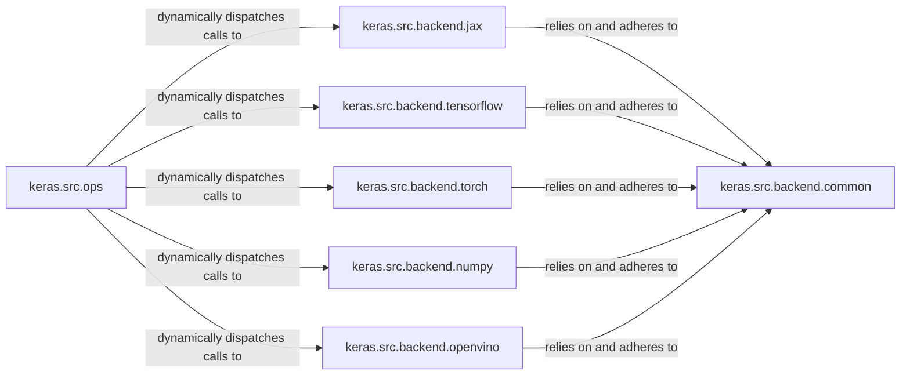

## Details

The "Backend Abstraction & Operations" subsystem in Keras 3 is designed to provide a unified, backend-agnostic API for fundamental tensor operations and computational primitives. It acts as the core translation layer, enabling Keras to run seamlessly across various deep learning frameworks.

### keras.src.backend.common
This foundational component defines the interfaces, shared utilities, and global state management (e.g., current backend, data types, Keras variable handling) that all specific backend implementations must adhere to. It establishes the contract for backend consistency.

**Related Classes/Methods**:

- <a href="https://github.com/keras-team/keras/blob/master/keras/src/backend/common" target="_blank" rel="noopener noreferrer">`keras.src.backend.common`</a>

### keras.src.backend.jax
Provides the concrete, low-level implementations of tensor operations and computational primitives specifically for the JAX deep learning framework. It handles JAX-specific tensor conversion, device management, and optimizations.

**Related Classes/Methods**:

- <a href="https://github.com/keras-team/keras/blob/master/keras/src/backend/jax" target="_blank" rel="noopener noreferrer">`keras.src.backend.jax`</a>

### keras.src.backend.tensorflow
Provides the concrete, low-level implementations of tensor operations and computational primitives specifically for the TensorFlow deep learning framework. It handles TensorFlow-specific tensor conversion, device management, and optimizations.

**Related Classes/Methods**:

- <a href="https://github.com/keras-team/keras/blob/master/keras/src/backend/tensorflow" target="_blank" rel="noopener noreferrer">`keras.src.backend.tensorflow`</a>

### keras.src.backend.torch
Provides the concrete, low-level implementations of tensor operations and computational primitives specifically for the PyTorch deep learning framework. It handles PyTorch-specific tensor conversion, device management, and optimizations.

**Related Classes/Methods**:

- <a href="https://github.com/keras-team/keras/blob/master/keras/src/backend/torch" target="_blank" rel="noopener noreferrer">`keras.src.backend.torch`</a>

### keras.src.backend.numpy
Provides concrete, low-level implementations of tensor operations and computational primitives using NumPy. This backend is primarily for CPU-based operations and serves as a lightweight, general-purpose option.

**Related Classes/Methods**:

- <a href="https://github.com/keras-team/keras/blob/master/keras/src/backend/numpy" target="_blank" rel="noopener noreferrer">`keras.src.backend.numpy`</a>

### keras.src.backend.openvino
Provides concrete, low-level implementations of tensor operations and computational primitives specifically for the OpenVINO inference engine. It handles OpenVINO-specific tensor conversion and device management, primarily for optimized inference.

**Related Classes/Methods**:

- <a href="https://github.com/keras-team/keras/blob/master/keras/src/backend/openvino" target="_blank" rel="noopener noreferrer">`keras.src.backend.openvino`</a>

### keras.src.ops
This component provides the high-level, backend-agnostic API that Keras users interact with for various tensor operations (e.g., mathematical operations, neural network layers, NumPy-like functions). Its primary role is to dynamically dispatch these high-level calls to the currently active backend implementation. It acts as the "translation layer" between the Keras API and the specific backend.

**Related Classes/Methods**:

- <a href="https://github.com/keras-team/keras/blob/master/keras/src/ops" target="_blank" rel="noopener noreferrer">`keras.src.ops`</a>

### [FAQ](https://github.com/CodeBoarding/GeneratedOnBoardings/tree/main?tab=readme-ov-file#faq)