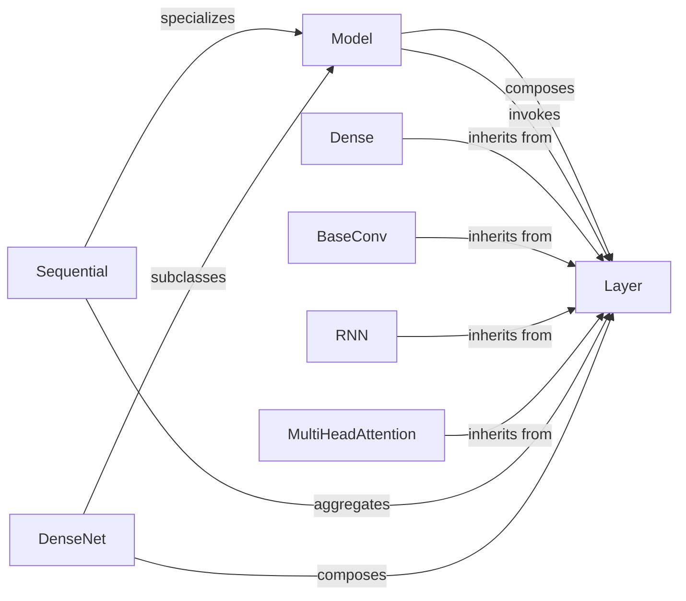

## Details

The Keras library's core architecture is built around the Model and Layer abstractions. The Model serves as the top-level container for neural networks, orchestrating the flow of data through various Layer components. Sequential models offer a simplified, linear stacking of Layer instances, while more complex, pre-built architectures like DenseNet subclass Model to encapsulate sophisticated network structures. Individual Layer implementations, such as Dense (fully connected), BaseConv (convolutional), RNN (recurrent), and MultiHeadAttention (attention mechanism), inherit from the base Layer class, providing specialized computational units. The Model composes and invokes these Layer instances to perform forward passes, training, and evaluation. Sequential models aggregate Layer instances in a defined order, and DenseNet (and similar application models) also compose various Layer types to form their specific architectures. This hierarchical structure allows for flexible and modular construction of neural networks.

### Model
The core abstraction for defining a neural network. It acts as a container for layers, manages the model's graph, and provides methods for training, evaluation, and prediction.

**Related Classes/Methods**:

- <a href="https://github.com/keras-team/keras/blob/master/keras/src/models/model.py#L34-L862" target="_blank" rel="noopener noreferrer">`keras.src.models.model.Model`:34-862</a>

### Layer
The base class for all neural network layers. It defines the fundamental interface for a computational unit, including weight management, input/output shape handling, and the call method for forward pass computation.

**Related Classes/Methods**: _None_

### Sequential
A specialized Model that allows for building neural networks by stacking layers linearly. It simplifies model definition for many common architectures.

**Related Classes/Methods**:

- <a href="https://github.com/keras-team/keras/blob/master/keras/src/models/sequential.py#L19-L383" target="_blank" rel="noopener noreferrer">`keras.src.models.sequential.Sequential`:19-383</a>

### Dense
Implements a fully connected (dense) neural network layer, performing a linear transformation followed by an activation function.

**Related Classes/Methods**:

- <a href="https://github.com/keras-team/keras/blob/master/keras/src/layers/core/dense.py#L15-L290" target="_blank" rel="noopener noreferrer">`keras.src.layers.core.Dense`:15-290</a>

### BaseConv
Provides the base functionality for convolutional layers, which are fundamental for processing grid-like data such as images.

**Related Classes/Methods**:

- <a href="https://github.com/keras-team/keras/blob/master/keras/src/layers/convolutional/base_conv.py#L16-L275" target="_blank" rel="noopener noreferrer">`keras.src.layers.convolutional.BaseConv`:16-275</a>

### RNN
Provides the base functionality for recurrent neural network layers, designed for sequential data processing.

**Related Classes/Methods**:

- <a href="https://github.com/keras-team/keras/blob/master/keras/src/layers/rnn/rnn.py#L13-L267" target="_blank" rel="noopener noreferrer">`keras.src.layers.rnn.RNN`:13-267</a>

### MultiHeadAttention
Implements the multi-head attention mechanism, a key component in Transformer architectures.

**Related Classes/Methods**:

- <a href="https://github.com/keras-team/keras/blob/master/keras/src/layers/attention/multi_head_attention.py#L19-L299" target="_blank" rel="noopener noreferrer">`keras.src.layers.attention.MultiHeadAttention`:19-299</a>

### DenseNet
Represents a pre-built, complex neural network architecture (e.g., DenseNet, ResNet, VGG) often used for specific tasks like image classification. These are typically subclasses of Model.

**Related Classes/Methods**:

- <a href="https://github.com/keras-team/keras/blob/master/keras/src/applications/densenet.py#L107-L322" target="_blank" rel="noopener noreferrer">`keras.src.applications.densenet.DenseNet`:107-322</a>

### [FAQ](https://github.com/CodeBoarding/GeneratedOnBoardings/tree/main?tab=readme-ov-file#faq)