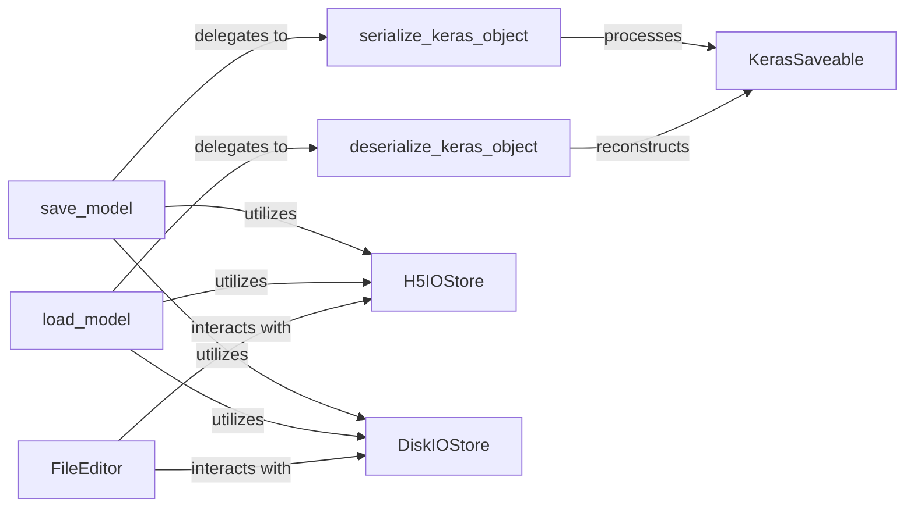

## Details

The Keras saving and loading subsystem provides a robust mechanism for model persistence, centered around the `save_model` and `load_model` high-level APIs. These functions orchestrate the serialization and deserialization processes by delegating to `serialize_keras_object` and `deserialize_keras_object`, which handle the conversion of Keras objects to and from a serializable format. The `KerasSaveable` abstract base class defines the common interface for all Keras objects capable of being saved. For actual data storage, the system employs `H5IOStore` for numerical data (like weights) and `DiskIOStore` for general assets and the native Keras format, abstracting the underlying file system interactions. An additional `FileEditor` component allows for direct, low-level manipulation of saved model files, leveraging the capabilities of both `H5IOStore` and `DiskIOStore`. This modular design ensures flexibility in handling various model components and storage formats.

### save_model
Provides the high-level API for saving a complete Keras model (architecture, weights, optimizer state). It orchestrates the entire persistence process, acting as the primary user-facing function for saving.

**Related Classes/Methods**:

- <a href="https://github.com/keras-team/keras/blob/master/keras/src/legacy/saving/serialization.py#L265-L328" target="_blank" rel="noopener noreferrer">`keras.src.legacy.saving.serialization.serialize_keras_object`:265-328</a>
- <a href="https://github.com/keras-team/keras/blob/master/keras/src/saving/saving_lib.py#L987-L1178" target="_blank" rel="noopener noreferrer">`keras.src.saving.saving_lib.H5IOStore`:987-1178</a>
- <a href="https://github.com/keras-team/keras/blob/master/keras/src/saving/saving_lib.py#L928-L984" target="_blank" rel="noopener noreferrer">`keras.src.saving.saving_lib.DiskIOStore`:928-984</a>

### load_model
Provides the high-level API for loading a complete Keras model from a persistent format. It orchestrates the reconstruction process, serving as the main entry point for model deployment or resuming training.

**Related Classes/Methods**:

- <a href="https://github.com/keras-team/keras/blob/master/keras/src/legacy/saving/serialization.py#L409-L555" target="_blank" rel="noopener noreferrer">`keras.src.legacy.saving.serialization.deserialize_keras_object`:409-555</a>
- <a href="https://github.com/keras-team/keras/blob/master/keras/src/saving/saving_lib.py#L987-L1178" target="_blank" rel="noopener noreferrer">`keras.src.saving.saving_lib.H5IOStore`:987-1178</a>
- <a href="https://github.com/keras-team/keras/blob/master/keras/src/saving/saving_lib.py#L928-L984" target="_blank" rel="noopener noreferrer">`keras.src.saving.saving_lib.DiskIOStore`:928-984</a>

### serialize_keras_object
Converts individual Keras objects (e.g., layers, optimizers, custom objects) into a serializable configuration (e.g., JSON-compatible dictionary). This is the core, format-agnostic serialization logic.

**Related Classes/Methods**:

- <a href="https://github.com/keras-team/keras/blob/master/keras/src/saving/keras_saveable.py#L4-L38" target="_blank" rel="noopener noreferrer">`keras.src.saving.keras_saveable.KerasSaveable`:4-38</a>

### deserialize_keras_object
Reconstructs Keras objects from their serialized configuration, instantiating them back into Python objects. This is the core, format-agnostic deserialization logic.

**Related Classes/Methods**:

- <a href="https://github.com/keras-team/keras/blob/master/keras/src/saving/keras_saveable.py#L4-L38" target="_blank" rel="noopener noreferrer">`keras.src.saving.keras_saveable.KerasSaveable`:4-38</a>

### KerasSaveable
An abstract base class that defines the contract for Keras objects that can be saved and loaded. It provides methods like `_obj_type` for type identification and `__reduce__` for custom pickling/unpickling behavior, ensuring consistent persistence across various Keras components.

**Related Classes/Methods**:

- <a href="https://github.com/keras-team/keras/blob/master/keras/src/saving/keras_saveable.py#L4-L38" target="_blank" rel="noopener noreferrer">`keras.src.saving.keras_saveable.KerasSaveable`:4-38</a>

### H5IOStore
Handles the low-level I/O operations specifically for the HDF5 file format. It manages the creation, retrieval, and closing of HDF5 files, including handling data within zip archives, making it suitable for storing numerical variables like model weights.

**Related Classes/Methods**:

- <a href="https://github.com/keras-team/keras/blob/master/keras/src/saving/saving_lib.py#L987-L1178" target="_blank" rel="noopener noreferrer">`keras.src.saving.saving_lib.H5IOStore`:987-1178</a>

### DiskIOStore
Handles low-level I/O operations for saving and loading models to/from disk directories. It manages directory creation, file retrieval, and cleanup of temporary directories, supporting the native Keras v3 format (`.keras` files) and asset storage within zip archives.

**Related Classes/Methods**:

- <a href="https://github.com/keras-team/keras/blob/master/keras/src/saving/saving_lib.py#L928-L984" target="_blank" rel="noopener noreferrer">`keras.src.saving.saving_lib.DiskIOStore`:928-984</a>

### FileEditor
Offers advanced utilities for inspecting and modifying saved model files directly, without needing to load the full model into memory. This is crucial for debugging or manipulating model metadata post-saving.

**Related Classes/Methods**:

- <a href="https://github.com/keras-team/keras/blob/master/keras/src/saving/saving_lib.py#L987-L1178" target="_blank" rel="noopener noreferrer">`keras.src.saving.saving_lib.H5IOStore`:987-1178</a>
- <a href="https://github.com/keras-team/keras/blob/master/keras/src/saving/saving_lib.py#L928-L984" target="_blank" rel="noopener noreferrer">`keras.src.saving.saving_lib.DiskIOStore`:928-984</a>

### [FAQ](https://github.com/CodeBoarding/GeneratedOnBoardings/tree/main?tab=readme-ov-file#faq)