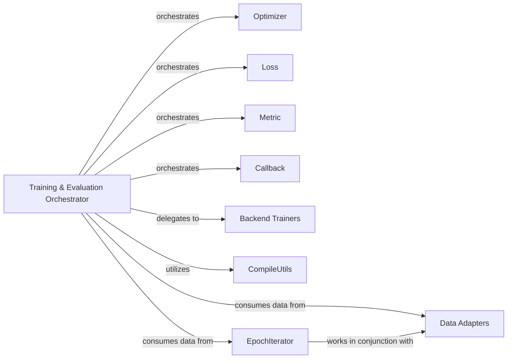

## Details

The `Training & Evaluation Orchestrator` subsystem in Keras 3 is designed to manage the entire deep learning workflow, from data preparation and model compilation to training, evaluation, and prediction. It acts as the central coordinator, integrating various specialized components to provide a high-level, backend-agnostic API for users.

### Training & Evaluation Orchestrator [[Expand]](./Training_Evaluation_Orchestrator.md)
The primary orchestrator of the deep learning workflow. It manages the entire lifecycle of training, evaluation, and prediction, including data iteration, loss computation, gradient application, metric updates, and callback invocation. It provides high-level methods (`fit`, `evaluate`, `predict`) that abstract away the complexities of the underlying deep learning backends.

**Related Classes/Methods**:

- <a href="https://github.com/keras-team/keras/blob/master/keras/src/trainers/trainer.py" target="_blank" rel="noopener noreferrer">`keras.src.trainers.trainer`</a>

### Optimizer
Defines the interface and common logic for all optimization algorithms. Responsible for applying gradients to update model variables during the training process to minimize the loss function.

**Related Classes/Methods**:

- <a href="https://github.com/keras-team/keras/blob/master/keras/src/optimizers/base_optimizer.py" target="_blank" rel="noopener noreferrer">`keras.src.optimizers.base_optimizer`</a>

### Loss
Provides a base for all loss functions. These functions compute the error or discrepancy between predicted outputs from the model and the true target outputs, guiding the optimization process.

**Related Classes/Methods**:

- <a href="https://github.com/keras-team/keras/blob/master/keras/src/losses/loss.py" target="_blank" rel="noopener noreferrer">`keras.src.losses.loss`</a>

### Metric
Serves as the base for all metrics. Metrics are used to quantify the performance of a model, updating internal state during training/evaluation and computing performance values (e.g., accuracy, precision).

**Related Classes/Methods**:

- <a href="https://github.com/keras-team/keras/blob/master/keras/src/metrics/metric.py" target="_blank" rel="noopener noreferrer">`keras.src.metrics.metric`</a>

### Callback
Provides hooks for non-intrusive extension of the training loop. Callbacks allow users to inject custom logic at various stages (e.g., start/end of epoch, batch) for tasks like logging, model saving, learning rate scheduling, or early stopping.

**Related Classes/Methods**:

- <a href="https://github.com/keras-team/keras/blob/master/keras/src/callbacks/callback.py" target="_blank" rel="noopener noreferrer">`keras.src.callbacks.callback`</a>

### Backend Trainers
Provide concrete, backend-specific implementations of the core training, testing, and prediction steps. These components translate the high-level operations requested by the `Trainer` into calls compatible with the chosen deep learning backend (e.g., TensorFlow, JAX, PyTorch).

**Related Classes/Methods**:

- <a href="https://github.com/keras-team/keras/blob/master/keras/src/backend/tensorflow/trainer.py" target="_blank" rel="noopener noreferrer">`keras.src.backend.tensorflow.trainer`</a>

### CompileUtils
Handles the instantiation and configuration of `Loss`, `Metric`, and `Optimizer` objects based on user specifications during the model compilation phase. It ensures that the model is correctly set up with the necessary components before training begins.

**Related Classes/Methods**:

- <a href="https://github.com/keras-team/keras/blob/master/keras/src/trainers/compile_utils.py" target="_blank" rel="noopener noreferrer">`keras.src.trainers.compile_utils`</a>

### Data Adapters
Converts diverse input data formats (e.g., NumPy arrays, TensorFlow Datasets, PyTorch DataLoaders) into a consistent, iterable structure that the `Trainer` can consume. This component ensures data agnosticism for the training loop.

**Related Classes/Methods**:

- <a href="https://github.com/keras-team/keras/blob/master/keras/src/trainers/data_adapters/data_adapter.py" target="_blank" rel="noopener noreferrer">`keras.src.trainers.data_adapters.data_adapter`</a>

### EpochIterator
Provides batches of data for processing by the `Trainer`, managing epoch boundaries and data shuffling. It works in conjunction with `Data Adapters` to deliver data efficiently to the training loop.

**Related Classes/Methods**:

- <a href="https://github.com/keras-team/keras/blob/master/keras/src/trainers/epoch_iterator.py" target="_blank" rel="noopener noreferrer">`keras.src.trainers.epoch_iterator`</a>

### [FAQ](https://github.com/CodeBoarding/GeneratedOnBoardings/tree/main?tab=readme-ov-file#faq)