```mermaid
graph LR
    Keras_Core_API_Model_Layer_Definition_["Keras Core API (Model & Layer Definition)"]
    Backend_Abstraction_Operations["Backend Abstraction & Operations"]
    Training_Evaluation_Orchestrator["Training & Evaluation Orchestrator"]
    Data_Preprocessing_Pipeline["Data & Preprocessing Pipeline"]
    Model_Persistence_Deployment["Model Persistence & Deployment"]
    Keras_Core_API_Model_Layer_Definition_ -- "Translates Operations" --> Backend_Abstraction_Operations
    Keras_Core_API_Model_Layer_Definition_ -- "Utilizes Primitives" --> Backend_Abstraction_Operations
    Training_Evaluation_Orchestrator -- "Executes Model" --> Keras_Core_API_Model_Layer_Definition_
    Training_Evaluation_Orchestrator -- "Updates Model Weights" --> Keras_Core_API_Model_Layer_Definition_
    Data_Preprocessing_Pipeline -- "Provides Processed Data" --> Training_Evaluation_Orchestrator
    Training_Evaluation_Orchestrator -- "Delegates Computations" --> Backend_Abstraction_Operations
    Model_Persistence_Deployment -- "Persists Model State" --> Keras_Core_API_Model_Layer_Definition_
    Model_Persistence_Deployment -- "Restores Model State" --> Keras_Core_API_Model_Layer_Definition_
    Keras_Core_API_Model_Layer_Definition_ -- "Integrates Preprocessing Layers" --> Data_Preprocessing_Pipeline
    click Keras_Core_API_Model_Layer_Definition_ href "https://github.com/CodeBoarding/GeneratedOnBoardings/blob/main/keras/Keras_Core_API_Model_Layer_Definition_.md" "Details"
    click Backend_Abstraction_Operations href "https://github.com/CodeBoarding/GeneratedOnBoardings/blob/main/keras/Backend_Abstraction_Operations.md" "Details"
    click Training_Evaluation_Orchestrator href "https://github.com/CodeBoarding/GeneratedOnBoardings/blob/main/keras/Training_Evaluation_Orchestrator.md" "Details"
    click Data_Preprocessing_Pipeline href "https://github.com/CodeBoarding/GeneratedOnBoardings/blob/main/keras/Data_Preprocessing_Pipeline.md" "Details"
    click Model_Persistence_Deployment href "https://github.com/CodeBoarding/GeneratedOnBoardings/blob/main/keras/Model_Persistence_Deployment.md" "Details"
```

## Details

The Keras architecture is designed for flexibility and backend agnosticism, centered around the Keras Core API (Model & Layer Definition) where users construct neural networks. All underlying tensor operations from these models and layers are routed through the Backend Abstraction & Operations component, which translates them into calls compatible with various deep learning frameworks (e.g., TensorFlow, JAX, PyTorch). The Training & Evaluation Orchestrator drives the learning process, consuming data prepared by the Data & Preprocessing Pipeline, applying optimization strategies, and monitoring performance. This orchestrator heavily relies on the Backend Abstraction & Operations for efficient computation. Finally, the Model Persistence & Deployment component ensures that trained models can be saved and loaded, facilitating deployment and continued development. This layered approach provides a consistent high-level API while allowing for powerful, backend-specific optimizations.

### Keras Core API (Model & Layer Definition) [[Expand]](./Keras_Core_API_Model_Layer_Definition_.md)
The primary interface for users to define, build, and interact with neural network models and layers. It includes the foundational `Model` and `Layer` classes, along with a rich library of standard layers and pre-built application models.

**Related Classes/Methods**:

- <a href="https://github.com/keras-team/keras/blob/master/keras/src/models/model.py" target="_blank" rel="noopener noreferrer">`keras.src.models.model`</a>
- <a href="https://github.com/keras-team/keras/blob/master/keras/src/layers/layer.py" target="_blank" rel="noopener noreferrer">`keras.src.layers.layer`</a>
- <a href="https://github.com/keras-team/keras/blob/master/keras/src/layers/" target="_blank" rel="noopener noreferrer">`keras.src.layers`</a>
- <a href="https://github.com/keras-team/keras/blob/master/keras/src/applications/" target="_blank" rel="noopener noreferrer">`keras.src.applications`</a>

### Backend Abstraction & Operations [[Expand]](./Backend_Abstraction_Operations.md)
Provides a unified, backend-agnostic API for fundamental tensor operations and computational primitives. It translates Keras's high-level operations into specific calls for the underlying deep learning frameworks (TensorFlow, JAX, PyTorch, OpenVINO), ensuring seamless execution across different backends.

**Related Classes/Methods**:

- <a href="https://github.com/keras-team/keras/blob/master/keras/src/backend/" target="_blank" rel="noopener noreferrer">`keras.src.backend`</a>
- <a href="https://github.com/keras-team/keras/blob/master/keras/src/ops/" target="_blank" rel="noopener noreferrer">`keras.src.ops`</a>

### Training & Evaluation Orchestrator [[Expand]](./Training_Evaluation_Orchestrator.md)
Manages the entire deep learning workflow, including training, evaluation, and prediction. It orchestrates data flow, applies optimization algorithms, computes losses, updates metrics, and integrates callbacks for monitoring and control.

**Related Classes/Methods**:

- <a href="https://github.com/keras-team/keras/blob/master/keras/src/trainers/" target="_blank" rel="noopener noreferrer">`keras.src.trainers`</a>
- <a href="https://github.com/keras-team/keras/blob/master/keras/src/optimizers/" target="_blank" rel="noopener noreferrer">`keras.src.optimizers`</a>
- <a href="https://github.com/keras-team/keras/blob/master/keras/src/losses/" target="_blank" rel="noopener noreferrer">`keras.src.losses`</a>
- <a href="https://github.com/keras-team/keras/blob/master/keras/src/metrics/" target="_blank" rel="noopener noreferrer">`keras.src.metrics`</a>
- <a href="https://github.com/keras-team/keras/blob/master/keras/src/callbacks/" target="_blank" rel="noopener noreferrer">`keras.src.callbacks`</a>

### Data & Preprocessing Pipeline [[Expand]](./Data_Preprocessing_Pipeline.md)
Offers layers for data preprocessing and augmentation, which can be integrated directly into Keras models. It also includes general-purpose utilities for handling various data formats and common data-related tasks.

**Related Classes/Methods**:

- <a href="https://github.com/keras-team/keras/blob/master/keras/src/layers/preprocessing/" target="_blank" rel="noopener noreferrer">`keras.src.layers.preprocessing`</a>
- <a href="https://github.com/keras-team/keras/blob/master/keras/src/utils/" target="_blank" rel="noopener noreferrer">`keras.src.utils`</a>

### Model Persistence & Deployment [[Expand]](./Model_Persistence_Deployment.md)
Handles the serialization and deserialization of Keras models, enabling their architecture, learned weights, and optimizer states to be persistently stored and retrieved for deployment or resuming training.

**Related Classes/Methods**:

- <a href="https://github.com/keras-team/keras/blob/master/keras/src/saving/" target="_blank" rel="noopener noreferrer">`keras.src.saving`</a>

### [FAQ](https://github.com/CodeBoarding/GeneratedOnBoardings/tree/main?tab=readme-ov-file#faq)