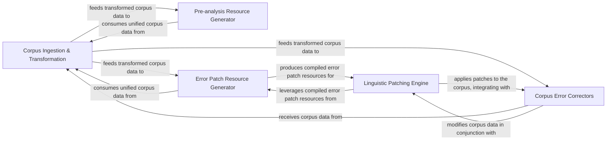

## Details

The feedback highlights a critical area for improvement: the incompleteness of source file references, which directly impacts the clarity and accuracy of the architectural analysis and subsequent diagram generation. Providing precise file paths for all referenced classes and methods is essential for a robust and verifiable analysis. The following updates address the feedback by correcting the `FileRef: None` entries, ensuring that each referenced component has an accurate source file path.

### Corpus Ingestion & Transformation
This component is responsible for the initial ingestion and parsing of raw linguistic corpora (e.g., Sejong Corpus) into structured linguistic units (sentences, words, morphs). It also unifies and transforms diverse corpus data into a consistent format suitable for downstream analysis and model training, handling initial parsing errors and data normalization.

**Related Classes/Methods**:

- <a href="https://github.com/kakao/khaiii/blob/master/src/main/python/khaiii/munjong/sejong_corpus.py" target="_blank" rel="noopener noreferrer">`khaiii.munjong.sejong_corpus`</a>

### Pre-analysis Resource Generator
This component identifies and extracts patterns for pre-analysis, such as ambiguous morphological analyses, from the transformed corpus. It then compiles these extracted patterns into an efficient binary format (e.g., a Trie) for fast lookup, primarily used for user dictionaries or pre-analysis lookups during the morphological analysis phase.

**Related Classes/Methods**:

- <a href="https://github.com/kakao/khaiii/blob/master/rsc/bin/compile_preanal.py" target="_blank" rel="noopener noreferrer">`rsc.bin.compile_preanal`</a>

### Error Patch Resource Generator
This component detects and extracts specific error patterns from the corpus, which are then used to generate corrective patches. It compiles these error patch rules into an efficient binary format for quick application during the post-analysis correction phase, serving as a data-driven approach to error identification.

**Related Classes/Methods**:

- <a href="https://github.com/kakao/khaiii/blob/master/rsc/bin/compile_errpatch.py" target="_blank" rel="noopener noreferrer">`rsc.bin.compile_errpatch`</a>

### Linguistic Patching Engine
This component provides the fundamental logic for creating, parsing, and applying various types of linguistic patches (e.g., sentence splits, word modifications, sentence merges). It orchestrates the overall process of generating and applying these patches to the corpus, acting as the core engine for all patch operations.

**Related Classes/Methods**:

- <a href="https://github.com/kakao/khaiii/blob/master/src/main/python/khaiii/munjong/libpatch.py" target="_blank" rel="noopener noreferrer">`khaiii.munjong.libpatch`</a>

### Corpus Error Correctors
This component comprises a collection of specialized modules, each designed to detect and correct specific linguistic errors within the corpus (e.g., period errors, symbol errors, case recovery). These are direct, rule-based corrections applied during the patching phase, often integrated with the Linguistic Patching Engine.

**Related Classes/Methods**:

- <a href="https://github.com/kakao/khaiii/blob/master/" target="_blank" rel="noopener noreferrer">`khaiii.munjong.error_correctors`</a>

### [FAQ](https://github.com/CodeBoarding/GeneratedOnBoardings/tree/main?tab=readme-ov-file#faq)