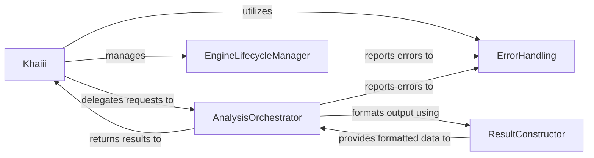

## Details

The `Khaiii` subsystem serves as the primary interface for morphological analysis, orchestrating the entire process from raw text input to structured linguistic output. The `Khaiii` component acts as the central coordinator, managing the `EngineLifecycleManager` for the underlying C++ inference engine and delegating analysis tasks to the `AnalysisOrchestrator`. The `AnalysisOrchestrator` is responsible for preparing input, invoking the core C++ engine, and then utilizing the `ResultConstructor` to transform raw engine output into user-friendly Python objects. Throughout this pipeline, the `ErrorHandling` component provides a centralized mechanism for managing and reporting operational issues, ensuring the robustness and reliability of the morphological analysis service. This clear separation of concerns facilitates maintainability and scalability, making the `Khaiii` component the user's direct interaction point while abstracting the complexities of the native inference engine.

### Khaiii
The primary user-facing component. It initializes the analyzer, accepts raw text input, and returns structured morphological analysis results. It acts as the main entry point for the inference engine, managing the overall analysis flow and the lifecycle of the underlying C++ engine.

**Related Classes/Methods**:

- <a href="https://github.com/kakao/khaiii/blob/master/train/extract_errpatch.py" target="_blank" rel="noopener noreferrer">`Khaiii`</a>

### EngineLifecycleManager
Responsible for the low-level initialization (`open`) and termination (`close`) of the native C++ inference engine. This component ensures proper resource allocation and deallocation, which is critical for the operational readiness and performance of the core morphological analysis model.

**Related Classes/Methods**:

- <a href="https://github.com/kakao/khaiii/blob/master/src/main/python/khaiii/khaiii.py" target="_blank" rel="noopener noreferrer">`EngineLifecycleManager`</a>

### AnalysisOrchestrator
Coordinates the entire analysis pipeline. It takes raw text input, prepares it for the C++ inference engine, invokes the core morphological analysis, and manages the transformation of its raw output. This component embodies the "online" processing phase.

**Related Classes/Methods**:

- <a href="https://github.com/kakao/khaiii/blob/master/src/main/python/khaiii/khaiii.py" target="_blank" rel="noopener noreferrer">`AnalysisOrchestrator`</a>

### ResultConstructor
Transforms the raw, internal output from the C++ inference engine into user-friendly, structured Python objects (`KhaiiiWord`, `KhaiiiMorph`). It makes the complex analysis results accessible and usable by external applications, acting as the final stage of the data pipeline.

**Related Classes/Methods**:

- <a href="https://github.com/kakao/khaiii/blob/master/src/main/python/khaiii/khaiii.py" target="_blank" rel="noopener noreferrer">`ResultConstructor`</a>

### ErrorHandling
Provides a consistent mechanism for handling and reporting errors that occur during the operation of the inference engine, whether originating from the underlying C++ component or the Python logic. While a cross-cutting concern, its explicit identification highlights its importance for the API's reliability.

**Related Classes/Methods**:

- <a href="https://github.com/kakao/khaiii/blob/master/src/main/python/khaiii/khaiii.py" target="_blank" rel="noopener noreferrer">`ErrorHandling`</a>

### [FAQ](https://github.com/CodeBoarding/GeneratedOnBoardings/tree/main?tab=readme-ov-file#faq)