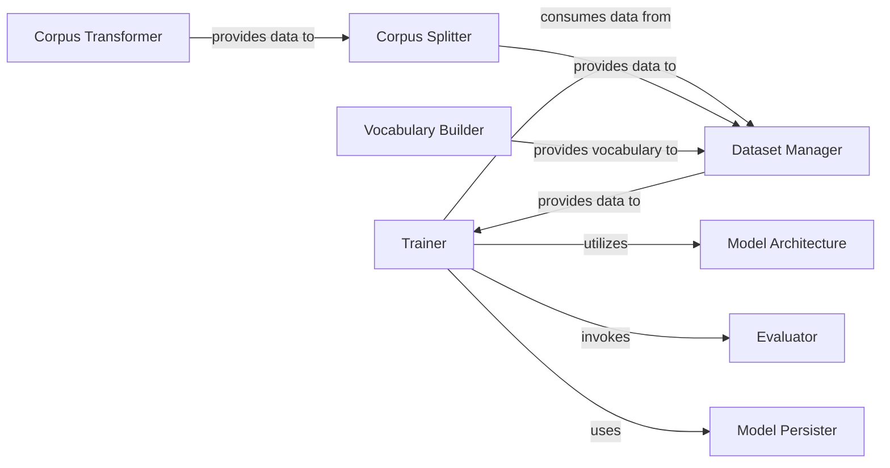

## Details

The `khaiii` training subsystem orchestrates the entire machine learning model training lifecycle. It begins with raw corpus data being processed by the `Corpus Transformer` and then divided into training, validation, and test sets by the `Corpus Splitter`. Concurrently, the `Vocabulary Builder` constructs the necessary vocabulary from the corpus. The `Dataset Manager` then prepares this processed data and vocabulary for consumption by the `Trainer`. The `Trainer` is the central component, responsible for managing the training epochs, interacting with the `Model Architecture` for forward and backward passes, and periodically invoking the `Evaluator` to assess model performance. Finally, the `Model Persister` handles saving the trained model and its configuration. This structured flow ensures efficient data preparation, robust model training, and reliable model persistence.

### Trainer
The core orchestrator of the machine learning training process. It manages training epochs, handles model state (saving/restoring checkpoints), and coordinates the flow of data and model updates.

**Related Classes/Methods**:

- <a href="https://github.com/kakao/khaiii/blob/master/src/main/python/khaiii/train/trainer.py#L1-L100" target="_blank" rel="noopener noreferrer">`src/main/python/khaiii/train/trainer.py`:1-100</a>

### Dataset Manager
Responsible for loading, preprocessing, and providing training and evaluation datasets in a format suitable for the model's input. It handles batching and data iteration.

**Related Classes/Methods**:

- <a href="https://github.com/kakao/khaiii/blob/master/src/main/python/khaiii/train/dataset.py#L1-L100" target="_blank" rel="noopener noreferrer">`src/main/python/khaiii/train/dataset.py`:1-100</a>

### Model Architecture
Defines the neural network structure, including various layers (e.g., embedding, convolutional, hidden layers) that constitute the machine learning model. It encapsulates the forward pass logic.

**Related Classes/Methods**:

- <a href="https://github.com/kakao/khaiii/blob/master/src/main/python/khaiii/train/models.py#L1-L100" target="_blank" rel="noopener noreferrer">`src/main/python/khaiii/train/models.py`:1-100</a>
- <a href="https://github.com/kakao/khaiii/blob/master/src/main/python/khaiii/train/embedder.py#L1-L100" target="_blank" rel="noopener noreferrer">`src/main/python/khaiii/train/embedder.py`:1-100</a>

### Evaluator
Assesses the performance of the trained model by calculating various metrics (e.g., word accuracy, morph accuracy) on validation or test datasets.

**Related Classes/Methods**:

- <a href="https://github.com/kakao/khaiii/blob/master/src/main/python/khaiii/train/evaluator.py#L1-L100" target="_blank" rel="noopener noreferrer">`src/main/python/khaiii/train/evaluator.py`:1-100</a>
- <a href="https://github.com/kakao/khaiii/blob/master/train/eval.py#L1-L100" target="_blank" rel="noopener noreferrer">`train/eval.py`:1-100</a>

### Model Persister
Manages the serialization and deserialization of the trained model, including its configuration, learned weights, and any other relevant metadata, enabling the model to be saved and loaded.

**Related Classes/Methods**:

- <a href="https://github.com/kakao/khaiii/blob/master/train/pickle_model.py#L1-L100" target="_blank" rel="noopener noreferrer">`train/pickle_model.py`:1-100</a>

### Corpus Transformer
Preprocesses raw corpus data, performing initial transformations such as tokenization, normalization, or format conversion, making it suitable for further processing.

**Related Classes/Methods**:

- <a href="https://github.com/kakao/khaiii/blob/master/train/transform_corpus.py#L1-L100" target="_blank" rel="noopener noreferrer">`train/transform_corpus.py`:1-100</a>

### Corpus Splitter
Divides the transformed corpus into distinct subsets for training, validation, and testing, ensuring proper evaluation and preventing data leakage.

**Related Classes/Methods**:

- <a href="https://github.com/kakao/khaiii/blob/master/train/split_corpus.py#L1-L100" target="_blank" rel="noopener noreferrer">`train/split_corpus.py`:1-100</a>

### Vocabulary Builder
Creates the vocabulary (e.g., character, morpheme, or word mappings to indices) from the corpus, which is essential for converting textual data into numerical representations for the model.

**Related Classes/Methods**:

- <a href="https://github.com/kakao/khaiii/blob/master/train/make_vocab.py#L1-L100" target="_blank" rel="noopener noreferrer">`train/make_vocab.py`:1-100</a>

### [FAQ](https://github.com/CodeBoarding/GeneratedOnBoardings/tree/main?tab=readme-ov-file#faq)