```mermaid
graph LR
    Khaiii_Core_API_Inference_Engine_["Khaiii Core API (Inference Engine)"]
    ML_Model_Training_Engine["ML Model Training Engine"]
    Corpus_Preprocessing_Patching_Munjong_["Corpus Preprocessing & Patching (Munjong)"]
    Resource_Compilation_Packaging["Resource Compilation & Packaging"]
    Runtime_Linguistic_Resources["Runtime Linguistic Resources"]
    Corpus_Preprocessing_Patching_Munjong_ -- "Provides Training Data & Features" --> ML_Model_Training_Engine
    Corpus_Preprocessing_Patching_Munjong_ -- "Generates Raw Linguistic Assets" --> Resource_Compilation_Packaging
    ML_Model_Training_Engine -- "Outputs Trained Model & Metadata" --> Resource_Compilation_Packaging
    Resource_Compilation_Packaging -- "Supplies Optimized Resources" --> Runtime_Linguistic_Resources
    Runtime_Linguistic_Resources -- "Provides Linguistic Data" --> Khaiii_Core_API_Inference_Engine_
    Khaiii_Core_API_Inference_Engine_ -- "Utilizes Linguistic Data" --> Runtime_Linguistic_Resources
    click Khaiii_Core_API_Inference_Engine_ href "https://github.com/CodeBoarding/GeneratedOnBoardings/blob/main/khaiii/Khaiii_Core_API_Inference_Engine_.md" "Details"
    click ML_Model_Training_Engine href "https://github.com/CodeBoarding/GeneratedOnBoardings/blob/main/khaiii/ML_Model_Training_Engine.md" "Details"
    click Corpus_Preprocessing_Patching_Munjong_ href "https://github.com/CodeBoarding/GeneratedOnBoardings/blob/main/khaiii/Corpus_Preprocessing_Patching_Munjong_.md" "Details"
```

## Details

The Khaiii project is structured around a clear data flow pipeline, moving from raw linguistic data to a deployable inference engine. This architecture ensures a clear separation of concerns between data preparation, model training, resource compilation, and runtime inference, facilitating maintainability and scalability. The data flow is primarily unidirectional, moving from raw data to processed resources and finally to the operational inference engine.

### Khaiii Core API (Inference Engine) [[Expand]](./Khaiii_Core_API_Inference_Engine_.md)
The primary user-facing component responsible for initializing the analyzer, accepting text input, and returning structured morphological analysis results. It orchestrates the inference pipeline, leveraging compiled linguistic resources. This component represents the "online" or "runtime" phase of the system.

**Related Classes/Methods**:

- <a href="https://github.com/kakao/khaiii/blob/master/src/main/python/khaiii/khaiii.py" target="_blank" rel="noopener noreferrer">`src/main/python/khaiii/khaiii.py`</a>

### ML Model Training Engine [[Expand]](./ML_Model_Training_Engine.md)
Manages the entire lifecycle of the machine learning model. This includes defining the model architecture, preparing datasets, executing the training process, and evaluating model performance. This component is central to the data-driven nature of Khaiii and represents the "offline" or "training" phase.

**Related Classes/Methods**:

- <a href="https://github.com/kakao/khaiii/blob/master/src/main/python/khaiii/train/trainer.py" target="_blank" rel="noopener noreferrer">`src/main/python/khaiii/train/trainer.py`</a>
- <a href="https://github.com/kakao/khaiii/blob/master/train/eval.py" target="_blank" rel="noopener noreferrer">`src/main/python/khaiii/train/eval.py`</a>
- <a href="https://github.com/kakao/khaiii/blob/master/train/pickle_model.py" target="_blank" rel="noopener noreferrer">`src/main/python/khaiii/train/pickle_model.py`</a>

### Corpus Preprocessing & Patching (Munjong) [[Expand]](./Corpus_Preprocessing_Patching_Munjong_.md)
Handles the ingestion, parsing, and transformation of raw linguistic corpora (e.g., Sejong Corpus) into a format suitable for model training. It also includes modules for detecting and correcting common linguistic errors and generating rule-based patches (misanalysis patcher, user dictionary pre-analysis). This component acts as a crucial data preparation and augmentation layer.

**Related Classes/Methods**:

- <a href="https://github.com/kakao/khaiii/blob/master/src/main/python/khaiii/munjong/sejong_corpus.py" target="_blank" rel="noopener noreferrer">`src/main/python/khaiii/munjong/sejong_corpus.py`</a>
- <a href="https://github.com/kakao/khaiii/blob/master/src/main/python/khaiii/munjong/libpatch.py" target="_blank" rel="noopener noreferrer">`src/main/python/khaiii/munjong/libpatch.py`</a>
- <a href="https://github.com/kakao/khaiii/blob/master/train/transform_corpus.py" target="_blank" rel="noopener noreferrer">`src/main/python/khaiii/train/transform_corpus.py`</a>
- <a href="https://github.com/kakao/khaiii/blob/master/train/extract_preanal.py" target="_blank" rel="noopener noreferrer">`src/main/python/khaiii/train/extract_preanal.py`</a>
- <a href="https://github.com/kakao/khaiii/blob/master/train/extract_errpatch.py" target="_blank" rel="noopener noreferrer">`src/main/python/khaiii/train/extract_errpatch.py`</a>

### Resource Compilation & Packaging
Responsible for taking the outputs from the training and preprocessing phases (trained models, dictionaries, patches) and compiling them into optimized, binary formats. These compiled resources are then efficiently loaded and utilized by the Khaiii Core API during inference. This component bridges the gap between the offline training/preparation and online inference.

**Related Classes/Methods**:

- <a href="https://github.com/kakao/khaiii/blob/master/rsc/bin/compile_model.py" target="_blank" rel="noopener noreferrer">`rsc/bin/compile_model.py`</a>
- <a href="https://github.com/kakao/khaiii/blob/master/rsc/bin/compile_errpatch.py" target="_blank" rel="noopener noreferrer">`rsc/bin/compile_errpatch.py`</a>
- <a href="https://github.com/kakao/khaiii/blob/master/rsc/bin/compile_preanal.py" target="_blank" rel="noopener noreferrer">`rsc/bin/compile_preanal.py`</a>
- <a href="https://github.com/kakao/khaiii/blob/master/rsc/bin/compile_restore.py" target="_blank" rel="noopener noreferrer">`rsc/bin/compile_restore.py`</a>

### Runtime Linguistic Resources
Provides essential linguistic data structures and utility functions that the Khaiii Core API utilizes during the morphological analysis process. This includes vocabularies, Trie-based dictionaries for efficient lookups, character alignment logic, and morpheme definitions. These are the static data assets loaded at runtime.

**Related Classes/Methods**:

- <a href="https://github.com/kakao/khaiii/blob/master/src/main/python/khaiii/resource/char_align.py" target="_blank" rel="noopener noreferrer">`src/main/python/khaiii/resource/char_align.py`</a>
- <a href="https://github.com/kakao/khaiii/blob/master/src/main/python/khaiii/resource/jaso.py" target="_blank" rel="noopener noreferrer">`src/main/python/khaiii/resource/jaso.py`</a>
- <a href="https://github.com/kakao/khaiii/blob/master/src/main/python/khaiii/resource/morphs.py" target="_blank" rel="noopener noreferrer">`src/main/python/khaiii/resource/morphs.py`</a>
- <a href="https://github.com/kakao/khaiii/blob/master/src/main/python/khaiii/resource/resource.py" target="_blank" rel="noopener noreferrer">`src/main/python/khaiii/resource/resource.py`</a>
- <a href="https://github.com/kakao/khaiii/blob/master/src/main/python/khaiii/resource/trie.py" target="_blank" rel="noopener noreferrer">`src/main/python/khaiii/resource/trie.py`</a>
- <a href="https://github.com/kakao/khaiii/blob/master/src/main/python/khaiii/resource/vocabulary.py" target="_blank" rel="noopener noreferrer">`src/main/python/khaiii/resource/vocabulary.py`</a>

### [FAQ](https://github.com/CodeBoarding/GeneratedOnBoardings/tree/main?tab=readme-ov-file#faq)