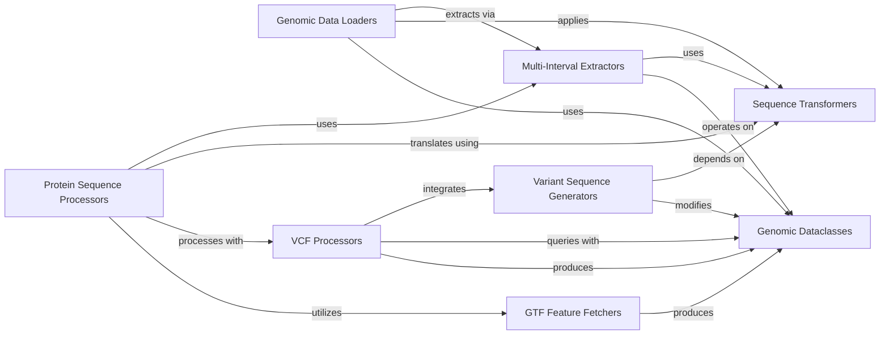

## Component Details

The `kipoiseq` library provides a comprehensive framework for handling genomic data, focusing on sequence manipulation and variant analysis. It defines core genomic data structures, offers various data loaders for different genomic data types (intervals, BED, GTF, splicing, protein), and includes robust components for sequence transformations, multi-interval extraction, VCF processing, GTF feature fetching, variant sequence generation, and protein sequence processing. The system's main flow involves loading genomic data, transforming sequences, extracting relevant regions, and integrating variant information to generate processed sequences for downstream analysis, particularly in machine learning applications.

### Genomic Dataclasses
This component defines fundamental data structures for representing genomic entities such as Variants and Intervals. These classes provide a standardized way to store and manipulate genomic coordinates and variant information, serving as basic building blocks for other components in the library.

**Related Classes/Methods**:

- <a href="https://github.com/kipoi/kipoiseq/blob/master/kipoiseq/dataclasses.py#L17-L149" target="_blank" rel="noopener noreferrer">`kipoiseq.kipoiseq.dataclasses.Variant` (17:149)</a>
- <a href="https://github.com/kipoi/kipoiseq/blob/master/kipoiseq/dataclasses.py#L152-L374" target="_blank" rel="noopener noreferrer">`kipoiseq.kipoiseq.dataclasses.Interval` (152:374)</a>

### Sequence Transformers
This component encompasses functions and classes responsible for various sequence transformations. This includes operations like one-hot encoding DNA/RNA sequences, resizing genomic intervals, padding, trimming, and reverse complementing sequences, which are crucial for preparing data for machine learning models.

**Related Classes/Methods**:

- <a href="https://github.com/kipoi/kipoiseq/blob/master/kipoiseq/transforms/transforms.py#L127-L225" target="_blank" rel="noopener noreferrer">`kipoiseq.kipoiseq.transforms.transforms.ReorderedOneHot` (127:225)</a>
- <a href="https://github.com/kipoi/kipoiseq/blob/master/kipoiseq/transforms/transforms.py#L91-L124" target="_blank" rel="noopener noreferrer">`kipoiseq.kipoiseq.transforms.transforms.OneHot` (91:124)</a>
- <a href="https://github.com/kipoi/kipoiseq/blob/master/kipoiseq/transforms/transforms.py#L77-L86" target="_blank" rel="noopener noreferrer">`kipoiseq.kipoiseq.transforms.transforms.ResizeInterval` (77:86)</a>
- <a href="https://github.com/kipoi/kipoiseq/blob/master/kipoiseq/transforms/functional.py#L26-L32" target="_blank" rel="noopener noreferrer">`kipoiseq.kipoiseq.transforms.functional.one_hot2string` (26:32)</a>
- <a href="https://github.com/kipoi/kipoiseq/blob/master/kipoiseq/transforms/functional.py#L72-L96" target="_blank" rel="noopener noreferrer">`kipoiseq.kipoiseq.transforms.functional.tokenize` (72:96)</a>
- <a href="https://github.com/kipoi/kipoiseq/blob/master/kipoiseq/transforms/functional.py#L112-L115" target="_blank" rel="noopener noreferrer">`kipoiseq.kipoiseq.transforms.functional.one_hot` (112:115)</a>
- <a href="https://github.com/kipoi/kipoiseq/blob/master/kipoiseq/transforms/functional.py#L118-L133" target="_blank" rel="noopener noreferrer">`kipoiseq.kipoiseq.transforms.functional.one_hot_dna` (118:133)</a>
- <a href="https://github.com/kipoi/kipoiseq/blob/master/kipoiseq/transforms/functional.py#L177-L230" target="_blank" rel="noopener noreferrer">`kipoiseq.kipoiseq.transforms.functional.fixed_len` (177:230)</a>
- <a href="https://github.com/kipoi/kipoiseq/blob/master/kipoiseq/transforms/functional.py#L35-L51" target="_blank" rel="noopener noreferrer">`kipoiseq.kipoiseq.transforms.functional.rc_dna` (35:51)</a>
- <a href="https://github.com/kipoi/kipoiseq/blob/master/kipoiseq/transforms/functional.py#L300-L322" target="_blank" rel="noopener noreferrer">`kipoiseq.kipoiseq.transforms.functional.translate` (300:322)</a>

### Genomic Data Loaders
This component provides various data loaders for handling genomic sequences based on intervals, BED files, and GTF annotations, supporting both string and one-hot encoded sequence outputs, including specialized loaders for splicing and protein data.

**Related Classes/Methods**:

- <a href="https://github.com/kipoi/kipoiseq/blob/master/kipoiseq/dataloaders/sequence.py#L268-L384" target="_blank" rel="noopener noreferrer">`kipoiseq.kipoiseq.dataloaders.sequence.SeqIntervalDl` (268:384)</a>
- <a href="https://github.com/kipoi/kipoiseq/blob/master/kipoiseq/dataloaders/sequence.py#L135-L261" target="_blank" rel="noopener noreferrer">`kipoiseq.kipoiseq.dataloaders.sequence.StringSeqIntervalDl` (135:261)</a>
- <a href="https://github.com/kipoi/kipoiseq/blob/master/kipoiseq/dataloaders/sequence.py#L26-L131" target="_blank" rel="noopener noreferrer">`kipoiseq.kipoiseq.dataloaders.sequence.BedDataset` (26:131)</a>
- <a href="https://github.com/kipoi/kipoiseq/blob/master/kipoiseq/dataloaders/splicing.py#L182-L276" target="_blank" rel="noopener noreferrer">`kipoiseq.kipoiseq.dataloaders.splicing.MMSpliceDl` (182:276)</a>
- <a href="https://github.com/kipoi/kipoiseq/blob/master/kipoiseq/dataloaders/splicing.py#L32-L129" target="_blank" rel="noopener noreferrer">`kipoiseq.kipoiseq.dataloaders.splicing.ExonInterval` (32:129)</a>
- <a href="https://github.com/kipoi/kipoiseq/blob/master/kipoiseq/dataloaders/protein.py#L30-L164" target="_blank" rel="noopener noreferrer">`kipoiseq.kipoiseq.dataloaders.protein.SingleVariantProteinDataLoader` (30:164)</a>
- <a href="https://github.com/kipoi/kipoiseq/blob/master/kipoiseq/dataloaders/protein.py#L168-L356" target="_blank" rel="noopener noreferrer">`kipoiseq.kipoiseq.dataloaders.protein.SingleVariantUTRDataLoader` (168:356)</a>

### Multi-Interval Extractors
This component offers a generic framework for extracting and concatenating sequences across multiple genomic intervals. It serves as a base for more specialized extractors, providing common functionalities for handling collections of intervals and their corresponding sequences.

**Related Classes/Methods**:

- <a href="https://github.com/kipoi/kipoiseq/blob/master/kipoiseq/extractors/multi_interval.py#L30-L83" target="_blank" rel="noopener noreferrer">`kipoiseq.kipoiseq.extractors.multi_interval.BaseMultiIntervalSeqExtractor` (30:83)</a>
- <a href="https://github.com/kipoi/kipoiseq/blob/master/kipoiseq/extractors/multi_interval.py#L129-L195" target="_blank" rel="noopener noreferrer">`kipoiseq.kipoiseq.extractors.multi_interval.GenericMultiIntervalSeqExtractor` (129:195)</a>
- <a href="https://github.com/kipoi/kipoiseq/blob/master/kipoiseq/extractors/multi_interval.py#L202-L307" target="_blank" rel="noopener noreferrer">`kipoiseq.kipoiseq.extractors.multi_interval.BaseMultiIntervalVCFSeqExtractor` (202:307)</a>

### VCF Processors
This component is dedicated to processing Variant Call Format (VCF) files. It provides functionalities for reading, querying, and filtering genomic variants, enabling the retrieval of specific variants or batches of variants based on genomic regions or sample IDs.

**Related Classes/Methods**:

- <a href="https://github.com/kipoi/kipoiseq/blob/master/kipoiseq/extractors/vcf_query.py#L113-L281" target="_blank" rel="noopener noreferrer">`kipoiseq.kipoiseq.extractors.vcf_query.VariantIntervalQueryable` (113:281)</a>
- <a href="https://github.com/kipoi/kipoiseq/blob/master/kipoiseq/extractors/vcf.py#L21-L211" target="_blank" rel="noopener noreferrer">`kipoiseq.kipoiseq.extractors.vcf.MultiSampleVCF` (21:211)</a>
- <a href="https://github.com/kipoi/kipoiseq/blob/master/kipoiseq/extractors/vcf_matching.py#L86-L110" target="_blank" rel="noopener noreferrer">`kipoiseq.kipoiseq.extractors.vcf_matching.PyrangesVariantFetcher` (86:110)</a>
- <a href="https://github.com/kipoi/kipoiseq/blob/master/kipoiseq/extractors/vcf_matching.py#L113-L196" target="_blank" rel="noopener noreferrer">`kipoiseq.kipoiseq.extractors.vcf_matching.BaseVariantMatcher` (113:196)</a>
- <a href="https://github.com/kipoi/kipoiseq/blob/master/kipoiseq/extractors/vcf_matching.py#L199-L258" target="_blank" rel="noopener noreferrer">`kipoiseq.kipoiseq.extractors.vcf_matching.SingleVariantMatcher` (199:258)</a>

### GTF Feature Fetchers
This component specializes in extracting specific genomic features, such as Coding Sequences (CDS) and Untranslated Regions (UTRs), from GTF annotation files. It provides methods to filter and retrieve intervals corresponding to these features, often used in gene and protein analysis.

**Related Classes/Methods**:

- <a href="https://github.com/kipoi/kipoiseq/blob/master/kipoiseq/extractors/gtf.py#L88-L151" target="_blank" rel="noopener noreferrer">`kipoiseq.kipoiseq.extractors.gtf.GTFMultiIntervalFetcher` (88:151)</a>
- <a href="https://github.com/kipoi/kipoiseq/blob/master/kipoiseq/extractors/gtf.py#L154-L265" target="_blank" rel="noopener noreferrer">`kipoiseq.kipoiseq.extractors.gtf.CDSFetcher` (154:265)</a>
- <a href="https://github.com/kipoi/kipoiseq/blob/master/kipoiseq/extractors/gtf.py#L268-L377" target="_blank" rel="noopener noreferrer">`kipoiseq.kipoiseq.extractors.gtf.UTRFetcher` (268:377)</a>

### Variant Sequence Generators
This component focuses on generating DNA sequences that incorporate genomic variants. It handles the complex logic of applying variants (SNVs, indels) to a reference sequence, managing overlaps, and ensuring correct sequence length and strand orientation.

**Related Classes/Methods**:

- <a href="https://github.com/kipoi/kipoiseq/blob/master/kipoiseq/extractors/vcf_seq.py#L23-L57" target="_blank" rel="noopener noreferrer">`kipoiseq.kipoiseq.extractors.vcf_seq.IntervalSeqBuilder` (23:57)</a>
- <a href="https://github.com/kipoi/kipoiseq/blob/master/kipoiseq/extractors/vcf_seq.py#L60-L303" target="_blank" rel="noopener noreferrer">`kipoiseq.kipoiseq.extractors.vcf_seq.VariantSeqExtractor` (60:303)</a>
- <a href="https://github.com/kipoi/kipoiseq/blob/master/kipoiseq/extractors/vcf_seq.py#L306-L325" target="_blank" rel="noopener noreferrer">`kipoiseq.kipoiseq.extractors.vcf_seq._BaseVCFSeqExtractor` (306:325)</a>
- <a href="https://github.com/kipoi/kipoiseq/blob/master/kipoiseq/extractors/vcf_seq.py#L328-L341" target="_blank" rel="noopener noreferrer">`kipoiseq.kipoiseq.extractors.vcf_seq.SingleVariantVCFSeqExtractor` (328:341)</a>
- <a href="https://github.com/kipoi/kipoiseq/blob/master/kipoiseq/extractors/vcf_seq.py#L344-L355" target="_blank" rel="noopener noreferrer">`kipoiseq.kipoiseq.extractors.vcf_seq.SingleSeqVCFSeqExtractor` (344:355)</a>

### Protein Sequence Processors
This component is designed for extracting and translating protein sequences from genomic data, with the capability to incorporate genetic variants. It leverages GTF annotations to identify coding regions and VCF data to introduce variants, ultimately producing amino acid sequences.

**Related Classes/Methods**:

- <a href="https://github.com/kipoi/kipoiseq/blob/master/kipoiseq/extractors/protein.py#L35-L69" target="_blank" rel="noopener noreferrer">`kipoiseq.kipoiseq.extractors.protein.UTRSeqExtractor` (35:69)</a>
- <a href="https://github.com/kipoi/kipoiseq/blob/master/kipoiseq/extractors/protein.py#L112-L166" target="_blank" rel="noopener noreferrer">`kipoiseq.kipoiseq.extractors.protein.TranscriptSeqExtractor` (112:166)</a>
- <a href="https://github.com/kipoi/kipoiseq/blob/master/kipoiseq/extractors/protein.py#L169-L180" target="_blank" rel="noopener noreferrer">`kipoiseq.kipoiseq.extractors.protein.ProteinSeqExtractor` (169:180)</a>
- <a href="https://github.com/kipoi/kipoiseq/blob/master/kipoiseq/extractors/protein.py#L183-L207" target="_blank" rel="noopener noreferrer">`kipoiseq.kipoiseq.extractors.protein.TranscriptVCFSeqExtractor` (183:207)</a>
- <a href="https://github.com/kipoi/kipoiseq/blob/master/kipoiseq/extractors/protein.py#L210-L258" target="_blank" rel="noopener noreferrer">`kipoiseq.kipoiseq.extractors.protein.ProteinVCFSeqExtractor` (210:258)</a>
- <a href="https://github.com/kipoi/kipoiseq/blob/master/kipoiseq/extractors/protein.py#L72-L108" target="_blank" rel="noopener noreferrer">`kipoiseq.kipoiseq.extractors.protein.cut_transcript_seq` (72:108)</a>

### [FAQ](https://github.com/CodeBoarding/GeneratedOnBoardings/tree/main?tab=readme-ov-file#faq)