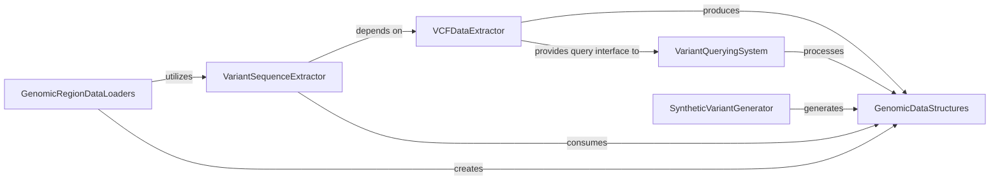

## Component Details

This graph illustrates the core components of the kipoiseq library, focusing on how genomic data structures are defined, extracted, queried, generated, and loaded. The central `GenomicDataStructures` component provides fundamental data types like `Variant` and `Interval`, which are consumed and produced by other components. `VCFDataExtractor` handles reading VCF files, feeding data to `VariantQueryingSystem` for filtering and `VariantSequenceExtractor` for sequence generation. `SyntheticVariantGenerator` creates new variants, while `GenomicRegionDataLoaders` manage loading various genomic file formats and preparing data for analysis, often utilizing the `VariantSequenceExtractor` for sequence processing.

### GenomicDataStructures
This component defines fundamental data structures for representing genomic information, specifically `Variant` for genetic variations and `Interval` for genomic regions. These classes provide methods for creation, manipulation (e.g., shifting, resizing intervals), and conversion from/to other formats. They serve as the foundational data types used across various other components in the kipoiseq library.

**Related Classes/Methods**:

- <a href="https://github.com/kipoi/kipoiseq/blob/master/kipoiseq/dataclasses.py#L17-L149" target="_blank" rel="noopener noreferrer">`kipoiseq.dataclasses.Variant` (17:149)</a>
- <a href="https://github.com/kipoi/kipoiseq/blob/master/kipoiseq/dataclasses.py#L152-L374" target="_blank" rel="noopener noreferrer">`kipoiseq.dataclasses.Interval` (152:374)</a>

### VCFDataExtractor
This component is responsible for reading, parsing, and fetching variant information from VCF (Variant Call Format) files. It provides methods to iterate through variants, fetch specific variants by interval or ID, and check for the presence of variants in samples. It relies on the `GenomicDataStructures` component for representing variants and intervals.

**Related Classes/Methods**:

- <a href="https://github.com/kipoi/kipoiseq/blob/master/kipoiseq/extractors/vcf.py#L21-L211" target="_blank" rel="noopener noreferrer">`kipoiseq.extractors.vcf.MultiSampleVCF` (21:211)</a>

### VariantQueryingSystem
This component provides a flexible framework for querying and filtering genomic variants, often in conjunction with genomic intervals. It allows for defining custom query logic and applying it to collections of variants. It heavily utilizes the `GenomicDataStructures` for defining query parameters and results.

**Related Classes/Methods**:

- <a href="https://github.com/kipoi/kipoiseq/blob/master/kipoiseq/extractors/vcf_query.py#L113-L281" target="_blank" rel="noopener noreferrer">`kipoiseq.extractors.vcf_query.VariantIntervalQueryable` (113:281)</a>
- <a href="https://github.com/kipoi/kipoiseq/blob/master/kipoiseq/extractors/vcf_query.py#L33-L45" target="_blank" rel="noopener noreferrer">`kipoiseq.extractors.vcf_query.VariantQuery` (33:45)</a>
- <a href="https://github.com/kipoi/kipoiseq/blob/master/kipoiseq/extractors/vcf_query.py#L48-L54" target="_blank" rel="noopener noreferrer">`kipoiseq.extractors.vcf_query.FilterVariantQuery` (48:54)</a>
- <a href="https://github.com/kipoi/kipoiseq/blob/master/kipoiseq/extractors/vcf_query.py#L83-L89" target="_blank" rel="noopener noreferrer">`kipoiseq.extractors.vcf_query.VariantIntervalQuery` (83:89)</a>
- <a href="https://github.com/kipoi/kipoiseq/blob/master/kipoiseq/extractors/vcf_query.py#L92-L107" target="_blank" rel="noopener noreferrer">`kipoiseq.extractors.vcf_query.NumberVariantQuery` (92:107)</a>

### SyntheticVariantGenerator
This component is designed to generate synthetic single nucleotide variants (SNVs), insertions, and deletions within specified genomic intervals. It uses a FASTA file for reference sequences and can generate combinations of variants. The generated variants are represented using the `GenomicDataStructures` component.

**Related Classes/Methods**:

- <a href="https://github.com/kipoi/kipoiseq/blob/master/kipoiseq/extractors/variant_combinations.py#L9-L98" target="_blank" rel="noopener noreferrer">`kipoiseq.extractors.variant_combinations.VariantCombinator` (9:98)</a>

### VariantSequenceExtractor
This component extracts DNA sequences from a reference genome, applying genetic variants (SNVs, indels) to generate alternative sequences. It handles complex scenarios like overlapping variants and ensures fixed-length output. It consumes `GenomicDataStructures` (Variants and Intervals) and often depends on `VCFDataExtractor` to get variant information.

**Related Classes/Methods**:

- <a href="https://github.com/kipoi/kipoiseq/blob/master/kipoiseq/extractors/vcf_seq.py#L60-L303" target="_blank" rel="noopener noreferrer">`kipoiseq.extractors.vcf_seq.VariantSeqExtractor` (60:303)</a>
- <a href="https://github.com/kipoi/kipoiseq/blob/master/kipoiseq/extractors/vcf_seq.py#L23-L57" target="_blank" rel="noopener noreferrer">`kipoiseq.extractors.vcf_seq.IntervalSeqBuilder` (23:57)</a>
- <a href="https://github.com/kipoi/kipoiseq/blob/master/kipoiseq/extractors/vcf_seq.py#L328-L341" target="_blank" rel="noopener noreferrer">`kipoiseq.extractors.vcf_seq.SingleVariantVCFSeqExtractor` (328:341)</a>
- <a href="https://github.com/kipoi/kipoiseq/blob/master/kipoiseq/extractors/vcf_seq.py#L344-L355" target="_blank" rel="noopener noreferrer">`kipoiseq.extractors.vcf_seq.SingleSeqVCFSeqExtractor` (344:355)</a>

### GenomicRegionDataLoaders
This component provides various data loaders for reading genomic data from different file formats, such as BED and GTF, and preparing it for downstream analysis. It includes functionalities for resizing intervals and converting sequences to one-hot encoding. It creates and manipulates `GenomicDataStructures` (Intervals) and can utilize `VariantSequenceExtractor` for sequence generation.

**Related Classes/Methods**:

- <a href="https://github.com/kipoi/kipoiseq/blob/master/kipoiseq/dataloaders/sequence.py#L387-L539" target="_blank" rel="noopener noreferrer">`kipoiseq.dataloaders.sequence.AnchoredGTFDl` (387:539)</a>
- <a href="https://github.com/kipoi/kipoiseq/blob/master/kipoiseq/dataloaders/sequence.py#L135-L261" target="_blank" rel="noopener noreferrer">`kipoiseq.dataloaders.sequence.StringSeqIntervalDl` (135:261)</a>
- <a href="https://github.com/kipoi/kipoiseq/blob/master/kipoiseq/dataloaders/sequence.py#L268-L384" target="_blank" rel="noopener noreferrer">`kipoiseq.dataloaders.sequence.SeqIntervalDl` (268:384)</a>
- <a href="https://github.com/kipoi/kipoiseq/blob/master/kipoiseq/dataloaders/sequence.py#L26-L131" target="_blank" rel="noopener noreferrer">`kipoiseq.dataloaders.sequence.BedDataset` (26:131)</a>
- <a href="https://github.com/kipoi/kipoiseq/blob/master/kipoiseq/extractors/gtf.py#L70-L85" target="_blank" rel="noopener noreferrer">`kipoiseq.extractors.gtf.gtf_row2interval` (70:85)</a>
- <a href="https://github.com/kipoi/kipoiseq/blob/master/kipoiseq/extractors/vcf_matching.py#L42-L60" target="_blank" rel="noopener noreferrer">`kipoiseq.extractors.vcf_matching.pyranges_to_intervals` (42:60)</a>

### [FAQ](https://github.com/CodeBoarding/GeneratedOnBoardings/tree/main?tab=readme-ov-file#faq)