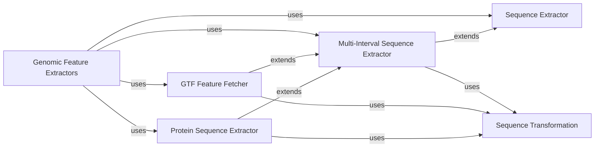

## Component Details

The Genomic Feature Extractors component provides a comprehensive set of functionalities for extracting various types of genomic data. It integrates specialized extractors to retrieve DNA sequences from FASTA files, specific features like CDS and UTRs from GTF files, and protein sequences. This component is designed to handle extractions across multiple genomic intervals and supports sequence transformations such as reverse complementation and translation, serving as a core utility for downstream genomic analysis.

### Genomic Feature Extractors
Extracts genomic sequences from FASTA files and features from GTF files (e.g., CDS, UTRs). It also provides functionalities for extracting sequences across multiple genomic intervals and protein sequences. This component serves as a unified interface for various specialized sequence and feature extraction functionalities within the kipoiseq library.

**Related Classes/Methods**:

- <a href="https://github.com/kipoi/kipoiseq/blob/master/kipoiseq/extractors/fasta.py#L7-L63" target="_blank" rel="noopener noreferrer">`kipoiseq.extractors.fasta.FastaStringExtractor` (7:63)</a>
- <a href="https://github.com/kipoi/kipoiseq/blob/master/kipoiseq/extractors/gtf.py#L154-L265" target="_blank" rel="noopener noreferrer">`kipoiseq.extractors.gtf.CDSFetcher` (154:265)</a>
- <a href="https://github.com/kipoi/kipoiseq/blob/master/kipoiseq/extractors/gtf.py#L268-L377" target="_blank" rel="noopener noreferrer">`kipoiseq.extractors.gtf.UTRFetcher` (268:377)</a>
- <a href="https://github.com/kipoi/kipoiseq/blob/master/kipoiseq/extractors/gtf.py#L88-L151" target="_blank" rel="noopener noreferrer">`kipoiseq.extractors.gtf.GTFMultiIntervalFetcher` (88:151)</a>
- <a href="https://github.com/kipoi/kipoiseq/blob/master/kipoiseq/extractors/protein.py#L169-L180" target="_blank" rel="noopener noreferrer">`kipoiseq.extractors.protein.ProteinSeqExtractor` (169:180)</a>
- <a href="https://github.com/kipoi/kipoiseq/blob/master/kipoiseq/extractors/protein.py#L112-L166" target="_blank" rel="noopener noreferrer">`kipoiseq.extractors.protein.TranscriptSeqExtractor` (112:166)</a>
- <a href="https://github.com/kipoi/kipoiseq/blob/master/kipoiseq/extractors/protein.py#L35-L69" target="_blank" rel="noopener noreferrer">`kipoiseq.extractors.protein.UTRSeqExtractor` (35:69)</a>
- <a href="https://github.com/kipoi/kipoiseq/blob/master/kipoiseq/extractors/multi_interval.py#L129-L195" target="_blank" rel="noopener noreferrer">`kipoiseq.extractors.multi_interval.GenericMultiIntervalSeqExtractor` (129:195)</a>

### Sequence Extractor
The Sequence Extractor component is responsible for extracting DNA sequences from FASTA files based on specified genomic intervals. It can handle strand information and force uppercase output. This component is a fundamental building block for other extractors and data loaders.

**Related Classes/Methods**:

- <a href="https://github.com/kipoi/kipoiseq/blob/master/kipoiseq/extractors/fasta.py#L7-L63" target="_blank" rel="noopener noreferrer">`kipoiseq.extractors.fasta.FastaStringExtractor` (7:63)</a>

### Multi-Interval Sequence Extractor
The Multi-Interval Sequence Extractor component is designed to extract and concatenate sequences across multiple genomic intervals. It serves as a base class for more specialized extractors that handle variants or specific genomic features like CDS or UTRs. It can also apply reverse complementation if strand information is provided.

**Related Classes/Methods**:

- <a href="https://github.com/kipoi/kipoiseq/blob/master/kipoiseq/extractors/multi_interval.py#L30-L83" target="_blank" rel="noopener noreferrer">`kipoiseq.extractors.multi_interval.BaseMultiIntervalSeqExtractor` (30:83)</a>
- <a href="https://github.com/kipoi/kipoiseq/blob/master/kipoiseq/extractors/multi_interval.py#L129-L195" target="_blank" rel="noopener noreferrer">`kipoiseq.extractors.multi_interval.GenericMultiIntervalSeqExtractor` (129:195)</a>

### GTF Feature Fetcher
The GTF Feature Fetcher component is responsible for parsing GTF (Gene Transfer Format) files and extracting specific genomic features like Coding Sequences (CDS) and Untranslated Regions (UTRs). It can filter features based on various criteria such as biotype and transcript support level.

**Related Classes/Methods**:

- <a href="https://github.com/kipoi/kipoiseq/blob/master/kipoiseq/extractors/gtf.py#L88-L151" target="_blank" rel="noopener noreferrer">`kipoiseq.extractors.gtf.GTFMultiIntervalFetcher` (88:151)</a>
- <a href="https://github.com/kipoi/kipoiseq/blob/master/kipoiseq/extractors/gtf.py#L154-L265" target="_blank" rel="noopener noreferrer">`kipoiseq.extractors.gtf.CDSFetcher` (154:265)</a>
- <a href="https://github.com/kipoi/kipoiseq/blob/master/kipoiseq/extractors/gtf.py#L268-L377" target="_blank" rel="noopener noreferrer">`kipoiseq.extractors.gtf.UTRFetcher` (268:377)</a>

### Protein Sequence Extractor
The Protein Sequence Extractor component is responsible for extracting protein and transcript sequences from genomic data, often utilizing GTF and FASTA files. It can handle translation from DNA to amino acid sequences.

**Related Classes/Methods**:

- <a href="https://github.com/kipoi/kipoiseq/blob/master/kipoiseq/extractors/protein.py#L169-L180" target="_blank" rel="noopener noreferrer">`kipoiseq.extractors.protein.ProteinSeqExtractor` (169:180)</a>
- <a href="https://github.com/kipoi/kipoiseq/blob/master/kipoiseq/extractors/protein.py#L112-L166" target="_blank" rel="noopener noreferrer">`kipoiseq.extractors.protein.TranscriptSeqExtractor` (112:166)</a>
- <a href="https://github.com/kipoi/kipoiseq/blob/master/kipoiseq/extractors/protein.py#L35-L69" target="_blank" rel="noopener noreferrer">`kipoiseq.extractors.protein.UTRSeqExtractor` (35:69)</a>

### Sequence Transformation
The Sequence Transformation component provides functional utilities for manipulating DNA sequences. This includes operations like reverse complementing DNA, one-hot encoding sequences, padding, trimming, and translating DNA to amino acid sequences.

**Related Classes/Methods**:

- <a href="https://github.com/kipoi/kipoiseq/blob/master/kipoiseq/transforms/functional.py#L35-L51" target="_blank" rel="noopener noreferrer">`kipoiseq.transforms.functional.rc_dna` (35:51)</a>
- <a href="https://github.com/kipoi/kipoiseq/blob/master/kipoiseq/transforms/functional.py#L118-L133" target="_blank" rel="noopener noreferrer">`kipoiseq.transforms.functional.one_hot_dna` (118:133)</a>
- <a href="https://github.com/kipoi/kipoiseq/blob/master/kipoiseq/transforms/functional.py#L233-L256" target="_blank" rel="noopener noreferrer">`kipoiseq.transforms.functional.resize_interval` (233:256)</a>
- <a href="https://github.com/kipoi/kipoiseq/blob/master/kipoiseq/transforms/functional.py#L300-L322" target="_blank" rel="noopener noreferrer">`kipoiseq.transforms.functional.translate` (300:322)</a>

### [FAQ](https://github.com/CodeBoarding/GeneratedOnBoardings/tree/main?tab=readme-ov-file#faq)