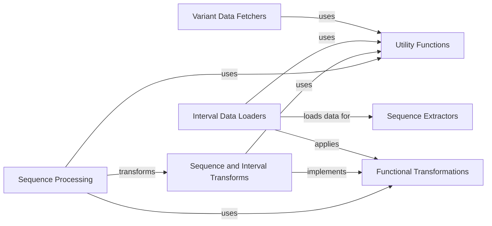

## Component Details

This graph illustrates the key components of the kipoiseq library, focusing on how biological sequence data is fetched, loaded, transformed, and processed for machine learning applications. The main flow involves fetching variant data, loading genomic intervals, extracting sequences based on these intervals, and then applying various transformations to prepare the data. Utility functions are leveraged across multiple components for common tasks.

### Variant Data Fetchers
This component provides an abstract base class for fetching genetic variants and a concrete implementation for multi-sample VCF files. It allows iterating through variants in batches and querying specific variants or regions.

**Related Classes/Methods**:

- <a href="https://github.com/kipoi/kipoiseq/blob/master/kipoiseq/variant_source.py#L8-L39" target="_blank" rel="noopener noreferrer">`kipoiseq.kipoiseq.variant_source.VariantFetcher` (8:39)</a>
- <a href="https://github.com/kipoi/kipoiseq/blob/master/kipoiseq/variant_source.py#L23-L30" target="_blank" rel="noopener noreferrer">`kipoiseq.kipoiseq.variant_source.VariantFetcher:batch_iter` (23:30)</a>
- <a href="https://github.com/kipoi/kipoiseq/blob/master/kipoiseq/variant_source.py#L14-L21" target="_blank" rel="noopener noreferrer">`kipoiseq.kipoiseq.variant_source.VariantFetcher:fetch_variants` (14:21)</a>
- <a href="https://github.com/kipoi/kipoiseq/blob/master/kipoiseq/variant_source.py#L33-L39" target="_blank" rel="noopener noreferrer">`kipoiseq.kipoiseq.variant_source.VariantFetcher:__iter__` (33:39)</a>
- <a href="https://github.com/kipoi/kipoiseq/blob/master/kipoiseq/extractors/vcf.py#L21-L211" target="_blank" rel="noopener noreferrer">`kipoiseq.kipoiseq.extractors.vcf.MultiSampleVCF` (21:211)</a>
- <a href="https://github.com/kipoi/kipoiseq/blob/master/kipoiseq/extractors/vcf.py#L69-L77" target="_blank" rel="noopener noreferrer">`kipoiseq.kipoiseq.extractors.vcf.MultiSampleVCF:batch_iter` (69:77)</a>
- <a href="https://github.com/kipoi/kipoiseq/blob/master/kipoiseq/extractors/vcf.py#L28-L32" target="_blank" rel="noopener noreferrer">`kipoiseq.kipoiseq.extractors.vcf.MultiSampleVCF:fetch_variants` (28:32)</a>
- <a href="https://github.com/kipoi/kipoiseq/blob/master/kipoiseq/extractors/vcf.py#L23-L26" target="_blank" rel="noopener noreferrer">`kipoiseq.kipoiseq.extractors.vcf.MultiSampleVCF:__init__` (23:26)</a>
- <a href="https://github.com/kipoi/kipoiseq/blob/master/kipoiseq/extractors/vcf.py#L34-L44" target="_blank" rel="noopener noreferrer">`kipoiseq.kipoiseq.extractors.vcf.MultiSampleVCF:_variants_from_cyvcf2` (34:44)</a>
- <a href="https://github.com/kipoi/kipoiseq/blob/master/kipoiseq/extractors/vcf.py#L50-L52" target="_blank" rel="noopener noreferrer">`kipoiseq.kipoiseq.extractors.vcf.MultiSampleVCF:has_variant` (50:52)</a>
- <a href="https://github.com/kipoi/kipoiseq/blob/master/kipoiseq/extractors/vcf.py#L79-L105" target="_blank" rel="noopener noreferrer">`kipoiseq.kipoiseq.extractors.vcf.MultiSampleVCF:query_variants` (79:105)</a>
- <a href="https://github.com/kipoi/kipoiseq/blob/master/kipoiseq/extractors/vcf.py#L123-L145" target="_blank" rel="noopener noreferrer">`kipoiseq.kipoiseq.extractors.vcf.MultiSampleVCF:get_variant` (123:145)</a>
- <a href="https://github.com/kipoi/kipoiseq/blob/master/kipoiseq/extractors/vcf.py#L201-L211" target="_blank" rel="noopener noreferrer">`kipoiseq.kipoiseq.extractors.vcf.MultiSampleVCF:get_samples` (201:211)</a>

### Interval Data Loaders
This component is responsible for loading genomic interval data from various file formats like BED and GTF. It provides functionalities to read intervals, associated labels, and anchor points for sequence extraction.

**Related Classes/Methods**:

- <a href="https://github.com/kipoi/kipoiseq/blob/master/kipoiseq/dataloaders/sequence.py#L26-L131" target="_blank" rel="noopener noreferrer">`kipoiseq.kipoiseq.dataloaders.sequence.BedDataset` (26:131)</a>
- <a href="https://github.com/kipoi/kipoiseq/blob/master/kipoiseq/dataloaders/sequence.py#L60-L108" target="_blank" rel="noopener noreferrer">`kipoiseq.kipoiseq.dataloaders.sequence.BedDataset:__init__` (60:108)</a>
- <a href="https://github.com/kipoi/kipoiseq/blob/master/kipoiseq/dataloaders/sequence.py#L110-L125" target="_blank" rel="noopener noreferrer">`kipoiseq.kipoiseq.dataloaders.sequence.BedDataset:__getitem__` (110:125)</a>
- <a href="https://github.com/kipoi/kipoiseq/blob/master/kipoiseq/dataloaders/sequence.py#L135-L261" target="_blank" rel="noopener noreferrer">`kipoiseq.kipoiseq.dataloaders.sequence.StringSeqIntervalDl` (135:261)</a>
- <a href="https://github.com/kipoi/kipoiseq/blob/master/kipoiseq/dataloaders/sequence.py#L187-L217" target="_blank" rel="noopener noreferrer">`kipoiseq.kipoiseq.dataloaders.sequence.StringSeqIntervalDl:__init__` (187:217)</a>
- <a href="https://github.com/kipoi/kipoiseq/blob/master/kipoiseq/dataloaders/sequence.py#L222-L252" target="_blank" rel="noopener noreferrer">`kipoiseq.kipoiseq.dataloaders.sequence.StringSeqIntervalDl:__getitem__` (222:252)</a>
- <a href="https://github.com/kipoi/kipoiseq/blob/master/kipoiseq/dataloaders/sequence.py#L387-L539" target="_blank" rel="noopener noreferrer">`kipoiseq.kipoiseq.dataloaders.sequence.AnchoredGTFDl` (387:539)</a>
- <a href="https://github.com/kipoi/kipoiseq/blob/master/kipoiseq/dataloaders/sequence.py#L456-L488" target="_blank" rel="noopener noreferrer">`kipoiseq.kipoiseq.dataloaders.sequence.AnchoredGTFDl:__init__` (456:488)</a>
- <a href="https://github.com/kipoi/kipoiseq/blob/master/kipoiseq/dataloaders/sequence.py#L507-L519" target="_blank" rel="noopener noreferrer">`kipoiseq.kipoiseq.dataloaders.sequence.AnchoredGTFDl:__getitem__` (507:519)</a>
- <a href="https://github.com/kipoi/kipoiseq/blob/master/kipoiseq/dataloaders/sequence.py#L490-L502" target="_blank" rel="noopener noreferrer">`kipoiseq.kipoiseq.dataloaders.sequence.AnchoredGTFDl._create_anchored_interval` (490:502)</a>

### Sequence Extractors
This component provides tools for extracting DNA sequences from FASTA files based on genomic intervals. It supports strand-aware extraction and forcing uppercase output.

**Related Classes/Methods**:

- <a href="https://github.com/kipoi/kipoiseq/blob/master/kipoiseq/extractors/fasta.py#L7-L63" target="_blank" rel="noopener noreferrer">`kipoiseq.extractors.fasta.FastaStringExtractor` (7:63)</a>
- <a href="https://github.com/kipoi/kipoiseq/blob/master/kipoiseq/extractors/fasta.py#L21-L27" target="_blank" rel="noopener noreferrer">`kipoiseq.extractors.fasta.FastaStringExtractor:__init__` (21:27)</a>
- <a href="https://github.com/kipoi/kipoiseq/blob/master/kipoiseq/extractors/fasta.py#L29-L60" target="_blank" rel="noopener noreferrer">`kipoiseq.extractors.fasta.FastaStringExtractor:extract` (29:60)</a>

### Sequence and Interval Transforms
This component offers a collection of classes for transforming genomic intervals and DNA sequences. It includes operations like resizing intervals, one-hot encoding sequences, and reordering axes for different data formats.

**Related Classes/Methods**:

- <a href="https://github.com/kipoi/kipoiseq/blob/master/kipoiseq/transforms/transforms.py#L77-L86" target="_blank" rel="noopener noreferrer">`kipoiseq.kipoiseq.transforms.transforms.ResizeInterval` (77:86)</a>
- <a href="https://github.com/kipoi/kipoiseq/blob/master/kipoiseq/transforms/transforms.py#L85-L86" target="_blank" rel="noopener noreferrer">`kipoiseq.kipoiseq.transforms.transforms.ResizeInterval:__call__` (85:86)</a>
- <a href="https://github.com/kipoi/kipoiseq/blob/master/kipoiseq/transforms/transforms.py#L91-L124" target="_blank" rel="noopener noreferrer">`kipoiseq.kipoiseq.transforms.transforms.OneHot` (91:124)</a>
- <a href="https://github.com/kipoi/kipoiseq/blob/master/kipoiseq/transforms/transforms.py#L112-L124" target="_blank" rel="noopener noreferrer">`kipoiseq.kipoiseq.transforms.transforms.OneHot:__call__` (112:124)</a>
- <a href="https://github.com/kipoi/kipoiseq/blob/master/kipoiseq/transforms/transforms.py#L127-L225" target="_blank" rel="noopener noreferrer">`kipoiseq.kipoiseq.transforms.transforms.ReorderedOneHot` (127:225)</a>
- <a href="https://github.com/kipoi/kipoiseq/blob/master/kipoiseq/transforms/transforms.py#L146-L190" target="_blank" rel="noopener noreferrer">`kipoiseq.kipoiseq.transforms.transforms.ReorderedOneHot:__init__` (146:190)</a>
- <a href="https://github.com/kipoi/kipoiseq/blob/master/kipoiseq/transforms/transforms.py#L10-L38" target="_blank" rel="noopener noreferrer">`kipoiseq.kipoiseq.transforms.transforms.Compose` (10:38)</a>
- <a href="https://github.com/kipoi/kipoiseq/blob/master/kipoiseq/transforms/transforms.py#L43-L54" target="_blank" rel="noopener noreferrer">`kipoiseq.kipoiseq.transforms.transforms.DummyAxis` (43:54)</a>
- <a href="https://github.com/kipoi/kipoiseq/blob/master/kipoiseq/transforms/transforms.py#L57-L71" target="_blank" rel="noopener noreferrer">`kipoiseq.kipoiseq.transforms.transforms.SwapAxes` (57:71)</a>

### Functional Transformations
This component contains core, stateless functions for performing common transformations on sequences and intervals, such as one-hot encoding DNA, resizing intervals, and reverse complementing sequences.

**Related Classes/Methods**:

- `kipoiseq.kipoiseq.transforms.functional` (full file reference)
- <a href="https://github.com/kipoi/kipoiseq/blob/master/kipoiseq/transforms/functional.py#L118-L133" target="_blank" rel="noopener noreferrer">`kipoiseq.kipoiseq.transforms.functional:one_hot_dna` (118:133)</a>
- <a href="https://github.com/kipoi/kipoiseq/blob/master/kipoiseq/transforms/functional.py#L112-L115" target="_blank" rel="noopener noreferrer">`kipoiseq.kipoiseq.transforms.functional:one_hot` (112:115)</a>
- <a href="https://github.com/kipoi/kipoiseq/blob/master/kipoiseq/transforms/functional.py#L233-L256" target="_blank" rel="noopener noreferrer">`kipoiseq.kipoiseq.transforms.functional:resize_interval` (233:256)</a>

### Utility Functions
This component provides various utility functions used across the kipoiseq library, including batch iteration, type parsing, and scalar conversion.

**Related Classes/Methods**:

- `kipoiseq.utils` (full file reference)
- <a href="https://github.com/kipoi/kipoiseq/blob/master/kipoiseq/utils.py#L48-L57" target="_blank" rel="noopener noreferrer">`kipoiseq.utils.batch_iter` (48:57)</a>
- <a href="https://github.com/kipoi/kipoiseq/blob/master/kipoiseq/utils.py#L18-L24" target="_blank" rel="noopener noreferrer">`kipoiseq.utils.to_scalar` (18:24)</a>
- <a href="https://github.com/kipoi/kipoiseq/blob/master/kipoiseq/utils.py#L27-L31" target="_blank" rel="noopener noreferrer">`kipoiseq.utils.parse_alphabet` (27:31)</a>
- <a href="https://github.com/kipoi/kipoiseq/blob/master/kipoiseq/utils.py#L34-L42" target="_blank" rel="noopener noreferrer">`kipoiseq.utils.parse_dtype` (34:42)</a>

### Sequence Processing
Offers a suite of functions and classes for transforming biological sequences, including one-hot encoding, resizing intervals, and handling sequence axes, crucial for preparing data for machine learning models. It also includes general-purpose helper functions.

**Related Classes/Methods**:

- <a href="https://github.com/kipoi/kipoiseq/blob/master/kipoiseq/transforms/transforms.py#L91-L124" target="_blank" rel="noopener noreferrer">`kipoiseq.kipoiseq.transforms.transforms.OneHot` (91:124)</a>
- <a href="https://github.com/kipoi/kipoiseq/blob/master/kipoiseq/transforms/functional.py#L118-L133" target="_blank" rel="noopener noreferrer">`kipoiseq.kipoiseq.transforms.functional.one_hot_dna` (118:133)</a>
- <a href="https://github.com/kipoi/kipoiseq/blob/master/kipoiseq/transforms/transforms.py#L77-L86" target="_blank" rel="noopener noreferrer">`kipoiseq.kipoiseq.transforms.transforms.ResizeInterval` (77:86)</a>
- <a href="https://github.com/kipoi/kipoiseq/blob/master/kipoiseq/utils.py#L48-L57" target="_blank" rel="noopener noreferrer">`kipoiseq.utils.batch_iter` (48:57)</a>
- <a href="https://github.com/kipoi/kipoiseq/blob/master/kipoiseq/utils.py#L27-L31" target="_blank" rel="noopener noreferrer">`kipoiseq.utils.parse_alphabet` (27:31)</a>
- <a href="https://github.com/kipoi/kipoiseq/blob/master/kipoiseq/utils.py#L34-L42" target="_blank" rel="noopener noreferrer">`kipoiseq.utils.parse_dtype` (34:42)</a>
- <a href="https://github.com/kipoi/kipoiseq/blob/master/kipoiseq/utils.py#L18-L24" target="_blank" rel="noopener noreferrer">`kipoiseq.utils.to_scalar` (18:24)</a>

### [FAQ](https://github.com/CodeBoarding/GeneratedOnBoardings/tree/main?tab=readme-ov-file#faq)