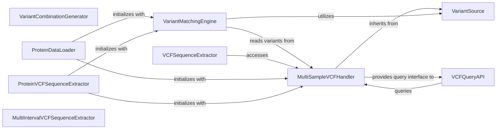

## Component Details

The Variant Data Management subsystem in `kipoiseq` is designed to handle comprehensive operations on Variant Call Format (VCF) files. It provides foundational capabilities for fetching and iterating genetic variants through the `VariantSource` and `MultiSampleVCFHandler` components. Complex querying and filtering of VCF data are managed by the `VCFQueryAPI`, while the `VariantMatchingEngine` facilitates matching variants against genomic intervals, often leveraging `pyranges`. Additionally, the system supports the generation of synthetic variant combinations via `VariantCombinationGenerator` and the extraction of genomic sequences around variants using `VCFSequenceExtractor`. Specialized components like `ProteinDataLoader` and `ProteinVCFSequenceExtractor` extend these core functionalities for protein-centric analyses, demonstrating the subsystem's adaptability in handling diverse genetic data processing needs.

### VariantSource
Manages the initial fetching and iteration of genetic variants from various sources, serving as a foundational component for variant access.

**Related Classes/Methods**:

- <a href="https://github.com/kipoi/kipoiseq/blob/master/kipoiseq/variant_source.py#L8-L39" target="_blank" rel="noopener noreferrer">`kipoiseq.kipoiseq.variant_source.VariantFetcher` (8:39)</a>

### MultiSampleVCFHandler
Provides core functionalities for reading, querying, and iterating through variants in multi-sample VCF files, including fetching specific variants or checking for variant presence. It extends VariantSource capabilities.

**Related Classes/Methods**:

- <a href="https://github.com/kipoi/kipoiseq/blob/master/kipoiseq/extractors/vcf.py#L21-L211" target="_blank" rel="noopener noreferrer">`kipoiseq.kipoiseq.extractors.vcf.MultiSampleVCF` (21:211)</a>

### VCFQueryAPI
Offers a programmatic interface for constructing and applying complex queries on VCF data, supporting logical operations (AND, OR) and interval-based filtering of variants.

**Related Classes/Methods**:

- <a href="https://github.com/kipoi/kipoiseq/blob/master/kipoiseq/extractors/vcf_query.py#L33-L45" target="_blank" rel="noopener noreferrer">`kipoiseq.kipoiseq.extractors.vcf_query.VariantQuery` (33:45)</a>
- <a href="https://github.com/kipoi/kipoiseq/blob/master/kipoiseq/extractors/vcf_query.py#L113-L281" target="_blank" rel="noopener noreferrer">`kipoiseq.kipoiseq.extractors.vcf_query.VariantIntervalQueryable` (113:281)</a>
- <a href="https://github.com/kipoi/kipoiseq/blob/master/kipoiseq/extractors/vcf_query.py#L19-L30" target="_blank" rel="noopener noreferrer">`kipoiseq.kipoiseq.extractors.vcf_query.BaseVariantQuery` (19:30)</a>
- <a href="https://github.com/kipoi/kipoiseq/blob/master/kipoiseq/extractors/vcf_query.py#L57-L80" target="_blank" rel="noopener noreferrer">`kipoiseq.kipoiseq.extractors.vcf_query.BaseVariantIntervalQuery` (57:80)</a>

### VariantMatchingEngine
Responsible for matching variants against defined intervals or other variant sets, often utilizing pyranges for efficient genomic interval operations. It includes base matching functionalities and specialized single/multi-variant matchers.

**Related Classes/Methods**:

- <a href="https://github.com/kipoi/kipoiseq/blob/master/kipoiseq/extractors/vcf_matching.py#L199-L258" target="_blank" rel="noopener noreferrer">`kipoiseq.kipoiseq.extractors.vcf_matching.SingleVariantMatcher` (199:258)</a>
- <a href="https://github.com/kipoi/kipoiseq/blob/master/kipoiseq/extractors/vcf_matching.py#L22-L39" target="_blank" rel="noopener noreferrer">`kipoiseq.kipoiseq.extractors.vcf_matching.variants_to_pyranges` (22:39)</a>
- <a href="https://github.com/kipoi/kipoiseq/blob/master/kipoiseq/extractors/vcf_matching.py#L63-L83" target="_blank" rel="noopener noreferrer">`kipoiseq.kipoiseq.extractors.vcf_matching.intervals_to_pyranges` (63:83)</a>
- <a href="https://github.com/kipoi/kipoiseq/blob/master/kipoiseq/extractors/vcf_matching.py#L86-L110" target="_blank" rel="noopener noreferrer">`kipoiseq.kipoiseq.extractors.vcf_matching.PyrangesVariantFetcher` (86:110)</a>
- <a href="https://github.com/kipoi/kipoiseq/blob/master/kipoiseq/extractors/vcf_matching.py#L113-L196" target="_blank" rel="noopener noreferrer">`kipoiseq.kipoiseq.extractors.vcf_matching.BaseVariantMatcher` (113:196)</a>
- <a href="https://github.com/kipoi/kipoiseq/blob/master/kipoiseq/extractors/vcf_matching.py#L261-L273" target="_blank" rel="noopener noreferrer">`kipoiseq.kipoiseq.extractors.vcf_matching.MultiVariantsMatcher` (261:273)</a>

### VariantCombinationGenerator
Generates various combinations of genetic variants, including single nucleotide variants (SNVs), insertions, and deletions, for downstream analysis. It can output these combinations to a VCF file.

**Related Classes/Methods**:

- <a href="https://github.com/kipoi/kipoiseq/blob/master/kipoiseq/extractors/variant_combinations.py#L9-L98" target="_blank" rel="noopener noreferrer">`kipoiseq.kipoiseq.extractors.variant_combinations.VariantCombinator` (9:98)</a>

### VCFSequenceExtractor
Extracts DNA sequences around genetic variants, allowing for the definition of upstream and downstream regions relative to the variant position. It leverages MultiSampleVCF to fetch variants and a FastaStringExtractor for reference sequences.

**Related Classes/Methods**:

- <a href="https://github.com/kipoi/kipoiseq/blob/master/kipoiseq/extractors/vcf_seq.py#L60-L303" target="_blank" rel="noopener noreferrer">`kipoiseq.kipoiseq.extractors.vcf_seq.VariantSeqExtractor` (60:303)</a>
- <a href="https://github.com/kipoi/kipoiseq/blob/master/kipoiseq/extractors/vcf_seq.py#L328-L341" target="_blank" rel="noopener noreferrer">`kipoiseq.kipoiseq.extractors.vcf_seq.SingleVariantVCFSeqExtractor` (328:341)</a>
- <a href="https://github.com/kipoi/kipoiseq/blob/master/kipoiseq/extractors/vcf_seq.py#L344-L355" target="_blank" rel="noopener noreferrer">`kipoiseq.kipoiseq.extractors.vcf_seq.SingleSeqVCFSeqExtractor` (344:355)</a>
- <a href="https://github.com/kipoi/kipoiseq/blob/master/kipoiseq/extractors/vcf_seq.py#L306-L325" target="_blank" rel="noopener noreferrer">`kipoiseq.kipoiseq.extractors.vcf_seq._BaseVCFSeqExtractor` (306:325)</a>

### ProteinDataLoader
A specialized data loader for protein-related sequences, integrating variant information from VCF files with UTR (Untranslated Region) data.

**Related Classes/Methods**:

- <a href="https://github.com/kipoi/kipoiseq/blob/master/kipoiseq/dataloaders/protein.py#L168-L356" target="_blank" rel="noopener noreferrer">`kipoiseq.kipoiseq.dataloaders.protein.SingleVariantUTRDataLoader` (168:356)</a>

### ProteinVCFSequenceExtractor
A specialized sequence extractor designed to extract protein-coding sequences based on VCF variants, often used in conjunction with variant matching and building upon multi-interval extraction.

**Related Classes/Methods**:

- <a href="https://github.com/kipoi/kipoiseq/blob/master/kipoiseq/extractors/protein.py#L210-L258" target="_blank" rel="noopener noreferrer">`kipoiseq.kipoiseq.extractors.protein.ProteinVCFSeqExtractor` (210:258)</a>
- <a href="https://github.com/kipoi/kipoiseq/blob/master/kipoiseq/extractors/protein.py#L265-L266" target="_blank" rel="noopener noreferrer">`kipoiseq.kipoiseq.extractors.protein.SingleVariantProteinVCFSeqExtractor` (265:266)</a>
- <a href="https://github.com/kipoi/kipoiseq/blob/master/kipoiseq/extractors/protein.py#L261-L262" target="_blank" rel="noopener noreferrer">`kipoiseq.kipoiseq.extractors.protein.SingleSeqProteinVCFSeqExtractor` (261:262)</a>

### MultiIntervalVCFSequenceExtractor
Extracts sequences for multiple genomic intervals based on VCF variants, serving as a foundational component for other VCF sequence extractors.

**Related Classes/Methods**:

- <a href="https://github.com/kipoi/kipoiseq/blob/master/kipoiseq/extractors/multi_interval.py#L202-L307" target="_blank" rel="noopener noreferrer">`kipoiseq.kipoiseq.extractors.multi_interval.BaseMultiIntervalVCFSeqExtractor` (202:307)</a>

### [FAQ](https://github.com/CodeBoarding/GeneratedOnBoardings/tree/main?tab=readme-ov-file#faq)