```mermaid
graph LR
    Genomic_Data_Models["Genomic Data Models"]
    Sequence_Processing["Sequence Processing"]
    Genomic_Data_Loaders["Genomic Data Loaders"]
    Genomic_Feature_Extractors["Genomic Feature Extractors"]
    Variant_Data_Management["Variant Data Management"]
    Genomic_Data_Models -- "provides data models to" --> Sequence_Processing
    Genomic_Data_Models -- "provides data models to" --> Genomic_Data_Loaders
    Genomic_Data_Models -- "provides data models to" --> Genomic_Feature_Extractors
    Genomic_Data_Models -- "provides data models to" --> Variant_Data_Management
    Sequence_Processing -- "applies transformations to data for" --> Genomic_Data_Loaders
    Sequence_Processing -- "applies transformations to extracted data" --> Genomic_Feature_Extractors
    Genomic_Data_Loaders -- "loads data using" --> Genomic_Feature_Extractors
    Genomic_Data_Loaders -- "integrates variant information from" --> Variant_Data_Management
    Genomic_Feature_Extractors -- "provides sequences and features to" --> Genomic_Data_Loaders
    Genomic_Feature_Extractors -- "extracts sequences for variant analysis" --> Variant_Data_Management
    Variant_Data_Management -- "provides variant data to" --> Genomic_Data_Loaders
    Variant_Data_Management -- "queries and filters variants for extraction" --> Genomic_Feature_Extractors
    click Genomic_Data_Models href "https://github.com/CodeBoarding/GeneratedOnBoardings/blob/main/kipoiseq/Genomic Data Models.md" "Details"
    click Sequence_Processing href "https://github.com/CodeBoarding/GeneratedOnBoardings/blob/main/kipoiseq/Sequence Processing.md" "Details"
    click Genomic_Data_Loaders href "https://github.com/CodeBoarding/GeneratedOnBoardings/blob/main/kipoiseq/Genomic Data Loaders.md" "Details"
    click Genomic_Feature_Extractors href "https://github.com/CodeBoarding/GeneratedOnBoardings/blob/main/kipoiseq/Genomic Feature Extractors.md" "Details"
    click Variant_Data_Management href "https://github.com/CodeBoarding/GeneratedOnBoardings/blob/main/kipoiseq/Variant Data Management.md" "Details"
```

## Component Details

The `kipoiseq` library provides a comprehensive framework for handling and processing genomic sequence and variant data. Its main flow involves loading biological data from various sources (FASTA, GTF, VCF), transforming these sequences for downstream analysis (e.g., one-hot encoding), extracting specific genomic features or sequences around variants, and managing genetic variant information. The library's purpose is to facilitate the preparation and manipulation of genomic data for machine learning and other bioinformatics applications.

### Genomic Data Models
Provides fundamental data structures like Variant for genetic variations and Interval for genomic regions, which are used throughout the kipoiseq library to represent and manipulate biological data.

**Related Classes/Methods**:

- <a href="https://github.com/kipoi/kipoiseq/blob/master/kipoiseq/dataclasses.py#L17-L149" target="_blank" rel="noopener noreferrer">`kipoiseq.kipoiseq.dataclasses.Variant` (17:149)</a>
- <a href="https://github.com/kipoi/kipoiseq/blob/master/kipoiseq/dataclasses.py#L152-L374" target="_blank" rel="noopener noreferrer">`kipoiseq.kipoiseq.dataclasses.Interval` (152:374)</a>

### Sequence Processing
Offers a suite of functions and classes for transforming biological sequences, including one-hot encoding, resizing intervals, and handling sequence axes, crucial for preparing data for machine learning models. It also includes general-purpose helper functions.

**Related Classes/Methods**:

- <a href="https://github.com/kipoi/kipoiseq/blob/master/kipoiseq/transforms/transforms.py#L91-L124" target="_blank" rel="noopener noreferrer">`kipoiseq.kipoiseq.transforms.transforms.OneHot` (91:124)</a>
- <a href="https://github.com/kipoi/kipoiseq/blob/master/kipoiseq/transforms/functional.py#L118-L133" target="_blank" rel="noopener noreferrer">`kipoiseq.kipoiseq.transforms.functional.one_hot_dna` (118:133)</a>
- <a href="https://github.com/kipoi/kipoiseq/blob/master/kipoiseq/transforms/transforms.py#L77-L86" target="_blank" rel="noopener noreferrer">`kipoiseq.kipoiseq.transforms.transforms.ResizeInterval` (77:86)</a>
- <a href="https://github.com/kipoi/kipoiseq/blob/master/kipoiseq/utils.py#L48-L57" target="_blank" rel="noopener noreferrer">`kipoiseq.utils.batch_iter` (48:57)</a>
- <a href="https://github.com/kipoi/kipoiseq/blob/master/kipoiseq/utils.py#L27-L31" target="_blank" rel="noopener noreferrer">`kipoiseq.utils.parse_alphabet` (27:31)</a>
- <a href="https://github.com/kipoi/kipoiseq/blob/master/kipoiseq/utils.py#L34-L42" target="_blank" rel="noopener noreferrer">`kipoiseq.utils.parse_dtype` (34:42)</a>
- <a href="https://github.com/kipoi/kipoiseq/blob/master/kipoiseq/utils.py#L18-L24" target="_blank" rel="noopener noreferrer">`kipoiseq.utils.to_scalar` (18:24)</a>

### Genomic Data Loaders
Provides various data loaders for handling genomic sequences based on intervals, BED files, and GTF annotations, supporting both string and one-hot encoded sequence outputs, including specialized loaders for splicing and protein data.

**Related Classes/Methods**:

- <a href="https://github.com/kipoi/kipoiseq/blob/master/kipoiseq/dataloaders/sequence.py#L268-L384" target="_blank" rel="noopener noreferrer">`kipoiseq.kipoiseq.dataloaders.sequence.SeqIntervalDl` (268:384)</a>
- <a href="https://github.com/kipoi/kipoiseq/blob/master/kipoiseq/dataloaders/sequence.py#L135-L261" target="_blank" rel="noopener noreferrer">`kipoiseq.kipoiseq.dataloaders.sequence.StringSeqIntervalDl` (135:261)</a>
- <a href="https://github.com/kipoi/kipoiseq/blob/master/kipoiseq/dataloaders/sequence.py#L26-L131" target="_blank" rel="noopener noreferrer">`kipoiseq.kipoiseq.dataloaders.sequence.BedDataset` (26:131)</a>
- <a href="https://github.com/kipoi/kipoiseq/blob/master/kipoiseq/dataloaders/splicing.py#L182-L276" target="_blank" rel="noopener noreferrer">`kipoiseq.kipoiseq.dataloaders.splicing.MMSpliceDl` (182:276)</a>
- <a href="https://github.com/kipoi/kipoiseq/blob/master/kipoiseq/dataloaders/splicing.py#L32-L129" target="_blank" rel="noopener noreferrer">`kipoiseq.kipoiseq.dataloaders.splicing.ExonInterval` (32:129)</a>
- <a href="https://github.com/kipoi/kipoiseq/blob/master/kipoiseq/dataloaders/protein.py#L30-L164" target="_blank" rel="noopener noreferrer">`kipoiseq.kipoiseq.dataloaders.protein.SingleVariantProteinDataLoader` (30:164)</a>
- <a href="https://github.com/kipoi/kipoiseq/blob/master/kipoiseq/dataloaders/protein.py#L168-L356" target="_blank" rel="noopener noreferrer">`kipoiseq.kipoiseq.dataloaders.protein.SingleVariantUTRDataLoader` (168:356)</a>

### Genomic Feature Extractors
Extracts genomic sequences from FASTA files and features from GTF files (e.g., CDS, UTRs). It also provides functionalities for extracting sequences across multiple genomic intervals and protein sequences.

**Related Classes/Methods**:

- <a href="https://github.com/kipoi/kipoiseq/blob/master/kipoiseq/extractors/fasta.py#L7-L63" target="_blank" rel="noopener noreferrer">`kipoiseq.extractors.fasta.FastaStringExtractor` (7:63)</a>
- <a href="https://github.com/kipoi/kipoiseq/blob/master/kipoiseq/extractors/gtf.py#L154-L265" target="_blank" rel="noopener noreferrer">`kipoiseq.kipoiseq.extractors.gtf.CDSFetcher` (154:265)</a>
- <a href="https://github.com/kipoi/kipoiseq/blob/master/kipoiseq/extractors/gtf.py#L268-L377" target="_blank" rel="noopener noreferrer">`kipoiseq.kipoiseq.extractors.gtf.UTRFetcher` (268:377)</a>
- <a href="https://github.com/kipoi/kipoiseq/blob/master/kipoiseq/extractors/gtf.py#L88-L151" target="_blank" rel="noopener noreferrer">`kipoiseq.kipoiseq.extractors.gtf.GTFMultiIntervalFetcher` (88:151)</a>
- <a href="https://github.com/kipoi/kipoiseq/blob/master/kipoiseq/extractors/protein.py#L169-L180" target="_blank" rel="noopener noreferrer">`kipoiseq.kipoiseq.extractors.protein.ProteinSeqExtractor` (169:180)</a>
- <a href="https://github.com/kipoi/kipoiseq/blob/master/kipoiseq/extractors/protein.py#L112-L166" target="_blank" rel="noopener noreferrer">`kipoiseq.kipoiseq.extractors.protein.TranscriptSeqExtractor` (112:166)</a>
- <a href="https://github.com/kipoi/kipoiseq/blob/master/kipoiseq/extractors/protein.py#L35-L69" target="_blank" rel="noopener noreferrer">`kipoiseq.kipoiseq.extractors.protein.UTRSeqExtractor` (35:69)</a>
- <a href="https://github.com/kipoi/kipoiseq/blob/master/kipoiseq/extractors/multi_interval.py#L129-L195" target="_blank" rel="noopener noreferrer">`kipoiseq.kipoiseq.extractors.multi_interval.GenericMultiIntervalSeqExtractor` (129:195)</a>

### Variant Data Management
Manages core operations related to Variant Call Format (VCF) files, including fetching, querying, filtering, and matching genetic variants. It also handles the extraction of genomic sequences around variants and the generation of variant combinations.

**Related Classes/Methods**:

- <a href="https://github.com/kipoi/kipoiseq/blob/master/kipoiseq/extractors/vcf.py#L21-L211" target="_blank" rel="noopener noreferrer">`kipoiseq.kipoiseq.extractors.vcf.MultiSampleVCF` (21:211)</a>
- <a href="https://github.com/kipoi/kipoiseq/blob/master/kipoiseq/extractors/vcf_query.py#L33-L45" target="_blank" rel="noopener noreferrer">`kipoiseq.kipoiseq.extractors.vcf_query.VariantQuery` (33:45)</a>
- <a href="https://github.com/kipoi/kipoiseq/blob/master/kipoiseq/extractors/vcf_query.py#L113-L281" target="_blank" rel="noopener noreferrer">`kipoiseq.kipoiseq.extractors.vcf_query.VariantIntervalQueryable` (113:281)</a>
- <a href="https://github.com/kipoi/kipoiseq/blob/master/kipoiseq/extractors/vcf_matching.py#L199-L258" target="_blank" rel="noopener noreferrer">`kipoiseq.kipoiseq.extractors.vcf_matching.SingleVariantMatcher` (199:258)</a>
- <a href="https://github.com/kipoi/kipoiseq/blob/master/kipoiseq/extractors/vcf_matching.py#L22-L39" target="_blank" rel="noopener noreferrer">`kipoiseq.kipoiseq.extractors.vcf_matching.variants_to_pyranges` (22:39)</a>
- <a href="https://github.com/kipoi/kipoiseq/blob/master/kipoiseq/extractors/vcf_matching.py#L63-L83" target="_blank" rel="noopener noreferrer">`kipoiseq.kipoiseq.extractors.vcf_matching.intervals_to_pyranges` (63:83)</a>
- <a href="https://github.com/kipoi/kipoiseq/blob/master/kipoiseq/extractors/vcf_seq.py#L60-L303" target="_blank" rel="noopener noreferrer">`kipoiseq.kipoiseq.extractors.vcf_seq.VariantSeqExtractor` (60:303)</a>
- <a href="https://github.com/kipoi/kipoiseq/blob/master/kipoiseq/extractors/vcf_seq.py#L328-L341" target="_blank" rel="noopener noreferrer">`kipoiseq.kipoiseq.extractors.vcf_seq.SingleVariantVCFSeqExtractor` (328:341)</a>
- <a href="https://github.com/kipoi/kipoiseq/blob/master/kipoiseq/extractors/vcf_seq.py#L344-L355" target="_blank" rel="noopener noreferrer">`kipoiseq.kipoiseq.extractors.vcf_seq.SingleSeqVCFSeqExtractor` (344:355)</a>
- <a href="https://github.com/kipoi/kipoiseq/blob/master/kipoiseq/variant_source.py#L8-L39" target="_blank" rel="noopener noreferrer">`kipoiseq.kipoiseq.variant_source.VariantFetcher` (8:39)</a>
- <a href="https://github.com/kipoi/kipoiseq/blob/master/kipoiseq/extractors/variant_combinations.py#L9-L98" target="_blank" rel="noopener noreferrer">`kipoiseq.kipoiseq.extractors.variant_combinations.VariantCombinator` (9:98)</a>

### [FAQ](https://github.com/CodeBoarding/GeneratedOnBoardings/tree/main?tab=readme-ov-file#faq)