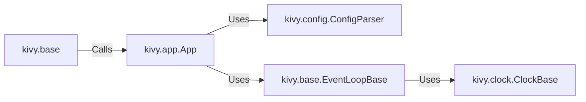

## Component Details

The Application Core manages the lifecycle of a Kivy application, from initialization and configuration loading to running the main event loop and handling termination. It coordinates various components to ensure smooth operation and provides a central point for managing the application's execution.

### kivy.app.App
The App class is the base class for Kivy applications. It manages the application lifecycle, including initialization, loading Kivy configuration, building the user interface, and running the main event loop. It also provides methods for managing settings and stopping the application.
- **Related Classes/Methods**: `kivy/app.py`

### kivy.config.ConfigParser
The ConfigParser class is responsible for reading, writing, and managing Kivy's configuration settings. It provides methods for setting, getting, and updating configuration options, allowing the application to adapt to different environments and user preferences.
- **Related Classes/Methods**: `kivy/config.py`

### kivy.base.EventLoopBase
The EventLoopBase class manages the main event loop for Kivy applications. It handles dispatching input events, updating the display, and managing application exit. It relies on the ClockBase to schedule events and manage time.
- **Related Classes/Methods**: `kivy/base.py`

### kivy.base
This module provides core functions for running and stopping the Kivy application. It initializes the application and starts the event loop, serving as the entry point for the application's execution.
- **Related Classes/Methods**: `kivy/base.py`

### kivy.clock.ClockBase
The ClockBase class serves as a base for different clock implementations in Kivy. It provides basic time management functionalities, allowing the application to schedule events and animations.
- **Related Classes/Methods**: `kivy/clock.py`
