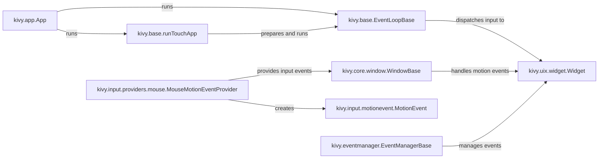

## Component Details

The Kivy event dispatching system is responsible for managing the flow of events, primarily user interactions, within the application. It starts with input events captured by input providers, which are then processed and dispatched to the appropriate UI elements (Widgets). The EventLoopBase orchestrates the main loop and event processing, while the EventManagerBase manages the event dispatching mechanism. Widgets, as the fundamental UI building blocks, receive and respond to these events, updating the application's state and appearance. The App class initializes and runs the application, tying together all the components.

### kivy.app.App
The App class serves as the entry point and orchestrator for a Kivy application. It initializes the application, manages its lifecycle, and provides a root widget that serves as the base for the user interface. It sets up the event loop and connects it to the windowing system.
- **Related Classes/Methods**: `kivy.app.App`

### kivy.base.runTouchApp
This function initializes and starts the Kivy event loop. It prepares the environment and then calls the EventLoopBase to run the application.
- **Related Classes/Methods**: `kivy.base.runTouchApp`

### kivy.base.EventLoopBase
The EventLoopBase class is the core of the Kivy event loop. It manages the main loop, dispatches input events, and handles the overall application flow. It's responsible for the application's heartbeat.
- **Related Classes/Methods**: `kivy.base.EventLoopBase`

### kivy.uix.widget.Widget
The Widget class is the base class for all UI elements in Kivy. It handles touch events, drawing, and layout. It's the fundamental building block of the user interface.
- **Related Classes/Methods**: `kivy.uix.widget.Widget`

### kivy.core.window.WindowBase
The WindowBase class provides an abstraction for the application window. It handles window creation, input events, and drawing. It's the interface to the operating system's windowing system.
- **Related Classes/Methods**: `kivy.core.window.WindowBase`

### kivy.input.providers.mouse.MouseMotionEventProvider
The MouseMotionEventProvider class is responsible for capturing mouse events and converting them into Kivy's motion event format.
- **Related Classes/Methods**: `kivy.input.providers.mouse.MouseMotionEventProvider`

### kivy.input.motionevent.MotionEvent
The MotionEvent class represents a single motion event, such as a mouse movement or touch event. It encapsulates the event's data, such as position and pressure.
- **Related Classes/Methods**: `kivy.input.motionevent.MotionEvent`

### kivy.eventmanager.EventManagerBase
The EventManagerBase class manages the dispatching of events to registered listeners.
- **Related Classes/Methods**: `kivy.eventmanager.EventManagerBase`
