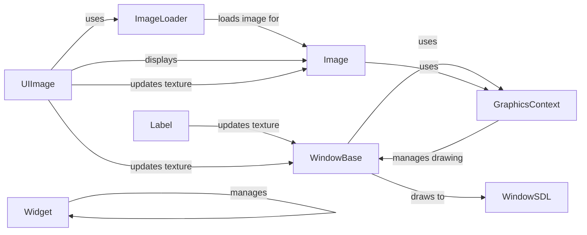

## Component Details

The Graphics Engine in Kivy is responsible for rendering UI elements and other graphical content on the screen. It leverages OpenGL for hardware-accelerated rendering, ensuring smooth and efficient performance. The engine manages drawing primitives, texture management, and shader support. The core components include the Window for managing the display, Images and ImageLoaders for handling textures, and the GraphicsContext for OpenGL operations. Widgets use these components to render themselves on the screen.

### WindowBase
Represents the application window and provides methods for drawing and handling window events. It serves as an abstract base for window implementations.
- **Related Classes/Methods**: `kivy.kivy.core.window.WindowBase`

### WindowSDL
A concrete implementation of WindowBase using SDL, responsible for buffer swapping and interacting with the operating system's windowing system.
- **Related Classes/Methods**: `kivy.kivy.core.window.window_sdl3.WindowSDL`

### Image
Represents an image, loading image data and creating a texture for rendering. It manages the image data and provides access to the texture.
- **Related Classes/Methods**: `kivy.kivy.core.image.Image`

### ImageLoader
Responsible for loading image data from various sources and formats. It handles the decoding and preparation of image data for use by the Image class.
- **Related Classes/Methods**: `kivy.kivy.core.image.ImageLoader`

### Widget
The base class for all UI elements, providing methods for managing child widgets, handling input events, and drawing itself on the screen.
- **Related Classes/Methods**: `kivy.kivy.uix.widget.Widget`

### UIImage
A Widget that displays an image, using the Image class to load and manage the image data. It simplifies the process of displaying images in the UI.
- **Related Classes/Methods**: `kivy.kivy.uix.image.Image`

### Label
A Widget that displays text, updating the texture with the rendered text. It handles text rendering and display within the UI.
- **Related Classes/Methods**: `kivy.kivy.uix.label.Label`

### GraphicsContext
Manages the OpenGL context and drawing operations. It provides an interface for drawing primitives, setting shader parameters, and managing textures.
- **Related Classes/Methods**: `kivy.kivy.graphics`
