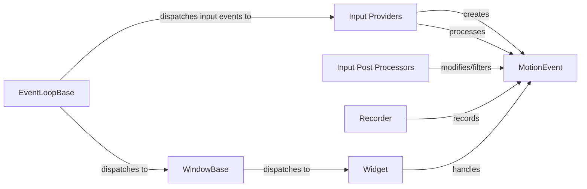

## Component Details

The Input Manager in Kivy is responsible for handling all input events, including touch, mouse, and keyboard. It normalizes and processes these events, making them available to the Event Dispatcher and UI elements. The process involves capturing raw input data via Input Providers, transforming them into MotionEvent objects, and refining these events through Input Post Processors before dispatching them to the appropriate widgets via the Window and Event Loop. This ensures accurate and consistent input handling across different devices and platforms.

### EventLoopBase
The base class for the Kivy event loop. It's responsible for dispatching input events to the appropriate handlers, ensuring that events are properly routed to the relevant parts of the application.
- **Related Classes/Methods**: `kivy.kivy.base.EventLoopBase`

### MotionEvent
Represents a single motion event, such as a touch or mouse movement. It stores information about the event's position, pressure, and other relevant data, serving as the fundamental data structure for input handling.
- **Related Classes/Methods**: `kivy.kivy.input.motionevent.MotionEvent`

### Input Providers
Modules responsible for capturing raw input data from various sources (e.g., mouse, touch screen) and translating it into MotionEvent objects. Each provider handles a specific input source, abstracting the details of the underlying hardware.
- **Related Classes/Methods**: `kivy.kivy.input.providers.mouse.MouseMotionEventProvider`, `kivy.kivy.input.providers.androidjoystick.AndroidMotionEventProvider`, `kivy.kivy.input.providers.tuio.TuioMotionEventProvider`, `kivy.kivy.input.providers.mactouch.MacMotionEventProvider`, `kivy.kivy.core.window.window_sdl3.SDL3MotionEventProvider`, `kivy.kivy.input.providers.leapfinger.LeapFingerEventProvider`

### Input Post Processors
Modules that modify or filter MotionEvent objects after they have been created by the input providers. This can include tasks such as calibration, dejittering, and gesture recognition, improving the accuracy and reliability of input events.
- **Related Classes/Methods**: `kivy.kivy.input.postproc.ignorelist.InputPostprocIgnoreList`, `kivy.kivy.input.postproc.calibration.InputPostprocCalibration`, `kivy.kivy.input.postproc.dejitter.InputPostprocDejitter`, `kivy.kivy.input.postproc.retaintouch.InputPostprocRetainTouch`, `kivy.kivy.input.postproc.tripletap.InputPostprocTripleTap`, `kivy.kivy.input.postproc.doubletap.InputPostprocDoubleTap`

### Widget
The base class for all UI elements in Kivy. It provides basic functionality for handling touch events, including collision detection and event dispatching, enabling interactive UI elements.
- **Related Classes/Methods**: `kivy.kivy.uix.widget.Widget`

### WindowBase
Base class for Kivy windows. It receives motion events and dispatches them to the appropriate widgets, acting as the central point for input event distribution.
- **Related Classes/Methods**: `kivy.kivy.core.window.WindowBase`

### Recorder
Records motion events for later playback or analysis. This is useful for debugging and testing input handling.
- **Related Classes/Methods**: `kivy.kivy.input.recorder.Recorder`
