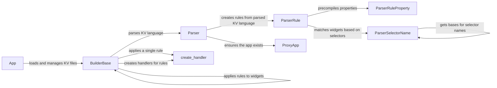

## Component Details

The Kivy Language (KV) Parser is a crucial subsystem within the Kivy framework, responsible for processing KV files that define the user interface and bind UI elements to application logic. The parsing process involves loading KV files, interpreting the KV language syntax, creating a set of rules, and applying these rules to construct the widget tree. The main flow starts with the App loading KV files, which are then parsed by the BuilderBase using the Parser. The Parser generates ParserRule objects, which represent the parsed rules and properties. These rules are then applied to the widget tree, creating and configuring the UI elements. The KV Parser enables a declarative approach to UI development, allowing developers to create reusable UI templates and easily customize the appearance and behavior of widgets.

### App
The App class serves as the entry point and orchestrator for Kivy applications. It manages the application lifecycle, including loading KV files and building the user interface. It initializes the BuilderBase and uses it to load and apply KV rules, effectively connecting the KV language definitions to the application's UI.
- **Related Classes/Methods**: `kivy.app.App`

### BuilderBase
The BuilderBase class is responsible for loading, parsing, and applying KV language rules. It acts as an intermediary between the App and the Parser, providing methods for loading KV files and strings, and for applying the parsed rules to create widgets. It uses the Parser to parse the KV language and applies the resulting rules to the widget tree.
- **Related Classes/Methods**: `kivy.lang.builder.BuilderBase`

### Parser
The Parser class is the core component responsible for parsing the KV language. It takes a KV string or file as input and generates a set of rules that can be applied to create widgets. It uses ParserRule and ParserRuleProperty to represent the parsed rules and properties, effectively translating the KV language into a structured representation.
- **Related Classes/Methods**: `kivy.lang.parser.Parser`

### ParserRule
The ParserRule class represents a single rule parsed from the KV language. It contains information about the target widget, the properties to set, and the values to set them to. It uses ParserSelectorName to match widgets based on their class hierarchy and ParserRuleProperty to handle property precompilation, enabling the application of specific styles and behaviors to targeted widgets.
- **Related Classes/Methods**: `kivy.lang.parser.ParserRule`

### ParserRuleProperty
The ParserRuleProperty class represents a property within a ParserRule. It handles precompilation and name extraction from expressions. It is used by ParserRule to manage properties, ensuring that property values are correctly interpreted and applied to the widgets.
- **Related Classes/Methods**: `kivy.lang.parser.ParserRuleProperty`

### ParserSelectorName
The ParserSelectorName class represents a selector name in a ParserRule. It handles matching widgets based on their class hierarchy. It is used by ParserRule to match widgets, allowing for targeted styling and behavior modifications based on widget types and relationships.
- **Related Classes/Methods**: `kivy.lang.parser.ParserSelectorName`

### create_handler
Creates a handler for a specific rule. It is used by BuilderBase to create handlers for rules, enabling the dynamic application of KV rules to widgets.
- **Related Classes/Methods**: `kivy.lang.builder.create_handler`

### ProxyApp
Proxy for the Kivy App. It is used by Parser to ensure the app exists, providing a safe and reliable way to access the application instance during parsing.
- **Related Classes/Methods**: `kivy.lang.parser.ProxyApp`
