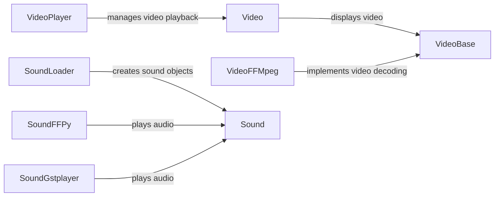

## Component Details

The Multimedia Support component in Kivy enables the integration of audio and video playback functionalities into applications. It provides a high-level interface for developers to easily incorporate multimedia content, manage playback controls, and handle various media formats. The core of the component relies on abstract classes for video and audio providers, which are then implemented using different backends like FFMpeg, GStreamer, ffpyplayer, and platform-specific APIs like Android's media player. This architecture allows for flexibility and cross-platform compatibility in multimedia handling.

### Video
The Video widget is a user interface element that displays a video file. It manages the video source, playback state, and texture updates to render the video frames on the screen. It relies on a VideoBase provider to handle the actual video decoding and playback.
- **Related Classes/Methods**: `kivy.uix.video.Video`

### VideoPlayer
The VideoPlayer widget provides a complete video playback interface, including controls for play/pause, volume, seeking, and fullscreen. It encapsulates the Video widget and adds a set of interactive controls for users to manage the video playback experience.
- **Related Classes/Methods**: `kivy.uix.videoplayer.VideoPlayer`

### VideoBase
VideoBase is an abstract base class for video providers. It defines the common interface for video loading, playback, and control operations. Concrete video providers, such as VideoFFMpeg, VideoGstplayer, and VideoFFPy, inherit from this class and implement the platform-specific video decoding and playback logic.
- **Related Classes/Methods**: `kivy.core.video.VideoBase`

### VideoFFMpeg
VideoFFMpeg is a video provider that utilizes the FFMpeg library for video decoding and playback. It implements the VideoBase interface and provides a concrete implementation for handling video playback using FFMpeg's capabilities.
- **Related Classes/Methods**: `kivy.core.video.video_ffmpeg.VideoFFMpeg`

### Sound
Sound is a base class for representing a sound object. It manages the audio source and provides methods for controlling playback, such as play, stop, pause, and seek. Concrete sound providers, such as SoundFFPy, SoundGstplayer and SoundAndroidPlayer, inherit from this class and implement the platform-specific audio decoding and playback logic.
- **Related Classes/Methods**: `kivy.core.audio_output.Sound`

### SoundLoader
SoundLoader is responsible for loading audio files and creating Sound objects. It acts as a factory for creating sound instances from various audio file formats. It determines the appropriate sound provider based on the platform and available libraries.
- **Related Classes/Methods**: `kivy.core.audio_output.SoundLoader`

### SoundFFPy
SoundFFPy is an audio player that utilizes the ffpyplayer library for audio decoding and playback. It implements the Sound interface and provides a concrete implementation for handling audio playback using ffpyplayer's capabilities.
- **Related Classes/Methods**: `kivy.core.audio_output.audio_ffpyplayer.SoundFFPy`

### SoundGstplayer
SoundGstplayer is an audio player that utilizes the GStreamer library for audio decoding and playback. It implements the Sound interface and provides a concrete implementation for handling audio playback using GStreamer's capabilities.
- **Related Classes/Methods**: `kivy.core.audio_output.audio_gstplayer.SoundGstplayer`
