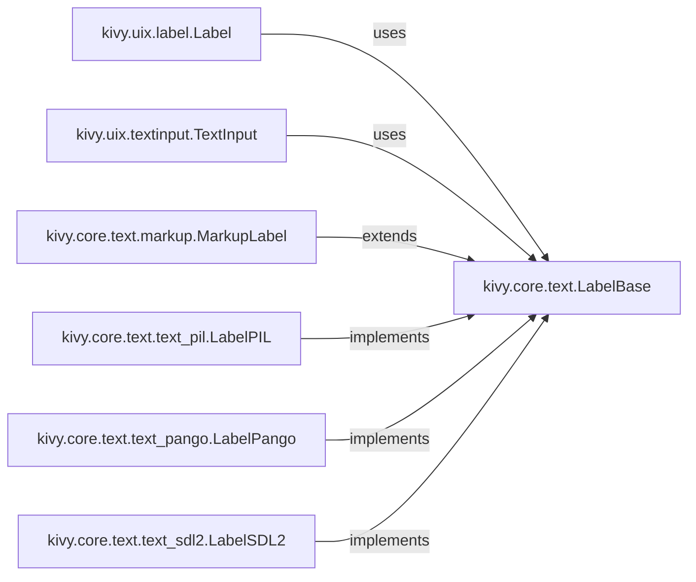

## Component Details

The Text Rendering Engine in Kivy is responsible for displaying text within the application. It provides a consistent interface for rendering text across different platforms and devices, abstracting away the complexities of underlying text rendering libraries. The engine supports various fonts, text styles, and text layout options, and it allows for text formatting using a simple markup language. The main flow involves widgets like Label and TextInput utilizing LabelBase and its implementations (LabelPIL, LabelPango, LabelSDL2) to render text. MarkupLabel extends this functionality by adding support for text formatting using a markup language.

### kivy.uix.label.Label
The Label widget displays text on the screen. It handles text formatting, alignment, and rendering. It uses a LabelBase core object to manage the actual text rendering.
- **Related Classes/Methods**: `kivy/uix/label.py`

### kivy.uix.textinput.TextInput
The TextInput widget allows users to enter and edit text. It handles keyboard input, cursor movement, text selection, and scrolling. It also manages the visual representation of the text, including the cursor and selection highlights, relying on LabelBase for rendering.
- **Related Classes/Methods**: `kivy/uix/textinput.py`

### kivy.core.text.LabelBase
LabelBase is an abstract class that provides the core functionality for rendering text. It handles font management, text shaping, and texture creation. Different implementations of LabelBase exist for different text rendering backends (e.g., PIL, Pango, SDL2).
- **Related Classes/Methods**: `kivy/core/text/__init__.py`

### kivy.core.text.markup.MarkupLabel
MarkupLabel extends LabelBase to support text formatting using a simple markup language. It parses the markup and applies the corresponding styles to the text, providing rich text formatting capabilities.
- **Related Classes/Methods**: `kivy/core/text/markup.py`

### kivy.core.text.text_pil.LabelPIL
LabelPIL is a concrete implementation of LabelBase that uses the Python Imaging Library (PIL) for text rendering. It provides a simple and portable text rendering solution, suitable for platforms where other backends are not available.
- **Related Classes/Methods**: `kivy/core/text/text_pil.py`

### kivy.core.text.text_pango.LabelPango
LabelPango is a concrete implementation of LabelBase that uses the Pango library for text rendering. Pango provides advanced text shaping and internationalization support, enabling the rendering of complex scripts and languages.
- **Related Classes/Methods**: `kivy/core/text/text_pango.py`

### kivy.core.text.text_sdl2.LabelSDL2
LabelSDL2 is a concrete implementation of LabelBase that uses the SDL2 library for text rendering. It provides hardware-accelerated text rendering, potentially improving performance on platforms that support SDL2.
- **Related Classes/Methods**: `kivy/core/text/text_sdl2.py`
