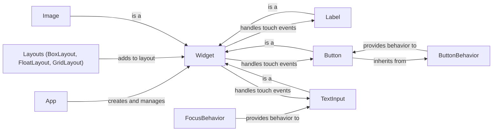

## Component Details

The UI Element System in Kivy provides a comprehensive set of pre-built UI elements (widgets) that developers can use to construct interactive user interfaces. These elements, ranging from basic widgets like buttons and labels to more complex layouts, offer a high degree of customization and reusability. The system also incorporates behaviors, which can be mixed into widgets to extend their functionality, promoting a flexible and modular approach to UI development. The core of the system revolves around the Widget class, which serves as the foundation for all UI elements, providing essential features for drawing, event handling, and layout management.

### App
The App class serves as the entry point and manager for a Kivy application. It handles the application lifecycle, including initialization, UI loading, and event processing. It's responsible for creating the main window and managing the overall application flow.
- **Related Classes/Methods**: `kivy.kivy.app.App`

### Widget
The Widget class is the fundamental building block for all UI elements in Kivy. It provides the basic functionality for drawing, event handling (touch, keyboard, etc.), and layout management. All visual components inherit from Widget, inheriting its core properties and methods.
- **Related Classes/Methods**: `kivy.kivy.uix.widget.Widget`

### Label
The Label class is a widget that displays text on the screen. It handles text rendering, font management, and text formatting. It allows developers to easily present textual information within the application's UI.
- **Related Classes/Methods**: `kivy.kivy.uix.label.Label`

### Button
The Button class is a clickable UI element that triggers an action when pressed. It inherits from both Widget and ButtonBehavior, combining visual representation with button-specific behavior.
- **Related Classes/Methods**: `kivy.kivy.uix.button.Button`

### Layouts (BoxLayout, FloatLayout, GridLayout)
Layout classes (BoxLayout, FloatLayout, and GridLayout) are container widgets that manage the arrangement of their child widgets. BoxLayout arranges widgets in a single row or column, FloatLayout allows for absolute or relative positioning, and GridLayout arranges widgets in a grid structure. These layouts provide different strategies for organizing UI elements.
- **Related Classes/Methods**: `kivy.kivy.uix.boxlayout.BoxLayout`, `kivy.kivy.uix.floatlayout.FloatLayout`, `kivy.kivy.uix.gridlayout.GridLayout`

### TextInput
The TextInput class provides a text input field where users can enter and edit text. It handles keyboard input, text selection, and text manipulation. It's often used for forms, search bars, and other text-based interactions.
- **Related Classes/Methods**: `kivy.kivy.uix.textinput.TextInput`

### Image
The Image class displays images on the screen. It supports various image formats and provides options for scaling and positioning images within the UI.
- **Related Classes/Methods**: `kivy.kivy.uix.image.Image`

### ButtonBehavior
The ButtonBehavior class provides button-like behavior (e.g., responding to touch events) to widgets. It can be mixed into other widgets to easily add button functionality without having to reimplement the event handling logic.
- **Related Classes/Methods**: `kivy.kivy.uix.behaviors.button.ButtonBehavior`

### FocusBehavior
The FocusBehavior class provides keyboard focus behavior to widgets, enabling them to receive keyboard input when focused. It's commonly used with TextInput and other interactive widgets.
- **Related Classes/Methods**: `kivy.kivy.uix.behaviors.focus.FocusBehavior`
