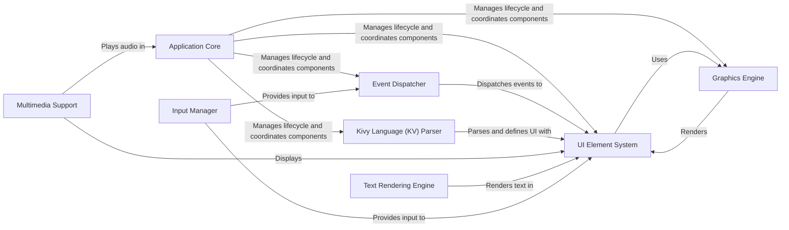

## Component Details

Kivy is a framework for building graphical user interfaces (GUIs) and other multi-touch applications. The core flow involves the Application Core managing the application lifecycle, the Input Manager handling user input, the Event Dispatcher routing events to UI elements, the UI Element System providing pre-built widgets, the Graphics Engine rendering the UI, the Kivy Language (KV) Parser defining the UI, the Multimedia Support playing audio and video, and the Text Rendering Engine displaying text.

### Application Core
The Application Core is responsible for managing the lifecycle of a Kivy application. This includes initialization, running the main event loop, loading Kivy configuration, and handling application termination. It serves as the central point for coordinating other components and ensuring the application runs smoothly.
- **Related Classes/Methods**: `kivy.kivy.app.App`, `kivy.kivy.base.runTouchApp`, `kivy.kivy.base.stopTouchApp`, `kivy.kivy.config.ConfigParser`, `kivy.kivy.clock.ClockBase`

### Input Manager
The Input Manager handles all input events, including touch, mouse, and keyboard. It processes and normalizes these events, making them available to the Event Dispatcher and UI elements for interaction. It also includes post-processing steps like calibration and de-jittering to improve input accuracy.
- **Related Classes/Methods**: `kivy.kivy.input.motionevent.MotionEvent`, `kivy.kivy.input.factory.MotionEventFactory`, `kivy.kivy.input.provider.MotionEventProvider`, `kivy.kivy.input.postproc.InputPostprocCalibration`, `kivy.kivy.input.postproc.InputPostprocDejitter`, `kivy.kivy.input.postproc.InputPostprocDoubleTap`, `kivy.kivy.input.providers`

### Event Dispatcher
The Event Dispatcher manages the flow of events within the Kivy application. It receives input events from the Input Manager and dispatches them to the appropriate UI elements. It is a central component for handling user interactions and application logic, ensuring that events are delivered to the correct recipients.
- **Related Classes/Methods**: `kivy.kivy.base.EventLoopBase`, `kivy.kivy.base.dispatch_input`, `kivy.kivy.eventmanager.EventManagerBase`

### UI Element System
The UI Element System provides a set of pre-built UI elements (widgets) such as buttons, labels, layouts, and more. These elements can be arranged and customized to create the application's user interface. It also includes behaviors that can be mixed into widgets to add functionality, allowing for flexible and reusable UI components.
- **Related Classes/Methods**: `kivy.kivy.uix.widget.Widget`, `kivy.kivy.uix.label.Label`, `kivy.kivy.uix.button.Button`, `kivy.kivy.uix.boxlayout.BoxLayout`, `kivy.kivy.uix.floatlayout.FloatLayout`, `kivy.kivy.uix.gridlayout.GridLayout`, `kivy.kivy.uix.textinput.TextInput`, `kivy.kivy.uix.image.Image`, `kivy.kivy.uix.behaviors.button.ButtonBehavior`, `kivy.kivy.uix.behaviors.focus.FocusBehavior`

### Graphics Engine
The Graphics Engine is responsible for rendering the UI elements and other graphical content on the screen. It provides drawing primitives, texture management, and shader support. It uses OpenGL for hardware-accelerated rendering, ensuring smooth and efficient performance.
- **Related Classes/Methods**: `kivy.kivy.graphics`, `kivy.kivy.core.image.Image`, `kivy.kivy.core.image.ImageLoader`, `kivy.kivy.core.window.WindowBase`

### Kivy Language (KV) Parser
The Kivy Language (KV) Parser is responsible for parsing KV files, which are used to define the user interface and bind UI elements to application logic. It allows developers to create reusable UI templates and easily customize the appearance and behavior of widgets, promoting a declarative approach to UI development.
- **Related Classes/Methods**: `kivy.kivy.lang.builder.BuilderBase`, `kivy.kivy.lang.parser.Parser`, `kivy.kivy.lang.parser.ParserRule`, `kivy.kivy.lang.parser.ParserRuleProperty`

### Multimedia Support
The Multimedia Support component provides functionality for playing audio and video within the Kivy application. It supports various formats and provides controls for playback, volume, and seeking. This allows developers to easily integrate multimedia content into their applications.
- **Related Classes/Methods**: `kivy.kivy.uix.video.Video`, `kivy.kivy.uix.videoplayer.VideoPlayer`, `kivy.kivy.core.video.VideoBase`, `kivy.kivy.core.video.video_ffmpeg.VideoFFMpeg`, `kivy.kivy.core.video.video_ffpyplayer.VideoFFPy`, `kivy.kivy.core.audio_output.Sound`, `kivy.kivy.core.audio_output.audio_ffpyplayer.SoundFFPy`, `kivy.kivy.core.audio_output.audio_gstplayer.SoundGstplayer`, `kivy.kivy.core.audio_output.audio_android.SoundAndroidPlayer`

### Text Rendering Engine
The Text Rendering Engine handles the display of text within the Kivy application. It supports various fonts, text styles, and text layout options. It uses different text providers (PIL, Pango, SDL3) to render text on different platforms, ensuring consistent text rendering across different devices.
- **Related Classes/Methods**: `kivy.kivy.core.text.LabelBase`, `kivy.kivy.core.text.text_pil.LabelPIL`, `kivy.kivy.core.text.text_pango.LabelPango`, `kivy.kivy.core.text.markup.MarkupLabel`