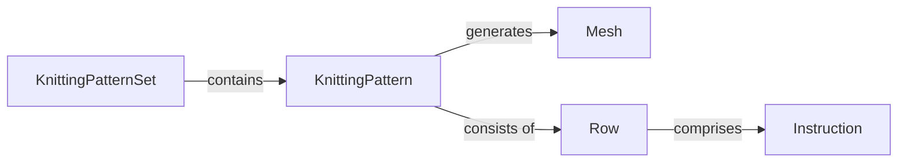

## Details

Updated analysis insights with source code references for KnittingPatternSet, KnittingPattern, and Mesh. Row and Instruction still need source code references.

### KnittingPatternSet
Represents a collection of knitting patterns.

**Related Classes/Methods**:

- <a href="https://github.com/fossasia/knittingpattern/blob/master/knittingpattern/KnittingPatternSet.py#L1-L100" target="_blank" rel="noopener noreferrer">`knittingpattern.KnittingPatternSet`:1-100</a>

### KnittingPattern
Defines a single knitting pattern.

**Related Classes/Methods**:

- <a href="https://github.com/fossasia/knittingpattern/blob/master/knittingpattern/KnittingPattern.py#L13-L86" target="_blank" rel="noopener noreferrer">`knittingpattern.KnittingPattern`:13-86</a>

### Mesh
Represents the knitted fabric structure.

**Related Classes/Methods**:

- <a href="https://github.com/fossasia/knittingpattern/blob/master/knittingpattern/Mesh.py#L1-L300" target="_blank" rel="noopener noreferrer">`knittingpattern.Mesh`:1-300</a>

### Row
Represents a single row in a knitting pattern.

**Related Classes/Methods**: _None_

### Instruction
Represents a single instruction in a knitting pattern.

**Related Classes/Methods**: _None_

### [FAQ](https://github.com/CodeBoarding/GeneratedOnBoardings/tree/main?tab=readme-ov-file#faq)