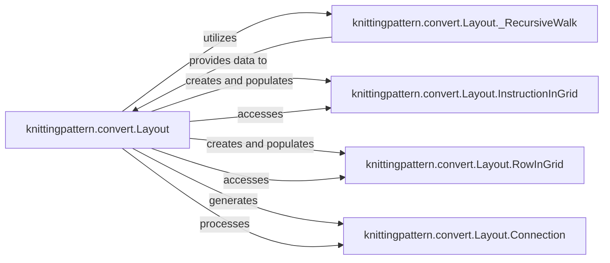

## Details

The `knittingpattern.convert` subsystem is centered around the `Layout` component, which orchestrates the spatial arrangement of knitting patterns. `Layout` utilizes `_RecursiveWalk` to systematically traverse the abstract pattern, receiving data that guides the placement process. As it processes the pattern, `Layout` creates and populates instances of `InstructionInGrid` and `RowInGrid`, which serve as internal data models representing the laid-out instructions and rows, respectively. `Layout` also accesses these grid components to refine the layout. Furthermore, `Layout` is responsible for generating `Connection` objects, which capture the spatial relationships between elements, and subsequently processes these connections to ensure accurate visualization of complex knitting structures.

### knittingpattern.convert.Layout
The orchestrator of the layout process. It takes the abstract knitting pattern and calculates the spatial arrangement of all its elements (stitches, rows, meshes) on a grid. It manages the recursive traversal of the pattern, places elements, expands meshes to prevent overlaps, and determines the overall bounding box. This component acts as the primary Converter from the abstract pattern to a concrete visual layout.

**Related Classes/Methods**:

- <a href="https://github.com/fossasia/knittingpattern/blob/master/knittingpattern/convert/Layout.py" target="_blank" rel="noopener noreferrer">`knittingpattern.convert.Layout`</a>
- <a href="https://github.com/fossasia/knittingpattern/blob/master/knittingpattern/convert/Layout.py#L195-L270" target="_blank" rel="noopener noreferrer">`knittingpattern.convert.Layout._RecursiveWalk`:195-270</a>
- <a href="https://github.com/fossasia/knittingpattern/blob/master/knittingpattern/convert/Layout.py#L100-L143" target="_blank" rel="noopener noreferrer">`knittingpattern.convert.Layout.InstructionInGrid`:100-143</a>
- <a href="https://github.com/fossasia/knittingpattern/blob/master/knittingpattern/convert/Layout.py#L146-L187" target="_blank" rel="noopener noreferrer">`knittingpattern.convert.Layout.RowInGrid`:146-187</a>
- <a href="https://github.com/fossasia/knittingpattern/blob/master/knittingpattern/convert/Layout.py" target="_blank" rel="noopener noreferrer">`knittingpattern.convert.Layout.Connection`</a>

### knittingpattern.convert.Layout._RecursiveWalk
A utility component that provides a structured mechanism for traversing the hierarchical abstract knitting pattern. It enables the Layout component to systematically access each row and instruction, ensuring all elements are considered for spatial placement. This component supports the Parser/Interpreter aspect by providing an iterable view of the pattern's structure.

**Related Classes/Methods**:

- <a href="https://github.com/fossasia/knittingpattern/blob/master/knittingpattern/convert/Layout.py#L195-L270" target="_blank" rel="noopener noreferrer">`knittingpattern.convert.Layout._RecursiveWalk`:195-270</a>

### knittingpattern.convert.Layout.InstructionInGrid
A data model component representing an individual knitting instruction (e.g., a stitch) after it has been processed and assigned spatial coordinates within the layout grid. It stores the instruction's position, size, and other layout-specific attributes. This is a key part of the Internal Data Model for the laid-out pattern.

**Related Classes/Methods**:

- <a href="https://github.com/fossasia/knittingpattern/blob/master/knittingpattern/convert/Layout.py#L100-L143" target="_blank" rel="noopener noreferrer">`knittingpattern.convert.Layout.InstructionInGrid`:100-143</a>

### knittingpattern.convert.Layout.RowInGrid
A data model component representing an entire row of knitting instructions after it has been processed and assigned spatial coordinates within the layout grid. It encapsulates the collective spatial attributes of a row. This is another crucial part of the Internal Data Model for the laid-out pattern.

**Related Classes/Methods**:

- <a href="https://github.com/fossasia/knittingpattern/blob/master/knittingpattern/convert/Layout.py#L146-L187" target="_blank" rel="noopener noreferrer">`knittingpattern.convert.Layout.RowInGrid`:146-187</a>

### knittingpattern.convert.Layout.Connection
A data model component that captures the spatial relationships and connections between different meshes or stitches within the laid-out pattern. This is vital for accurately visualizing how stitches interlock and for ensuring correct rendering of complex knitting structures. It extends the Internal Data Model to include relational spatial information.

**Related Classes/Methods**:

- <a href="https://github.com/fossasia/knittingpattern/blob/master/knittingpattern/convert/Layout.py" target="_blank" rel="noopener noreferrer">`knittingpattern.convert.Layout.Connection`</a>

### [FAQ](https://github.com/CodeBoarding/GeneratedOnBoardings/tree/main?tab=readme-ov-file#faq)