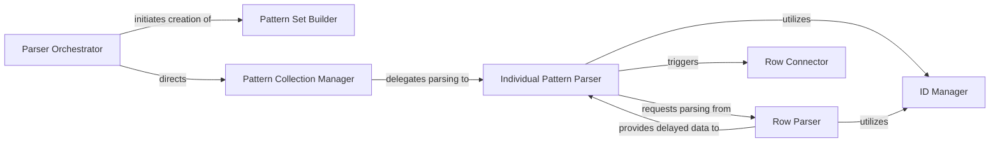

## Details

The `Pattern Parser` subsystem is primarily encapsulated within the `knittingpattern.Parser` module, specifically the `Parser.py` file. Its core responsibility is to interpret raw input data (typically JSON objects) and transform it into a canonical, structured internal knitting pattern data model, handling validation and data enrichment.

### Parser Orchestrator
Manages the overall parsing lifecycle, including initialization, state management, and providing entry points for parsing operations. It acts as the primary coordinator for the parsing process.

**Related Classes/Methods**:

- <a href="https://github.com/fossasia/knittingpattern/blob/master/knittingpattern/Parser.py#L76-L90" target="_blank" rel="noopener noreferrer">`knittingpattern.Parser.knitting_pattern_set`:76-90</a>
- <a href="https://github.com/fossasia/knittingpattern/blob/master/knittingpattern/Parser.py#L40-L49" target="_blank" rel="noopener noreferrer">`knittingpattern.Parser.__init__`:40-49</a>
- <a href="https://github.com/fossasia/knittingpattern/blob/master/knittingpattern/Parser.py#L51-L58" target="_blank" rel="noopener noreferrer">`knittingpattern.Parser._start`:51-58</a>
- <a href="https://github.com/fossasia/knittingpattern/blob/master/knittingpattern/Parser.py#L257-L266" target="_blank" rel="noopener noreferrer">`knittingpattern.Parser.default_parser`:257-266</a>

### Pattern Set Builder
Constructs the high-level structure of the knitting pattern set, including version and type validation, ensuring the input conforms to the expected schema.

**Related Classes/Methods**:

- <a href="https://github.com/fossasia/knittingpattern/blob/master/knittingpattern/Parser.py#L247-L254" target="_blank" rel="noopener noreferrer">`knittingpattern.Parser._create_pattern_set`:247-254</a>
- <a href="https://github.com/fossasia/knittingpattern/blob/master/knittingpattern/Parser.py#L231-L241" target="_blank" rel="noopener noreferrer">`knittingpattern.Parser._get_type`:231-241</a>
- <a href="https://github.com/fossasia/knittingpattern/blob/master/knittingpattern/Parser.py#L68-L74" target="_blank" rel="noopener noreferrer">`knittingpattern.Parser._error`:68-74</a>

### Pattern Collection Manager
Iterates through the input data to manage the parsing of individual patterns within a larger set, delegating the detailed parsing of each pattern.

**Related Classes/Methods**:

- <a href="https://github.com/fossasia/knittingpattern/blob/master/knittingpattern/Parser.py#L138-L143" target="_blank" rel="noopener noreferrer">`knittingpattern.Parser._fill_pattern_collection`:138-143</a>

### Individual Pattern Parser
Parses the intricate details of a single knitting pattern, including its rows, and handles post-processing steps like instruction finalization and inheritance resolution.

**Related Classes/Methods**:

- <a href="https://github.com/fossasia/knittingpattern/blob/master/knittingpattern/Parser.py#L174-L182" target="_blank" rel="noopener noreferrer">`knittingpattern.Parser._pattern`:174-182</a>
- <a href="https://github.com/fossasia/knittingpattern/blob/master/knittingpattern/Parser.py#L184-L192" target="_blank" rel="noopener noreferrer">`knittingpattern.Parser.new_pattern`:184-192</a>
- <a href="https://github.com/fossasia/knittingpattern/blob/master/knittingpattern/Parser.py#L107-L112" target="_blank" rel="noopener noreferrer">`knittingpattern.Parser._finish_instructions`:107-112</a>
- <a href="https://github.com/fossasia/knittingpattern/blob/master/knittingpattern/Parser.py#L92-L97" target="_blank" rel="noopener noreferrer">`knittingpattern.Parser._finish_inheritance`:92-97</a>

### Row Parser
Focuses on parsing individual rows and their specific elements, including marking certain data for delayed processing (e.g., instructions or inheritance that depend on other parsed elements).

**Related Classes/Methods**:

- <a href="https://github.com/fossasia/knittingpattern/blob/master/knittingpattern/Parser.py#L194-L199" target="_blank" rel="noopener noreferrer">`knittingpattern.Parser._rows`:194-199</a>
- <a href="https://github.com/fossasia/knittingpattern/blob/master/knittingpattern/Parser.py#L145-L153" target="_blank" rel="noopener noreferrer">`knittingpattern.Parser._row`:145-153</a>
- <a href="https://github.com/fossasia/knittingpattern/blob/master/knittingpattern/Parser.py#L114-L120" target="_blank" rel="noopener noreferrer">`knittingpattern.Parser._delay_instructions`:114-120</a>
- <a href="https://github.com/fossasia/knittingpattern/blob/master/knittingpattern/Parser.py#L99-L105" target="_blank" rel="noopener noreferrer">`knittingpattern.Parser._delay_inheritance`:99-105</a>

### Row Connector
Establishes logical connections and relationships between parsed rows, crucial for building the complete pattern structure.

**Related Classes/Methods**:

- <a href="https://github.com/fossasia/knittingpattern/blob/master/knittingpattern/Parser.py#L201-L229" target="_blank" rel="noopener noreferrer">`knittingpattern.Parser._connect_rows`:201-229</a>

### ID Manager
Provides a utility for standardizing and converting elements to internal identifiers, ensuring data consistency and uniqueness within the parsed data model.

**Related Classes/Methods**:

- <a href="https://github.com/fossasia/knittingpattern/blob/master/knittingpattern/Parser.py#L60-L66" target="_blank" rel="noopener noreferrer">`knittingpattern.Parser._to_id`:60-66</a>

### [FAQ](https://github.com/CodeBoarding/GeneratedOnBoardings/tree/main?tab=readme-ov-file#faq)