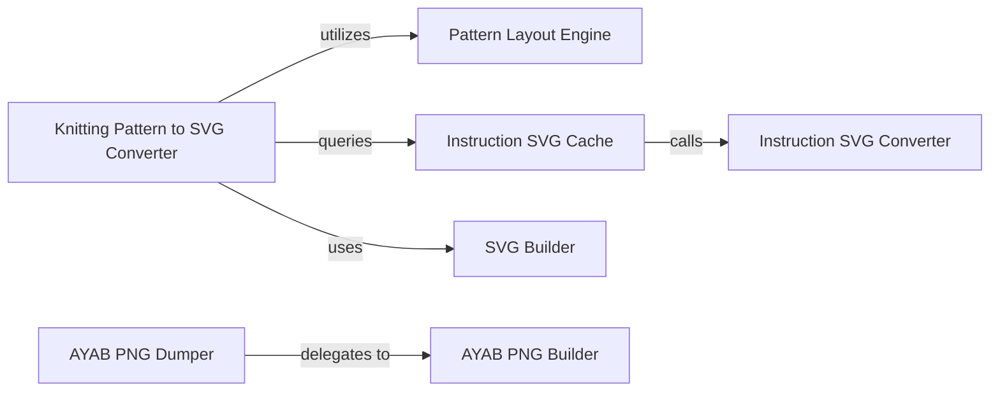

## Details

The Visual Output Converters subsystem is primarily defined by the knittingpattern.convert package, encompassing modules responsible for transforming the internal knitting pattern data model into visual formats.

### Knitting Pattern to SVG Converter
Orchestrates the conversion of an entire knitting pattern into a complete SVG document. It manages the overall SVG structure, registers individual instruction SVGs as definitions, and places them according to the pattern's layout.

**Related Classes/Methods**:

- <a href="https://github.com/fossasia/knittingpattern/blob/master/knittingpattern/convert/KnittingPatternToSVG.py" target="_blank" rel="noopener noreferrer">`knittingpattern.convert.KnittingPatternToSVG`</a>

### Instruction SVG Converter
Converts individual knitting instructions into their specific SVG dictionary representations, handling visual styling and geometric details for each instruction type.

**Related Classes/Methods**:

- <a href="https://github.com/fossasia/knittingpattern/blob/master/knittingpattern/convert/InstructionToSVG.py" target="_blank" rel="noopener noreferrer">`knittingpattern.convert.InstructionToSVG`</a>

### Instruction SVG Cache
Caches the SVG representations of individual knitting instructions to optimize performance by avoiding redundant generation.

**Related Classes/Methods**:

- <a href="https://github.com/fossasia/knittingpattern/blob/master/knittingpattern/convert/InstructionSVGCache.py" target="_blank" rel="noopener noreferrer">`knittingpattern.convert.InstructionSVGCache`</a>

### SVG Builder
A low-level utility component for programmatically constructing and manipulating SVG elements, such as placing `use` tags, defining symbols, and managing layers within an SVG document.

**Related Classes/Methods**:

- <a href="https://github.com/fossasia/knittingpattern/blob/master/knittingpattern/convert/SVGBuilder.py" target="_blank" rel="noopener noreferrer">`knittingpattern.convert.SVGBuilder`</a>

### AYAB PNG Dumper
Converts the knitting pattern into a PNG image format specifically tailored for AYAB knitting machines. This is the high-level entry point for AYAB output.

**Related Classes/Methods**:

- <a href="https://github.com/fossasia/knittingpattern/blob/master/knittingpattern/convert/AYABPNGDumper.py" target="_blank" rel="noopener noreferrer">`knittingpattern.convert.AYABPNGDumper`</a>

### AYAB PNG Builder
Handles the low-level pixel manipulation, color conversion, and image construction necessary to generate the AYAB PNG image from the pattern data.

**Related Classes/Methods**:

- <a href="https://github.com/fossasia/knittingpattern/blob/master/knittingpattern/convert/AYABPNGBuilder.py" target="_blank" rel="noopener noreferrer">`knittingpattern.convert.AYABPNGBuilder`</a>

### Pattern Layout Engine
Manages the spatial arrangement of knitting instructions on a grid, calculating positions, bounding boxes, and handling connections. While a separate component, it is critical for the visual output process by providing spatial information.

**Related Classes/Methods**:

- <a href="https://github.com/fossasia/knittingpattern/blob/master/knittingpattern/convert/Layout.py" target="_blank" rel="noopener noreferrer">`knittingpattern.convert.Layout`</a>

### [FAQ](https://github.com/CodeBoarding/GeneratedOnBoardings/tree/main?tab=readme-ov-file#faq)