```mermaid
graph LR
    Pattern_Loader["Pattern Loader"]
    Pattern_Parser["Pattern Parser"]
    Knitting_Pattern_Data_Model["Knitting Pattern Data Model"]
    Instruction_Library["Instruction Library"]
    Layout_Engine["Layout Engine"]
    Visual_Output_Converters["Visual Output Converters"]
    Generic_Data_Dumpers["Generic Data Dumpers"]
    Pattern_Loader -- "Provides Raw Data To" --> Pattern_Parser
    Pattern_Parser -- "Constructs/Populates" --> Knitting_Pattern_Data_Model
    Pattern_Parser -- "Utilizes" --> Instruction_Library
    Knitting_Pattern_Data_Model -- "Provides Pattern Data To" --> Layout_Engine
    Knitting_Pattern_Data_Model -- "Provides Pattern Data To" --> Visual_Output_Converters
    Knitting_Pattern_Data_Model -- "Provides Pattern Data To" --> Generic_Data_Dumpers
    Instruction_Library -- "Provides Instruction Definitions To" --> Pattern_Parser
    Layout_Engine -- "Provides Layout Information To" --> Visual_Output_Converters
    click Pattern_Loader href "https://github.com/CodeBoarding/GeneratedOnBoardings/blob/main/knittingpattern/Pattern_Loader.md" "Details"
    click Pattern_Parser href "https://github.com/CodeBoarding/GeneratedOnBoardings/blob/main/knittingpattern/Pattern_Parser.md" "Details"
    click Knitting_Pattern_Data_Model href "https://github.com/CodeBoarding/GeneratedOnBoardings/blob/main/knittingpattern/Knitting_Pattern_Data_Model.md" "Details"
    click Layout_Engine href "https://github.com/CodeBoarding/GeneratedOnBoardings/blob/main/knittingpattern/Layout_Engine.md" "Details"
    click Visual_Output_Converters href "https://github.com/CodeBoarding/GeneratedOnBoardings/blob/main/knittingpattern/Visual_Output_Converters.md" "Details"
    click Generic_Data_Dumpers href "https://github.com/CodeBoarding/GeneratedOnBoardings/blob/main/knittingpattern/Generic_Data_Dumpers.md" "Details"
```

## Details

The `knittingpattern` project functions as a specialized Domain-Specific Language (DSL) parser and converter for knitting patterns, embodying a clear pipeline architecture. The process begins with the **Pattern Loader** ingesting raw pattern data from various sources. This raw data is then fed to the **Pattern Parser**, which interprets it and, with the aid of the **Instruction Library** for instruction definitions, constructs the canonical **Knitting Pattern Data Model**. This central data model serves as the single source of truth for the knitting pattern. From this core model, data flows to two distinct output pathways: the **Layout Engine** calculates spatial arrangements for visual representation, which then informs the **Visual Output Converters** to generate formats like SVG and PNG; concurrently, the **Generic Data Dumpers** serialize the pattern into standard data exchange formats such as JSON and XML. This modular design ensures clear separation of concerns, facilitating extensibility for new input, output, or instruction types.

### Pattern Loader [[Expand]](./Pattern_Loader.md)
Responsible for ingesting raw knitting pattern data from various external sources (files, strings, URLs). It acts as the primary entry point for data into the system.

**Related Classes/Methods**:

- <a href="https://github.com/fossasia/knittingpattern/blob/master/knittingpattern/Loader.py" target="_blank" rel="noopener noreferrer">`Pattern Loader`</a>
- <a href="https://github.com/fossasia/knittingpattern/blob/master/knittingpattern/__init__.py" target="_blank" rel="noopener noreferrer">`Pattern Loader`</a>

### Pattern Parser [[Expand]](./Pattern_Parser.md)
Interprets the raw input data (typically JSON objects) and constructs the canonical, structured internal knitting pattern data model. It handles the validation and transformation of input specifications into rich data objects.

**Related Classes/Methods**:

- <a href="https://github.com/fossasia/knittingpattern/blob/master/knittingpattern/Parser.py" target="_blank" rel="noopener noreferrer">`Pattern Parser`</a>

### Knitting Pattern Data Model [[Expand]](./Knitting_Pattern_Data_Model.md)
The core, format-agnostic representation of a knitting pattern. This component encapsulates the entire structure of a pattern, including sets, individual patterns, rows, instructions, and meshes, along with their interconnections. It serves as the central data hub for all operations.

**Related Classes/Methods**:

- <a href="https://github.com/fossasia/knittingpattern/blob/master/knittingpattern/KnittingPatternSet.py" target="_blank" rel="noopener noreferrer">`Knitting Pattern Data Model`</a>
- <a href="https://github.com/fossasia/knittingpattern/blob/master/knittingpattern/KnittingPattern.py" target="_blank" rel="noopener noreferrer">`Knitting Pattern Data Model`</a>
- <a href="https://github.com/fossasia/knittingpattern/blob/master/knittingpattern/Row.py" target="_blank" rel="noopener noreferrer">`Knitting Pattern Data Model`</a>
- <a href="https://github.com/fossasia/knittingpattern/blob/master/knittingpattern/Instruction.py" target="_blank" rel="noopener noreferrer">`Knitting Pattern Data Model`</a>
- <a href="https://github.com/fossasia/knittingpattern/blob/master/knittingpattern/Mesh.py" target="_blank" rel="noopener noreferrer">`Knitting Pattern Data Model`</a>

### Instruction Library
A registry and management system for predefined knitting instructions. It provides a standardized way to define, retrieve, and validate instruction types and their properties, used during parsing and rendering.

**Related Classes/Methods**:

- <a href="https://github.com/fossasia/knittingpattern/blob/master/knittingpattern/InstructionLibrary.py" target="_blank" rel="noopener noreferrer">`Instruction Library`</a>

### Layout Engine [[Expand]](./Layout_Engine.md)
Calculates the spatial arrangement and positioning of knitting pattern elements (e.g., stitches, rows) on a grid or canvas. This is a crucial step for visual rendering, determining how the abstract pattern translates into a visual layout.

**Related Classes/Methods**:

- <a href="https://github.com/fossasia/knittingpattern/blob/master/knittingpattern/convert/Layout.py" target="_blank" rel="noopener noreferrer">`Layout Engine`</a>

### Visual Output Converters [[Expand]](./Visual_Output_Converters.md)
Transforms the internal Knitting Pattern Data Model into various visual formats, such as SVG for web display or PNG for specific machine interfaces (e.g., AYAB). This component leverages the Layout Engine for spatial information.

**Related Classes/Methods**:

- <a href="https://github.com/fossasia/knittingpattern/blob/master/knittingpattern/convert/KnittingPatternToSVG.py" target="_blank" rel="noopener noreferrer">`Visual Output Converters`</a>
- <a href="https://github.com/fossasia/knittingpattern/blob/master/knittingpattern/convert/InstructionToSVG.py" target="_blank" rel="noopener noreferrer">`Visual Output Converters`</a>
- <a href="https://github.com/fossasia/knittingpattern/blob/master/knittingpattern/convert/InstructionSVGCache.py" target="_blank" rel="noopener noreferrer">`Visual Output Converters`</a>
- <a href="https://github.com/fossasia/knittingpattern/blob/master/knittingpattern/convert/SVGBuilder.py" target="_blank" rel="noopener noreferrer">`Visual Output Converters`</a>
- <a href="https://github.com/fossasia/knittingpattern/blob/master/knittingpattern/convert/AYABPNGDumper.py" target="_blank" rel="noopener noreferrer">`Visual Output Converters`</a>
- <a href="https://github.com/fossasia/knittingpattern/blob/master/knittingpattern/convert/AYABPNGBuilder.py" target="_blank" rel="noopener noreferrer">`Visual Output Converters`</a>

### Generic Data Dumpers [[Expand]](./Generic_Data_Dumpers.md)
Serializes the internal Knitting Pattern Data Model into standard data exchange formats like JSON and XML, enabling interoperability and persistence.

**Related Classes/Methods**:

- <a href="https://github.com/fossasia/knittingpattern/blob/master/knittingpattern/Dumper/json.py" target="_blank" rel="noopener noreferrer">`Generic Data Dumpers`</a>
- <a href="https://github.com/fossasia/knittingpattern/blob/master/knittingpattern/Dumper/xml.py" target="_blank" rel="noopener noreferrer">`Generic Data Dumpers`</a>
- <a href="https://github.com/fossasia/knittingpattern/blob/master/knittingpattern/Dumper/file.py" target="_blank" rel="noopener noreferrer">`Generic Data Dumpers`</a>

### [FAQ](https://github.com/CodeBoarding/GeneratedOnBoardings/tree/main?tab=readme-ov-file#faq)