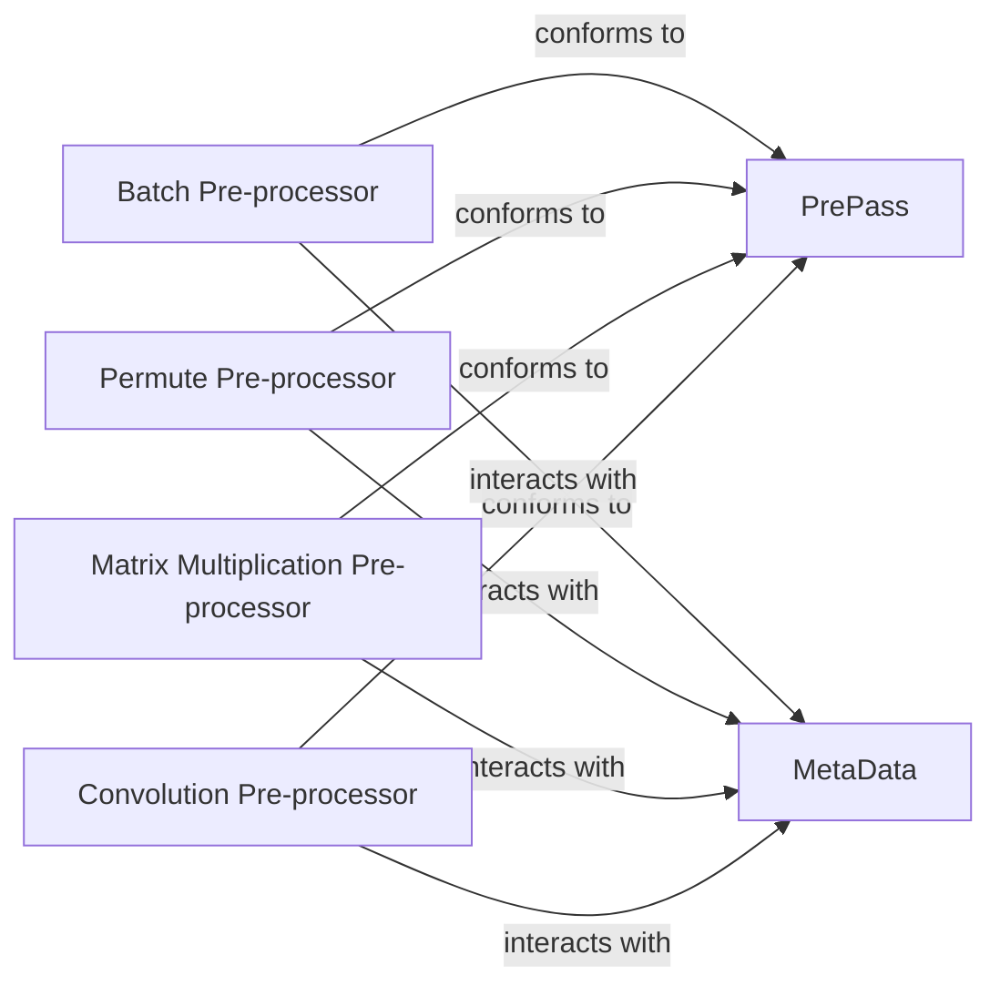

## Details

The Koila pre-processing subsystem is designed around the `PrePass` concept, which serves as a flexible contract for various computational graph transformations. Concrete pre-processors, such as `Batch Pre-processor`, `Permute Pre-processor`, `Matrix Multiplication Pre-processor`, and `Convolution Pre-processor`, are functions that conform to this `PrePass` contract. These pre-processors are responsible for analyzing and modifying tensor metadata, which is centrally managed by the `MetaData` component. The primary interaction pathway involves each concrete pre-processor reading from and updating the `MetaData` to ensure accurate shape, batch, and type information propagates through the computational graph, optimizing operations for efficiency and correctness. This architecture allows for extensible and specialized pre-processing steps while maintaining a consistent interface.

### PrePass
Defines the common interface and abstract structure for all pre-processing steps. It acts as an orchestrator, ensuring a consistent approach to applying various transformations to the computational graph's metadata. This component is fundamental as it establishes the contract for all specific pre-processing operations. Clarification: `PrePass` is likely a conceptual interface or a callable that concrete pre-processor functions conform to, rather than a traditional abstract class that they inherit from. The "implements" relationship should be understood as "conforms to the `PrePass` contract" or "is a `PrePass` callable."

**Related Classes/Methods**:

- <a href="https://github.com/rentruewang/koila/blob/main/src/koila/lazy.py" target="_blank" rel="noopener noreferrer">`PrePass`</a>

### MetaData
Manages and stores critical metadata (e.g., shapes, batch dimensions, data types, device information) for tensors within the computational graph. It serves as the central information repository that all pre-pass functions interact with to read and update tensor properties, making it indispensable for data flow within the subsystem.

**Related Classes/Methods**:

- <a href="https://github.com/rentruewang/koila/blob/main/src/koila/prepasses.py" target="_blank" rel="noopener noreferrer">`MetaData`</a>

### Batch Pre-processor
Specifically infers and propagates batch dimension information across the computational graph. This is crucial for Koila's memory optimization goals and ensuring correct batched operations, making it a distinct and vital pre-processing step. Correction: The provided line range (31:32) for `batch` in `koila.eager.py` is too narrow and likely points to a decorator or function signature rather than the core logic. A more accurate source reference for the core implementation logic is needed to fully understand its responsibilities.

**Related Classes/Methods**:

- <a href="https://github.com/rentruewang/koila/blob/main/src/koila/eager.py#L31-L32" target="_blank" rel="noopener noreferrer">`batch`:31-32</a>

### Permute Pre-processor
A concrete pre-pass function responsible for handling the reordering of tensor dimensions. It conforms to the `PrePass` contract and is a representative example of general tensor manipulation within the subsystem.

**Related Classes/Methods**:

- <a href="https://github.com/rentruewang/koila/blob/main/src/koila/shapes.py#L79-L95" target="_blank" rel="noopener noreferrer">`permute`:79-95</a>

### Matrix Multiplication Pre-processor
Analyzes and transforms shapes specifically for matrix multiplication operations, ensuring compatibility and efficiency before actual computation. It conforms to the `PrePass` contract, highlighting the subsystem's ability to handle operation-specific shape requirements.

**Related Classes/Methods**:

- <a href="https://github.com/rentruewang/koila/blob/main/src/koila/shapes.py#L143-L190" target="_blank" rel="noopener noreferrer">`matmul`:143-190</a>

### Convolution Pre-processor
Manages shape and dimension transformations related to convolutional operations, which are fundamental in Convolutional Neural Networks (CNNs). It conforms to the `PrePass` contract, demonstrating the subsystem's support for complex neural network operations.

**Related Classes/Methods**:

- <a href="https://github.com/rentruewang/koila/blob/main/src/koila/prepasses.py#L468-L506" target="_blank" rel="noopener noreferrer">`conv`:468-506</a>

### [FAQ](https://github.com/CodeBoarding/GeneratedOnBoardings/tree/main?tab=readme-ov-file#faq)