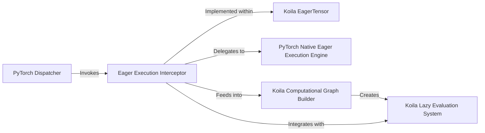

## Details

The Koila Eager Execution Subsystem seamlessly integrates Koila's lazy evaluation capabilities with PyTorch's eager execution model. At its core, the `Koila EagerTensor` acts as a custom tensor type that wraps standard PyTorch tensors. This `EagerTensor` overrides the `__torch_function__` method, which serves as the `Eager Execution Interceptor`. When PyTorch's `PyTorch Dispatcher` encounters an operation involving an `EagerTensor`, it invokes this interceptor. The interceptor then intelligently decides whether to delegate the operation to the `PyTorch Native Eager Execution Engine` for immediate computation or to feed it into the `Koila Computational Graph Builder` to construct a lazy computational graph, which is then managed by the `Koila Lazy Evaluation System`. This design allows Koila to selectively apply lazy evaluation, optimizing performance while maintaining compatibility with PyTorch's familiar eager paradigm.

### Koila EagerTensor
The custom tensor type in Koila that wraps standard PyTorch tensors. It is fundamental to Koila's lazy evaluation, as it overrides the `__torch_function__` method to enable the interception of PyTorch operations.

**Related Classes/Methods**:

- <a href="https://github.com/rentruewang/koila/blob/main/src/koila/eager.py#L24-L64" target="_blank" rel="noopener noreferrer">`src.koila.eager.eagertensor`:24-64</a>

### Eager Execution Interceptor [[Expand]](./Eager_Execution_Interceptor.md)
This component, specifically implemented as the `__torch_function__` method within `koila.eager.EagerTensor`, serves as the critical interception point for integrating Koila's lazy evaluation system with PyTorch's eager execution mode. It transparently intercepts PyTorch operations involving `EagerTensor` instances, deciding whether to build a computational node for Koila's lazy graph or to delegate the operation back to PyTorch's native eager execution.

**Related Classes/Methods**:

### PyTorch Dispatcher
PyTorch's internal mechanism responsible for routing tensor operations. When an operation involves a custom tensor type like `EagerTensor`, the Dispatcher invokes the `__torch_function__` method of that custom tensor. (Note: This is an external PyTorch component, no Koila source code reference is applicable.)

**Related Classes/Methods**: _None_

### PyTorch Native Eager Execution Engine
The core PyTorch engine for immediate execution of tensor operations. The `Eager Execution Interceptor` delegates operations to this engine when Koila determines that lazy evaluation is not required or applicable for a given operation. (Note: This is an external PyTorch component, no Koila source code reference is applicable.)

**Related Classes/Methods**: _None_

### Koila Computational Graph Builder
This component is responsible for constructing and managing the computational graph that represents the lazy operations within Koila. The `Eager Execution Interceptor` feeds operations into this builder when it decides to incorporate them into Koila's lazy evaluation system.

**Related Classes/Methods**:

- <a href="https://github.com/rentruewang/koila/blob/main/src/koila/lazy.py#L153-L441" target="_blank" rel="noopener noreferrer">`src.koila.lazy.LazyTensor`:153-441</a>

### Koila Lazy Evaluation System
The overarching system in Koila responsible for managing, optimizing, and executing computations defined within the computational graph. The `Eager Execution Interceptor` acts as the primary entry point for integrating PyTorch operations into this system.

**Related Classes/Methods**:

- <a href="https://github.com/rentruewang/koila/blob/main/src/koila/lazy.py#L153-L441" target="_blank" rel="noopener noreferrer">`src.koila.lazy.LazyTensor`:153-441</a>

### [FAQ](https://github.com/CodeBoarding/GeneratedOnBoardings/tree/main?tab=readme-ov-file#faq)