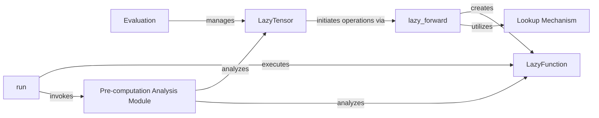

## Details

The Koila library provides a lazy evaluation framework for PyTorch, enabling deferred computation and graph-level optimizations. The core of the system revolves around building a computational graph of `LazyTensor` and `LazyFunction` instances, which is then analyzed and executed by the `run` component. Pre-computation analyses, including shape inference and batch dimension handling, are performed by the `Pre-computation Analysis Module` to optimize the graph before eager execution.

### LazyTensor
The primary user-facing component. It wraps PyTorch tensors, enabling lazy evaluation by deferring operations. It acts as a fundamental node within the deferred computational graph and provides the interface for users to interact with Koila's lazy features.

**Related Classes/Methods**:

- <a href="https://github.com/rentruewang/koila/blob/main/src/koila/lazy.py#L153-L441" target="_blank" rel="noopener noreferrer">`LazyTensor`:153-441</a>

### lazy_forward
The central dispatcher for Koila's lazy evaluation. It intercepts PyTorch operations performed on `LazyTensor` instances and constructs the deferred computational graph by creating `LazyFunction` nodes for each operation. It serves as the primary PyTorch integration layer.

**Related Classes/Methods**:

- <a href="https://github.com/rentruewang/koila/blob/main/src/koila/lazy.py#L494-L506" target="_blank" rel="noopener noreferrer">`lazy_forward`:494-506</a>

### LazyFunction
Represents a single deferred PyTorch operation within the lazy computational graph. It encapsulates the operation, its arguments, and any necessary context for later execution.

**Related Classes/Methods**:

- <a href="https://github.com/rentruewang/koila/blob/main/src/koila/lazy.py#L45-L61" target="_blank" rel="noopener noreferrer">`LazyFunction`:45-61</a>

### run
Orchestrates the execution of the entire deferred computational graph. It manages the order of operations, incorporates pre-computation analysis and optimizations (e.g., batch sizing, memory management), and triggers the actual PyTorch computations.

**Related Classes/Methods**:

- <a href="https://github.com/rentruewang/koila/blob/main/src/koila/eager.py#L34-L36" target="_blank" rel="noopener noreferrer">`run`:34-36</a>

### Evaluation
Manages the overall evaluation process of the lazy graph, potentially handling intermediate results, caching, or other aspects related to efficient computation flow.

**Related Classes/Methods**:

- <a href="https://github.com/rentruewang/koila/blob/main/src/koila/lazy.py#L64-L150" target="_blank" rel="noopener noreferrer">`Evaluation`:64-150</a>

### Lookup Mechanism
Provides dynamic resolution of native PyTorch methods and functions to their corresponding lazy Koila implementations, ensuring seamless interception and graph construction.

**Related Classes/Methods**:

- <a href="https://github.com/rentruewang/koila/blob/main/src/koila/lazy.py#L625-L626" target="_blank" rel="noopener noreferrer">`lookup_method`:625-626</a>
- <a href="https://github.com/rentruewang/koila/blob/main/src/koila/lazy.py#L628-L629" target="_blank" rel="noopener noreferrer">`lookup_function`:628-629</a>

### Pre-computation Analysis Module
A dedicated module for performing various pre-computation analyses and transformations on the lazy computational graph. This includes critical tasks like shape inference, batch dimension handling, and other graph-level optimizations before execution. The `PrePass` and related functions (e.g., `reduce_dims`, `mean`) are key components within this module.

**Related Classes/Methods**:

- <a href="https://github.com/rentruewang/koila/blob/main/src/koila/lazy.py" target="_blank" rel="noopener noreferrer">`PrePass`</a>
- <a href="https://github.com/rentruewang/koila/blob/main/src/koila/shapes.py#L193-L220" target="_blank" rel="noopener noreferrer">`reduce_dims`:193-220</a>

### [FAQ](https://github.com/CodeBoarding/GeneratedOnBoardings/tree/main?tab=readme-ov-file#faq)