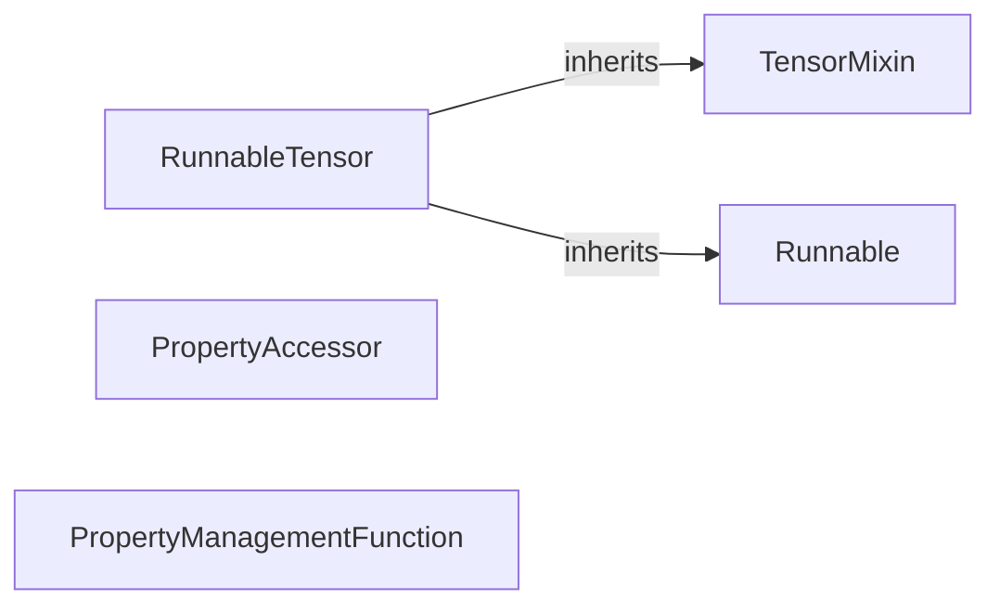

## Details

Updated analysis of koila/src/koila/interfaces.py with correct source code references.

### Runnable
An abstract base class defining a common interface for runnable objects.

**Related Classes/Methods**:

### TensorMixin
A mixin class providing tensor-related functionalities.

**Related Classes/Methods**:

### RunnableTensor
A class combining runnable and tensor functionalities.

**Related Classes/Methods**:

### PropertyAccessor
Property accessor for a specific attribute.

**Related Classes/Methods**:

### PropertyManagementFunction
Function for managing properties.

**Related Classes/Methods**:

### [FAQ](https://github.com/CodeBoarding/GeneratedOnBoardings/tree/main?tab=readme-ov-file#faq)