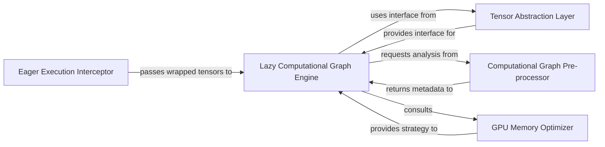

## Details

Koila's architecture centers around a lazy evaluation paradigm to optimize GPU memory usage for PyTorch models. It intercepts standard PyTorch operations via the Eager Execution Interceptor, converting them into a deferred computational graph managed by the Lazy Computational Graph Engine. This engine orchestrates the entire lazy execution flow, leveraging the Tensor Abstraction Layer for consistent tensor handling. Before actual computation, the Computational Graph Pre-processor analyzes and optimizes the graph's metadata, while the GPU Memory Optimizer dynamically determines efficient batch sizes, ensuring computations fit within available memory. This integrated approach allows Koila to enhance PyTorch's memory efficiency without requiring significant code changes from the user.

### Eager Execution Interceptor [[Expand]](./Eager_Execution_Interceptor.md)
Integrates Koila with PyTorch's eager execution mode by intercepting `__torch_function__` calls. It wraps standard PyTorch tensors, allowing them to be seamlessly used within Koila's lazy evaluation system without requiring significant changes to existing PyTorch code.

**Related Classes/Methods**:

- <a href="https://github.com/rentruewang/koila/blob/main/src/koila/eager.py" target="_blank" rel="noopener noreferrer">`Eager Execution Interceptor`</a>

### Tensor Abstraction Layer [[Expand]](./Tensor_Abstraction_Layer.md)
Provides a unified interface for accessing fundamental tensor properties (shape, data type, device, batch information) for both eager PyTorch tensors and Koila's lazy tensor representations. It defines the core protocols (`Runnable`, `TensorMixin`, `RunnableTensor`) and utility functions for consistent tensor interaction within Koila.

**Related Classes/Methods**:

- <a href="https://github.com/rentruewang/koila/blob/main/src/koila/interfaces.py" target="_blank" rel="noopener noreferrer">`Tensor Abstraction Layer`</a>

### Lazy Computational Graph Engine [[Expand]](./Lazy_Computational_Graph_Engine.md)
The central orchestrator for Koila's lazy evaluation. It intercepts PyTorch operations, builds a deferred computational graph, manages its execution, and integrates pre-computation analysis and GPU memory management. This component is responsible for the overall flow of lazy operations.

**Related Classes/Methods**:

- <a href="https://github.com/rentruewang/koila/blob/main/src/koila/lazy.py" target="_blank" rel="noopener noreferrer">`Lazy Computational Graph Engine`</a>

### Computational Graph Pre-processor [[Expand]](./Computational_Graph_Pre_processor.md)
Analyzes and transforms the computational graph's metadata (e.g., shapes, batch dimensions) before actual tensor computation. This component is crucial for optimizing memory and ensuring correct tensor operations by inferring and propagating shape and batch information through the graph.

**Related Classes/Methods**:

- <a href="https://github.com/rentruewang/koila/blob/main/src/koila/prepasses.py" target="_blank" rel="noopener noreferrer">`Computational Graph Pre-processor`</a>

### GPU Memory Optimizer
Dynamically manages GPU memory by determining optimal batch sizes and freeing up resources. It ensures that computations fit within available GPU memory, often by adjusting batch sizes based on memory constraints.

**Related Classes/Methods**:

- <a href="https://github.com/rentruewang/koila/blob/main/src/koila/gpus.py" target="_blank" rel="noopener noreferrer">`GPU Memory Optimizer`</a>

### [FAQ](https://github.com/CodeBoarding/GeneratedOnBoardings/tree/main?tab=readme-ov-file#faq)