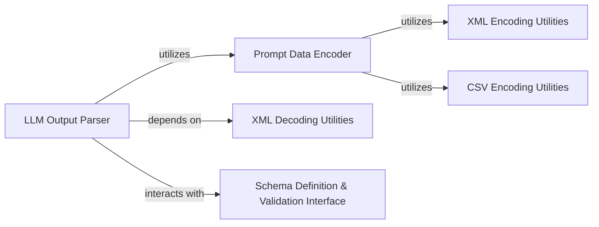

## Details

The `kor` subsystem focuses on robust interaction with Large Language Models (LLMs) by managing the encoding of structured data into LLM prompts and the subsequent decoding and validation of LLM outputs. It primarily consists of components for data serialization (Prompt Data Encoder), deserialization and validation (LLM Output Parser), and specialized utilities for handling different data formats like XML and CSV. The system ensures that data exchanged with LLMs adheres to predefined schemas, enhancing the reliability and accuracy of LLM-driven applications.

### Prompt Data Encoder
This component is responsible for serializing structured Python data (such as schemas, examples, or query parameters) into specific text formats (e.g., XML, CSV) that are suitable for inclusion in LLM prompts. It acts as the primary interface for preparing structured input for the LLM.

**Related Classes/Methods**:

- <a href="https://github.com/eyurtsev/kor/blob/main/kor/encoders/xml.py#L141-L145" target="_blank" rel="noopener noreferrer">`kor.encoders.xml.encode`:141-145</a>
- <a href="https://github.com/eyurtsev/kor/blob/main/kor/encoders/csv_data.py#L57-L84" target="_blank" rel="noopener noreferrer">`kor.encoders.csv_data.encode`:57-84</a>

### LLM Output Parser
This is the core component for deserializing and validating raw text output received from an LLM back into structured Python data. It orchestrates the parsing process, leveraging format-specific decoders and integrating with schema validation mechanisms to ensure the output conforms to expected structures.

**Related Classes/Methods**:

- <a href="https://github.com/eyurtsev/kor/blob/main/kor/extraction/parser.py#L15-L73" target="_blank" rel="noopener noreferrer">`kor.extraction.parser.KorParser`:15-73</a>

### XML Encoding Utilities
Provides low-level, recursive functionality for constructing well-formed XML strings. This component is a helper used by the `Prompt Data Encoder` to serialize complex Python data structures into XML format for LLM prompts.

**Related Classes/Methods**:

- <a href="https://github.com/eyurtsev/kor/blob/main/kor/encoders/xml.py#L31-L43" target="_blank" rel="noopener noreferrer">`kor.encoders.xml._write_tag`:31-43</a>

### CSV Encoding Utilities
Offers low-level functionality for extracting top-level field names from structured data, which are then used to form the header row for CSV output. This component assists the `Prompt Data Encoder` in preparing data for CSV-formatted prompts.

**Related Classes/Methods**:

- <a href="https://github.com/eyurtsev/kor/blob/main/kor/encoders/csv_data.py#L21-L26" target="_blank" rel="noopener noreferrer">`kor.encoders.csv_data._extract_top_level_fieldnames`:21-26</a>

### XML Decoding Utilities
Handles the low-level parsing of XML tags and their content from raw LLM output. This component is crucial for the `LLM Output Parser` to reconstruct structured data from XML-formatted responses.

**Related Classes/Methods**:

- <a href="https://github.com/eyurtsev/kor/blob/main/kor/encoders/xml.py#L147-L153" target="_blank" rel="noopener noreferrer">`kor.encoders.xml.decode`:147-153</a>
- <a href="https://github.com/eyurtsev/kor/blob/main/kor/encoders/xml.py#L46-L105" target="_blank" rel="noopener noreferrer">`kor.encoders.xml.TagParser`:46-105</a>

### Schema Definition & Validation Interface
This component represents the interface and mechanisms through which the `LLM Output Parser` receives and utilizes schema information to guide parsing and perform validation of the extracted data. It ensures that the parsed output adheres to predefined structural and type constraints. The `KorParser` directly interacts with a `Validator` instance for this purpose.

**Related Classes/Methods**:

- <a href="https://github.com/eyurtsev/kor/blob/main/kor/validators.py#L10-L23" target="_blank" rel="noopener noreferrer">`kor.validators.Validator`:10-23</a>
- <a href="https://github.com/eyurtsev/kor/blob/main/kor/extraction/parser.py" target="_blank" rel="noopener noreferrer">`kor.extraction.parser.KorParser.validator`</a>

### [FAQ](https://github.com/CodeBoarding/GeneratedOnBoardings/tree/main?tab=readme-ov-file#faq)