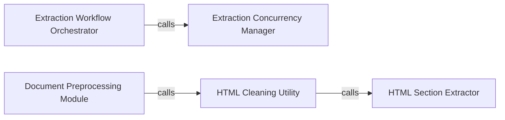

## Details

The `LLM Interaction & Workflow Orchestration` subsystem is responsible for managing the end-to-end information extraction process, from initial document preparation to the final interaction with the LLM and output handling.

### Extraction Workflow Orchestrator
This component acts as the primary facade for the entire information extraction process. It orchestrates the high-level steps, including delegating individual document processing and overseeing the data flow from input to potential final output. It embodies the "workflow orchestration" aspect.

**Related Classes/Methods**:

- <a href="https://github.com/eyurtsev/kor/blob/main/kor/extraction/api.py#L131-L194" target="_blank" rel="noopener noreferrer">`kor.extraction.api.extract_from_documents`:131-194</a>

### Extraction Concurrency Manager
Responsible for managing the rate and parallelism of document processing. It ensures efficient resource utilization and prevents overloading, especially when dealing with external LLM calls or large batches of documents.

**Related Classes/Methods**:

- <a href="https://github.com/eyurtsev/kor/blob/main/kor/extraction/api.py#L21-L40" target="_blank" rel="noopener noreferrer">`kor.extraction.api._extract_from_document_with_semaphore`:21-40</a>

### Document Preprocessing Module
This component handles the initial, optional preprocessing of raw input documents (e.g., HTML) to transform them into a cleaner, more structured format suitable for information extraction by an LLM. It's a key part of preparing data for the LLM interaction.

**Related Classes/Methods**:

- <a href="https://github.com/eyurtsev/kor/blob/main/kor/documents/html.py#L72-L85" target="_blank" rel="noopener noreferrer">`kor.documents.html.process`:72-85</a>

### HTML Cleaning Utility
A specialized utility within the preprocessing module that removes extraneous elements, scripts, styles, and other noise from HTML content. Its goal is to isolate and prepare the relevant text for subsequent extraction by the LLM.

**Related Classes/Methods**:

- <a href="https://github.com/eyurtsev/kor/blob/main/kor/documents/html.py#L40-L52" target="_blank" rel="noopener noreferrer">`kor.documents.html._clean_html`:40-52</a>

### HTML Section Extractor
A granular utility that extracts or formats specific, smaller sections of HTML. It supports the `HTML Cleaning Utility` by providing focused content segments, contributing to the overall effectiveness of the preprocessing pipeline.

**Related Classes/Methods**:

- <a href="https://github.com/eyurtsev/kor/blob/main/kor/documents/html.py#L15-L37" target="_blank" rel="noopener noreferrer">`kor.documents.html._get_mini_html`:15-37</a>

### [FAQ](https://github.com/CodeBoarding/GeneratedOnBoardings/tree/main?tab=readme-ov-file#faq)