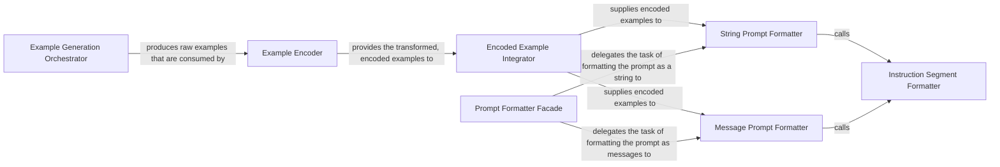

## Details

This subsystem is responsible for creating few-shot examples based on a defined schema and assembling the final, formatted prompt that guides the Large Language Model for accurate information extraction.

### Example Generation Orchestrator
Orchestrates the creation of structured few-shot examples by traversing a given schema, embodying the schema-driven approach. It internally manages the visitation of schema elements and assembly of output.

**Related Classes/Methods**:

- <a href="https://github.com/eyurtsev/kor/blob/main/kor/examples.py#L106-L121" target="_blank" rel="noopener noreferrer">`kor.examples.generate_examples`:106-121</a>

### Example Encoder
Transforms the raw examples generated by the orchestrator into a specific, encoded format (e.g., a string or a list of messages) that can be directly embedded within the LLM prompt.

**Related Classes/Methods**:

- <a href="https://github.com/eyurtsev/kor/blob/main/kor/encoders/encode.py#L52-L65" target="_blank" rel="noopener noreferrer">`kor.encoders.encode.encode_examples`:52-65</a>

### Encoded Example Integrator
Acts as an intermediary, coordinating the encoding of examples and their subsequent integration into the prompt. It ensures a smooth flow of data from example generation to prompt assembly.

**Related Classes/Methods**:

- <a href="https://github.com/eyurtsev/kor/blob/main/kor/prompts.py#L122-L127" target="_blank" rel="noopener noreferrer">`kor.prompts.generate_encoded_examples`:122-127</a>

### Prompt Formatter Facade
The primary entry point for the entire prompt assembly process. It determines the final prompt format (string or messages) and delegates to the appropriate formatting functions, acting as a facade for prompt construction.

**Related Classes/Methods**:

- <a href="https://github.com/eyurtsev/kor/blob/main/kor/prompts.py#L67-L75" target="_blank" rel="noopener noreferrer">`kor.prompts.format_prompt`:67-75</a>

### String Prompt Formatter
Formats the complete prompt as a single string, combining instructional text and encoded examples. This is used for LLMs that expect a single string input.

**Related Classes/Methods**:

- <a href="https://github.com/eyurtsev/kor/blob/main/kor/prompts.py#L86-L102" target="_blank" rel="noopener noreferrer">`kor.prompts.to_string`:86-102</a>

### Message Prompt Formatter
Formats the complete prompt as a list of messages, suitable for chat-based LLMs, combining instructional text and encoded examples.

**Related Classes/Methods**:

- <a href="https://github.com/eyurtsev/kor/blob/main/kor/prompts.py#L104-L120" target="_blank" rel="noopener noreferrer">`kor.prompts.to_messages`:104-120</a>

### Instruction Segment Formatter
Formats the static, instructional part of the prompt, providing the LLM with general guidelines for the task. This ensures consistent and clear instructions are provided.

**Related Classes/Methods**:

- <a href="https://github.com/eyurtsev/kor/blob/main/kor/prompts.py#L129-L143" target="_blank" rel="noopener noreferrer">`kor.prompts.format_instruction_segment`:129-143</a>

### [FAQ](https://github.com/CodeBoarding/GeneratedOnBoardings/tree/main?tab=readme-ov-file#faq)