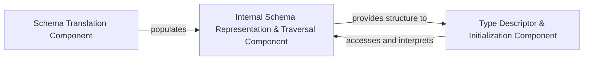

## Details

The `Schema Definition & Management` subsystem is crucial for Kor's ability to process and extract structured information. It acts as the foundational layer, translating user-defined data models into an internal, manipulable schema that guides the entire extraction process.

### Schema Translation Component
This component serves as the primary entry point for defining schemas within Kor. It is responsible for converting external, user-friendly schema definitions (specifically Pydantic models) into Kor's internal, structured node representation. This involves recursively traversing the Pydantic model's fields and translating them into corresponding Kor nodes, ensuring that the user's intent is accurately captured in Kor's internal format.

**Related Classes/Methods**:

- <a href="https://github.com/eyurtsev/kor/blob/main/kor/adapters.py" target="_blank" rel="noopener noreferrer">`kor.adapters`</a>

### Internal Schema Representation & Traversal Component
This component defines the core data structures (nodes) that constitute Kor's internal schema. It provides a robust framework for representing complex, hierarchical schemas and includes mechanisms for traversing these nodes (e.g., using a visitor pattern) and validating the integrity and consistency of the constructed schema. It is the backbone upon which all schema-related operations are performed.

**Related Classes/Methods**:

- <a href="https://github.com/eyurtsev/kor/blob/main/kor/nodes.py" target="_blank" rel="noopener noreferrer">`kor.nodes`</a>

### Type Descriptor & Initialization Component
This component manages the initialization and description of various type representations within the Kor schema. It provides different ways to render or interpret the schema's structure and types, which is crucial for generating prompts, displaying schema information, or integrating with external systems. It allows for flexible presentation of the schema based on the specific needs of downstream components.

**Related Classes/Methods**:

- <a href="https://github.com/eyurtsev/kor/blob/main/kor/type_descriptors.py" target="_blank" rel="noopener noreferrer">`kor.type_descriptors`</a>

### [FAQ](https://github.com/CodeBoarding/GeneratedOnBoardings/tree/main?tab=readme-ov-file#faq)