```mermaid
graph LR
    Schema_Definition_Management["Schema Definition & Management"]
    Prompt_Example_Generation["Prompt & Example Generation"]
    LLM_Interaction_Workflow_Orchestration["LLM Interaction & Workflow Orchestration"]
    Data_Encoding_Parsing["Data Encoding & Parsing"]
    Structured_Data_Validation["Structured Data Validation"]
    Schema_Definition_Management -- "provides schema to" --> Prompt_Example_Generation
    Schema_Definition_Management -- "defines validation rules for" --> Structured_Data_Validation
    Prompt_Example_Generation -- "generates prompt for" --> LLM_Interaction_Workflow_Orchestration
    Prompt_Example_Generation -- "uses" --> Data_Encoding_Parsing
    LLM_Interaction_Workflow_Orchestration -- "sends raw output to" --> Data_Encoding_Parsing
    Data_Encoding_Parsing -- "decodes data for" --> Structured_Data_Validation
    Data_Encoding_Parsing -- "encodes data for" --> Prompt_Example_Generation
    Structured_Data_Validation -- "returns validated data to" --> LLM_Interaction_Workflow_Orchestration
    click Schema_Definition_Management href "https://github.com/CodeBoarding/GeneratedOnBoardings/blob/main/kor/Schema_Definition_Management.md" "Details"
    click Prompt_Example_Generation href "https://github.com/CodeBoarding/GeneratedOnBoardings/blob/main/kor/Prompt_Example_Generation.md" "Details"
    click LLM_Interaction_Workflow_Orchestration href "https://github.com/CodeBoarding/GeneratedOnBoardings/blob/main/kor/LLM_Interaction_Workflow_Orchestration.md" "Details"
    click Data_Encoding_Parsing href "https://github.com/CodeBoarding/GeneratedOnBoardings/blob/main/kor/Data_Encoding_Parsing.md" "Details"
```

## Details

The `kor` library is architected as a highly modular, schema-driven pipeline for information extraction using Large Language Models. The process begins with the Schema Definition & Management component, which translates user-defined data structures into an internal schema. This schema, combined with dynamically generated examples by the Prompt & Example Generation component, forms a precise instruction set for the LLM. The central LLM Interaction & Workflow Orchestration component manages the entire extraction lifecycle, from initial document preprocessing to dispatching prompts and receiving raw LLM responses. These raw responses are then channeled to the Data Encoding & Parsing component for transformation into structured data. Finally, the Structured Data Validation component rigorously checks this extracted data against the original schema, ensuring accuracy and integrity before the validated output is returned, completing the robust information extraction cycle.

### Schema Definition & Management [[Expand]](./Schema_Definition_Management.md)
Defines and manages the internal representation of extraction schemas, converting user-defined Pydantic models into a structured format for Kor's internal processing. It is the foundational component for defining the target output structure.

**Related Classes/Methods**:

- <a href="https://github.com/eyurtsev/kor/blob/main/kor/adapters.py" target="_blank" rel="noopener noreferrer">`kor/adapters`</a>
- <a href="https://github.com/eyurtsev/kor/blob/main/kor/nodes.py" target="_blank" rel="noopener noreferrer">`kor/nodes`</a>
- <a href="https://github.com/eyurtsev/kor/blob/main/kor/type_descriptors.py" target="_blank" rel="noopener noreferrer">`kor/type_descriptors`</a>

### Prompt & Example Generation [[Expand]](./Prompt_Example_Generation.md)
Responsible for creating few-shot examples based on the schema and assembling the final, formatted prompt that guides the Large Language Model for accurate information extraction.

**Related Classes/Methods**:

- <a href="https://github.com/eyurtsev/kor/blob/main/kor/examples.py" target="_blank" rel="noopener noreferrer">`kor/examples`</a>
- <a href="https://github.com/eyurtsev/kor/blob/main/kor/prompts.py" target="_blank" rel="noopener noreferrer">`kor/prompts`</a>
- <a href="https://github.com/eyurtsev/kor/blob/main/kor/encoders/encode.py" target="_blank" rel="noopener noreferrer">`kor/encoders/encode`</a>

### LLM Interaction & Workflow Orchestration [[Expand]](./LLM_Interaction_Workflow_Orchestration.md)
Manages the entire information extraction workflow. This includes orchestrating optional document preprocessing, sending the constructed prompts to the LLM, and overseeing the overall data flow from input to final validated output.

**Related Classes/Methods**:

- <a href="https://github.com/eyurtsev/kor/blob/main/kor/extraction/api.py" target="_blank" rel="noopener noreferrer">`kor/extraction/api`</a>
- <a href="https://github.com/eyurtsev/kor/blob/main/kor/documents/html.py" target="_blank" rel="noopener noreferrer">`kor/documents/html`</a>

### Data Encoding & Parsing [[Expand]](./Data_Encoding_Parsing.md)
Handles the serialization of structured data (e.g., schema, examples) into formats suitable for LLM prompts (e.g., XML) and, crucially, the deserialization and parsing of raw LLM output back into structured data.

**Related Classes/Methods**:

- <a href="https://github.com/eyurtsev/kor/blob/main/kor/encoders/xml.py" target="_blank" rel="noopener noreferrer">`kor/encoders/xml`</a>
- <a href="https://github.com/eyurtsev/kor/blob/main/kor/encoders/csv_data.py" target="_blank" rel="noopener noreferrer">`kor/encoders/csv_data`</a>
- <a href="https://github.com/eyurtsev/kor/blob/main/kor/extraction/parser.py" target="_blank" rel="noopener noreferrer">`kor/extraction/parser`</a>

### Structured Data Validation
Ensures the integrity and correctness of the extracted and parsed structured data. It validates the data against the initial schema defined by the Schema Definition & Management component, ensuring adherence to expected types and structures.

**Related Classes/Methods**:

- <a href="https://github.com/eyurtsev/kor/blob/main/kor/nodes.py" target="_blank" rel="noopener noreferrer">`kor/nodes`</a>
- <a href="https://github.com/eyurtsev/kor/blob/main/kor/validators.py" target="_blank" rel="noopener noreferrer">`kor/validators`</a>

### [FAQ](https://github.com/CodeBoarding/GeneratedOnBoardings/tree/main?tab=readme-ov-file#faq)