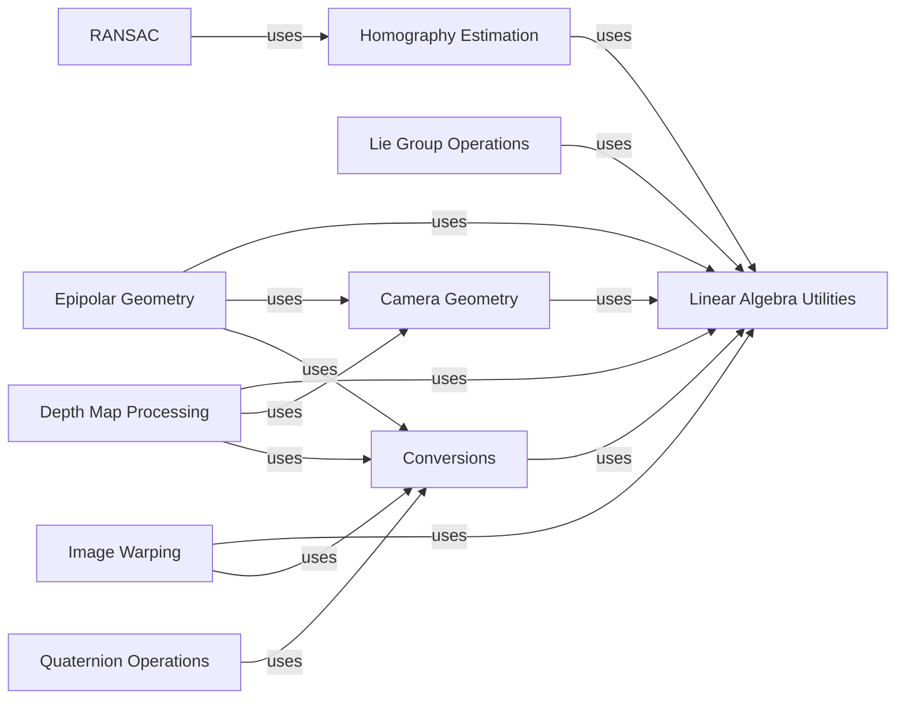

## Component Details

### Camera Geometry
This component provides functionalities for camera models, projections, and stereo vision. It includes classes for pinhole cameras, perspective projections, and stereo camera setups, enabling the representation and manipulation of camera parameters and the simulation of camera behavior.
- **Related Classes/Methods**: `kornia.geometry.camera`, `kornia.geometry.camera.pinhole`, `kornia.geometry.camera.perspective`, `kornia.geometry.camera.stereo`

### Epipolar Geometry
This component focuses on epipolar geometry, providing functions for computing fundamental and essential matrices, as well as triangulation methods for 3D reconstruction from stereo images. It facilitates the determination of geometric relationships between multiple views of a scene.
- **Related Classes/Methods**: `kornia.geometry.epipolar`, `kornia.geometry.epipolar.fundamental`, `kornia.geometry.epipolar.essential`, `kornia.geometry.epipolar.triangulation`

### Lie Group Operations
This component provides Lie group implementations for SE(2), SE(3), SO(2), and SO(3), including exponential and logarithmic maps, hat and vee operators, and group operations. It is used for representing and manipulating transformations in a geometrically consistent way, ensuring proper handling of rotations and translations.
- **Related Classes/Methods**: `kornia.geometry.liegroup`, `kornia.geometry.liegroup.se2`, `kornia.geometry.liegroup.se3`, `kornia.geometry.liegroup.so2`, `kornia.geometry.liegroup.so3`

### Linear Algebra Utilities
This component provides linear algebra utilities for geometric operations, including composing and inverting transformations, transforming points, and calculating distances. It is a foundational component used by many other geometry modules, providing basic mathematical operations.
- **Related Classes/Methods**: `kornia.geometry.linalg`

### Quaternion Operations
This component implements quaternion operations, including arithmetic, conversion to/from other representations, and interpolation. Quaternions are used for representing rotations in 3D space, offering an alternative to rotation matrices and Euler angles.
- **Related Classes/Methods**: `kornia.geometry.quaternion`

### Homography Estimation
This component provides functions for homography estimation, including DLT and iterated DLT methods, and error calculation. Homographies are used for relating images taken from different viewpoints, enabling image alignment and perspective correction.
- **Related Classes/Methods**: `kornia.geometry.homography`

### RANSAC
This component implements the RANSAC algorithm for robust estimation, which is used to estimate model parameters from data containing outliers. It provides a robust method for fitting models to noisy data, commonly used in geometric estimation problems.
- **Related Classes/Methods**: `kornia.geometry.ransac`

### Conversions
This component offers functions for converting between different representations of transformations, such as rotation matrices, quaternions, axis-angle, and Euler angles. It facilitates interoperability between different geometric representations.
- **Related Classes/Methods**: `kornia.geometry.conversions`

### Image Warping
Provides functions for image warping, including perspective and affine transformations. It includes functions to compute transformation matrices and warp images using these matrices, enabling image manipulation and alignment.
- **Related Classes/Methods**: `kornia.geometry.transform.imgwarp`

### Depth Map Processing
Provides functions for depth map processing, including conversion to 3D point clouds, normal estimation, and warping depth maps. It facilitates the processing and analysis of depth information.
- **Related Classes/Methods**: `kornia.geometry.depth`
