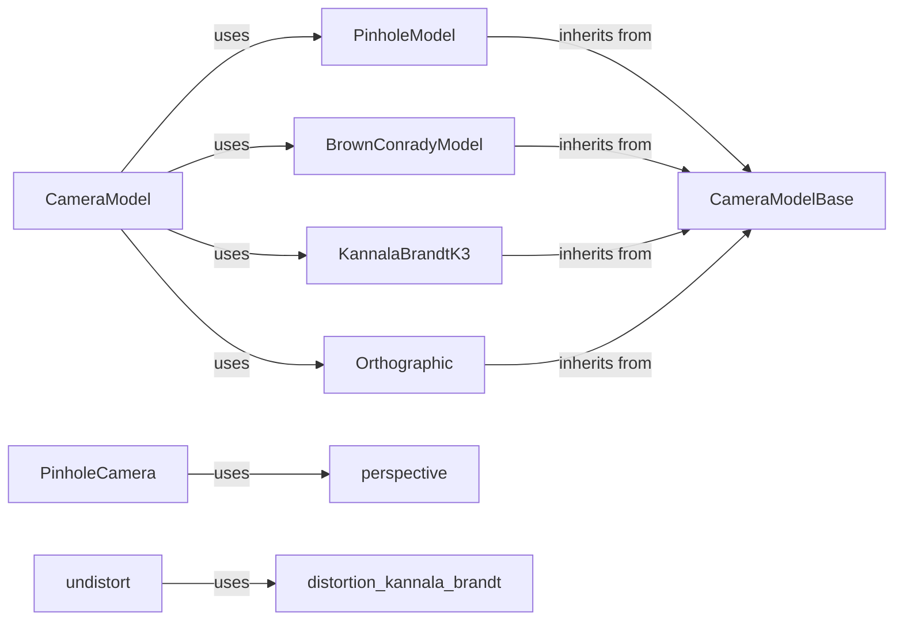

## Component Details

The Camera Models component in Kornia provides a comprehensive suite of tools for representing and manipulating camera models, encompassing pinhole, orthographic, and Brown-Conrady models. It facilitates camera calibration, distortion correction, and point projection/unprojection, essential for 3D reconstruction, camera pose estimation, and augmented reality applications. The core functionality revolves around defining camera models, handling lens distortion, and performing projective transformations.

### CameraModelBase
The CameraModelBase class serves as an abstract base for different camera models. It defines the common interface for camera parameters and operations, ensuring consistency across various camera model implementations. It provides a foundation for concrete camera models like PinholeModel and BrownConradyModel.
- **Related Classes/Methods**: `kornia.sensors.camera.camera_model.CameraModelBase`

### PinholeModel
The PinholeModel class implements the pinhole camera model, inheriting from CameraModelBase. It provides specific functionalities for pinhole camera projection and unprojection, making it a fundamental component for perspective-based vision tasks. It uses functions from the `perspective` and `projection_z1` modules.
- **Related Classes/Methods**: `kornia.sensors.camera.camera_model.PinholeModel`

### BrownConradyModel
The BrownConradyModel class implements the Brown-Conrady distortion model, inheriting from CameraModelBase. It provides methods for applying and removing radial and tangential lens distortions, crucial for correcting lens imperfections in real-world camera systems.
- **Related Classes/Methods**: `kornia.sensors.camera.camera_model.BrownConradyModel`

### KannalaBrandtK3
The KannalaBrandtK3 class implements the Kannala-Brandt distortion model, inheriting from CameraModelBase. It provides methods for applying and removing distortion based on the Kannala-Brandt model, offering an alternative to Brown-Conrady for modeling lens distortion.
- **Related Classes/Methods**: `kornia.sensors.camera.camera_model.KannalaBrandtK3`

### Orthographic
The Orthographic class implements the orthographic camera model, inheriting from CameraModelBase. It provides methods for orthographic projection and unprojection, suitable for scenarios where perspective effects are negligible.
- **Related Classes/Methods**: `kornia.sensors.camera.camera_model.Orthographic`

### CameraModel
The CameraModel class acts as a factory for creating camera models from a given type. It uses a dictionary to map camera model types to their corresponding classes, allowing for easy instantiation of different camera models based on a string identifier.
- **Related Classes/Methods**: `kornia.sensors.camera.camera_model.CameraModel`, `kornia.sensors.camera.camera_model:get_model_from_type`

### PinholeCamera
The PinholeCamera class represents a pinhole camera with intrinsic and extrinsic parameters. It provides methods for projecting and unprojecting points, as well as converting between different coordinate systems. It relies on `perspective` and `projection_z1` modules for projection functionalities.
- **Related Classes/Methods**: `kornia.geometry.camera.pinhole.PinholeCamera`

### perspective
The `perspective` module contains functions for perspective projection and unprojection. These functions are used by the PinholeCamera class to perform perspective transformations.
- **Related Classes/Methods**: `kornia.geometry.camera.perspective`

### distortion_kannala_brandt
The `distortion_kannala_brandt` module contains functions for distorting and undistorting points using the Kannala-Brandt distortion model. These functions are used by the KannalaBrandtK3 camera model and the undistort/distort modules.
- **Related Classes/Methods**: `kornia.geometry.camera.distortion_kannala_brandt`

### undistort
The `undistort` module contains functions for undistorting points and images. It uses the distortion models to remove lens distortion from images and point clouds.
- **Related Classes/Methods**: `kornia.geometry.calibration.undistort`
