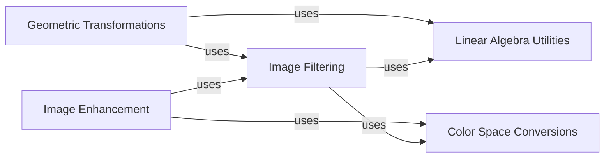

## Component Details

### Geometric Transformations
This component provides functionalities for performing various geometric transformations on images, including affine transformations, homography warping, image warping, cropping, pyramid generation, elastic transforms, thin plate splines, and flipping. It enables the manipulation of the spatial arrangement of pixels in an image.
- **Related Classes/Methods**: `kornia.geometry.transform.affwarp`, `kornia.geometry.transform.imgwarp`, `kornia.geometry.transform.homography_warper`, `kornia.geometry.transform.crop2d`, `kornia.geometry.transform.pyramid`, `kornia.geometry.transform.elastic_transform`, `kornia.geometry.transform.thin_plate_spline`, `kornia.geometry.transform.flips`

### Color Space Conversions
This component offers functions for converting images between different color spaces, such as RGB, grayscale, HSV, LAB, XYZ, YCbCr, YUV, and RAW. It facilitates color-based image processing tasks by enabling the manipulation of color information in images.
- **Related Classes/Methods**: `kornia.color.rgb`, `kornia.color.gray`, `kornia.color.hsv`, `kornia.color.lab`, `kornia.color.xyz`, `kornia.color.ycbcr`, `kornia.color.colormap`, `kornia.color.yuv`, `kornia.color.raw`

### Image Filtering
This component provides a collection of image filtering operations, including blurring, edge detection (Canny, Sobel), noise reduction (median, Gaussian, bilateral), and other filters like Laplacian, Unsharp Masking, and motion blur. It allows for the enhancement and modification of image features through convolution-based techniques.
- **Related Classes/Methods**: `kornia.filters.blur`, `kornia.filters.canny`, `kornia.filters.sobel`, `kornia.filters.median`, `kornia.filters.gaussian`, `kornia.filters.bilateral`, `kornia.filters.motion`, `kornia.filters.laplacian`, `kornia.filters.unsharp`, `kornia.filters.dexined`, `kornia.filters.blur_pool`, `kornia.filters.in_range`

### Image Enhancement
This component offers functions for enhancing the visual quality of images, including adjusting brightness, contrast, and color balance, normalization, histogram equalization, and JPEG artifact reduction. It enables the improvement of image appearance and the extraction of relevant information.
- **Related Classes/Methods**: `kornia.enhance.adjust`, `kornia.enhance.normalize`, `kornia.enhance.histogram`, `kornia.enhance.jpeg`, `kornia.enhance.core`, `kornia.enhance.integral`, `kornia.enhance.zca`

### Linear Algebra Utilities
This component offers a set of linear algebra functions specifically tailored for image processing tasks. It provides tools for performing matrix operations, vector calculations, and other linear algebra operations on image data, which are essential for various image transformations and filtering operations.
- **Related Classes/Methods**: `kornia.geometry.linalg`
