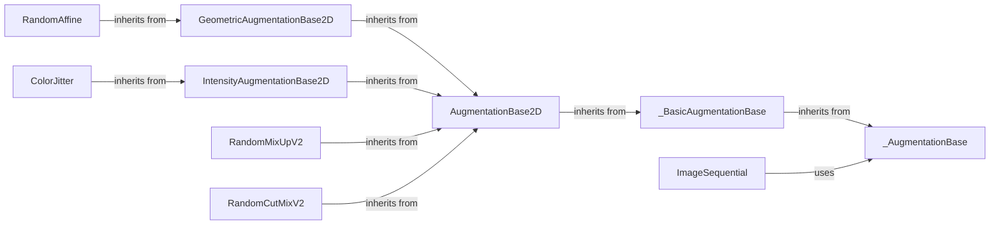

## Component Details

The Data Augmentation component in Kornia provides a comprehensive suite of tools for enhancing the diversity of image datasets used in training deep learning models. It encompasses a range of techniques, including geometric transformations, intensity adjustments, and pixel-level manipulations, all designed to improve the generalization and robustness of trained models. The core of the component lies in its modular design, with base classes defining the structure for augmentations and specific implementations providing concrete transformations. Auto-augmentation policies are also included, which automatically search for the best augmentation strategies for a given dataset.

### _AugmentationBase
The abstract base class for all augmentations. It defines the core interface for applying transformations to different data types associated with an image, such as inputs, masks, bounding boxes, keypoints, and class labels. It ensures that all augmentations have a consistent way of handling different data modalities and applying inverse transformations.
- **Related Classes/Methods**: `kornia.augmentation.base._AugmentationBase`

### _BasicAugmentationBase
This base class provides common functionalities for augmentations, including parameter generation and batch processing. It handles the random number generation and tensor validation aspects of augmentations, ensuring that augmentations are applied consistently and correctly across batches of images.
- **Related Classes/Methods**: `kornia.augmentation.base._BasicAugmentationBase`

### AugmentationBase2D
The base class for 2D image augmentations. It extends `_BasicAugmentationBase` and adds specific functionalities for 2D image augmentations, such as handling bounding boxes and keypoints. It provides a foundation for building more complex 2D augmentations.
- **Related Classes/Methods**: `kornia.augmentation._2d.base.AugmentationBase2D`

### GeometricAugmentationBase2D
This base class is for geometric 2D augmentations. It inherits from `AugmentationBase2D` and provides methods for computing transformation matrices and applying transformations to different data types. It is used as a base for geometric transformations like rotation, scaling, and translation.
- **Related Classes/Methods**: `kornia.augmentation._2d.geometric.base.GeometricAugmentationBase2D`

### IntensityAugmentationBase2D
The base class for intensity 2D augmentations. It inherits from `AugmentationBase2D` and provides functionalities specific to intensity transformations like color jittering and contrast adjustment. It serves as a foundation for building intensity-based augmentations.
- **Related Classes/Methods**: `kornia.augmentation._2d.intensity.base.IntensityAugmentationBase2D`

### RandomAffine
This class implements random affine transformation augmentation. It inherits from `GeometricAugmentationBase2D` and applies random rotations, scaling, translations, and shears to the input image. It is a commonly used augmentation technique for improving the robustness of image recognition models.
- **Related Classes/Methods**: `kornia.augmentation._2d.geometric.affine.RandomAffine`

### ColorJitter
This class implements color jittering augmentation. It inherits from `IntensityAugmentationBase2D` and randomly adjusts the brightness, contrast, saturation, and hue of the input image. It is a commonly used augmentation technique for improving the robustness of image recognition models to color variations.
- **Related Classes/Methods**: `kornia.augmentation._2d.intensity.color_jitter.ColorJitter`

### RandomMixUpV2
This class implements the MixUp augmentation technique. It inherits from `AugmentationBase2D` and creates new images by linearly interpolating between two randomly selected images and their corresponding labels. It is a regularization technique that can improve the generalization performance of deep learning models.
- **Related Classes/Methods**: `kornia.augmentation._2d.mix.mixup.RandomMixUpV2`

### RandomCutMixV2
This class implements the CutMix augmentation technique. It inherits from `AugmentationBase2D` and creates new images by cutting and pasting rectangular regions from one image into another. It is a regularization technique that can improve the generalization performance of deep learning models.
- **Related Classes/Methods**: `kornia.augmentation._2d.mix.cutmix.RandomCutMixV2`

### ImageSequential
A container that applies a sequence of image augmentations. It allows for chaining multiple augmentation operations together to form a complex augmentation pipeline. It provides a convenient way to apply a series of augmentations to an image.
- **Related Classes/Methods**: `kornia.augmentation.container.image.ImageSequential`
