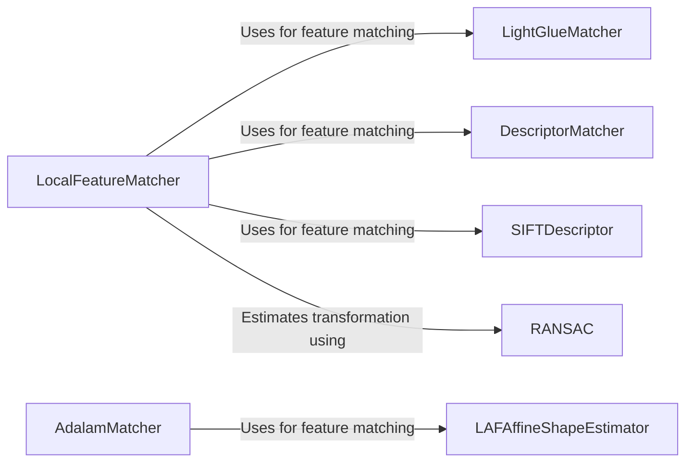

## Component Details

### LocalFeatureMatcher
The LocalFeatureMatcher integrates feature extraction and matching into a single module. It encapsulates the process of detecting keypoints, describing them, and finding correspondences between them. It is used in applications like planar tracking to find matches between a target image and the current frame, providing a unified interface for feature processing.
- **Related Classes/Methods**: `kornia.feature.integrated`

### LightGlueMatcher
LightGlueMatcher implements the LightGlue neural network for feature matching. It learns to match features based on their appearance and context, leveraging attention mechanisms to establish correspondences between features in different images. It is used as a feature matcher within the LocalFeatureMatcher, offering robust matching capabilities even under challenging conditions.
- **Related Classes/Methods**: `kornia.feature.lightglue`

### DescriptorMatcher
The DescriptorMatcher matches descriptors based on a distance metric. It provides a way to find the nearest neighbors between two sets of descriptors, enabling the establishment of correspondences between features. It is used in planar tracking as part of the feature matching pipeline, facilitating the identification of matching features across different images.
- **Related Classes/Methods**: `kornia.feature.matching`

### SIFTDescriptor
The SIFTDescriptor computes SIFT descriptors for given local features. It calculates a histogram of gradient orientations in the neighborhood of each keypoint, providing a robust feature representation that is invariant to scale and orientation changes. It is used to provide robust feature descriptors for matching, enabling accurate and reliable feature matching even under varying image conditions.
- **Related Classes/Methods**: `kornia.feature.siftdesc`

### RANSAC
RANSAC estimates a robust transformation between two sets of points using the RANSAC algorithm. It iteratively selects random subsets of the data to fit a model and evaluates the model's fit to the remaining data, effectively removing outliers and providing a robust estimate of the transformation. It is used to remove outliers when estimating homographies for image stitching and planar tracking, ensuring accurate and reliable geometric transformations.
- **Related Classes/Methods**: `kornia.geometry.ransac`

### AdalamMatcher
AdalamMatcher implements the Adaptive Locally Affine Matching (Adalam) algorithm for feature matching. It uses local affine transformations to improve the accuracy of feature matching, adapting to local geometric distortions and providing more accurate correspondences. It relies on functions from `kornia.feature.laf` to handle local affine frames, enabling robust feature matching even in the presence of significant geometric variations.
- **Related Classes/Methods**: `kornia.feature.adalam.adalam`

### LAFAffineShapeEstimator
The LAFAffineShapeEstimator estimates the affine shape of local affine frames (LAFs). It refines the shape of the local feature regions to improve matching accuracy, providing a more accurate representation of the local geometry. It uses functions from `kornia.feature.laf` to manipulate and extract information from LAFs, enabling precise estimation of local affine shapes.
- **Related Classes/Methods**: `kornia.feature.affine_shape`
