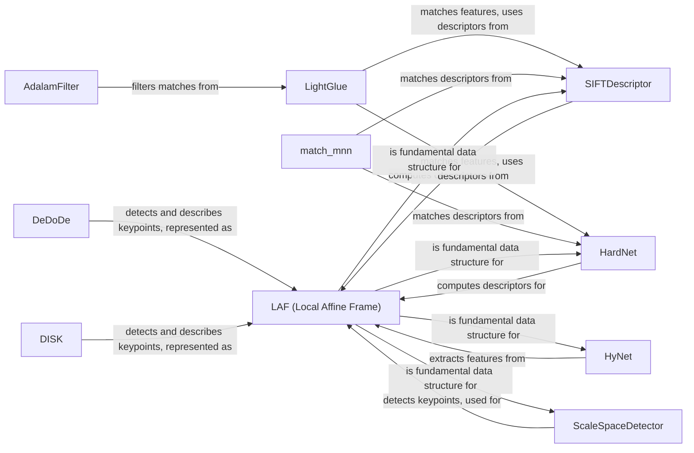

## Component Details

The Feature Extraction and Matching component provides a comprehensive suite of tools for identifying and matching features in images. It encompasses keypoint detection, descriptor computation, and feature matching algorithms. The process typically involves detecting salient points in images using methods like ScaleSpaceDetector or deep learning models such as DeDoDe and DISK. These keypoints are then described using descriptors like SIFT, HardNet, or learned descriptors from models like HyNet. Finally, feature matching is performed using techniques like mutual nearest neighbor search or learned matching algorithms like LightGlue and LoFTR, with optional filtering using AdalamFilter to remove outliers. The LAF (Local Affine Frame) plays a central role, providing a normalized patch around keypoints for descriptor computation and affine invariance.

### LAF (Local Affine Frame)
Represents a local affine frame, defining an ellipse-like region around a keypoint. It stores the center, scale, and orientation, normalizing image patches for descriptor computation to achieve affine invariance. It is a fundamental data structure used by many feature extraction and matching algorithms.
- **Related Classes/Methods**: `kornia.feature.laf`

### ScaleSpaceDetector
Detects keypoints by searching for local maxima across different scales in a scale space representation of the image. It often uses image pyramids and detectors like Harris or DoG. The detected keypoints are then used to create LAFs.
- **Related Classes/Methods**: `kornia.feature.scale_space_detector.ScaleSpaceDetector`, `kornia.feature.scale_space_detector.MultiResolutionDetector`

### SIFTDescriptor
Computes SIFT descriptors, which are histograms of gradient orientations, providing invariance to scale, rotation, and illumination changes. It operates on LAFs to compute the descriptors.
- **Related Classes/Methods**: `kornia.feature.siftdesc.SIFTDescriptor`, `kornia.feature.siftdesc`

### HardNet
Computes HardNet descriptors using a CNN trained to produce discriminative descriptors robust to viewpoint and illumination changes. It operates on LAFs to compute the descriptors.
- **Related Classes/Methods**: `kornia.feature.hardnet.HardNet`

### LightGlue
Matches features between two images using a transformer network, attending to relevant features and predicting correspondences based on similarity and spatial relationships. It can use SIFT or HardNet descriptors as input.
- **Related Classes/Methods**: `kornia.feature.lightglue.LightGlue`

### DeDoDe
A deep learning model for joint keypoint detection and description, using a transformer-based architecture to learn robust features for matching. It directly outputs keypoints and descriptors, often represented as LAFs.
- **Related Classes/Methods**: `kornia.feature.dedode.dedode.DeDoDe`

### DISK
A deep learning model for dense keypoint detection and description, predicting a dense heatmap of keypoint locations and computing descriptors. It directly outputs keypoints and descriptors, often represented as LAFs.
- **Related Classes/Methods**: `kornia.feature.disk.disk.DISK`

### AdalamFilter
Filters putative matches using Adaptive Locally Affine Matching (Adalam), estimating a local affine transformation to filter outliers. It refines the matches produced by algorithms like LightGlue.
- **Related Classes/Methods**: `kornia.feature.adalam.adalam.AdalamFilter`

### HyNet
A feature extraction module based on a CNN, used to extract features from image patches defined by LAFs.
- **Related Classes/Methods**: `kornia.feature.hynet`

### match_mnn
Matches descriptors using mutual nearest neighbor search. It can be used with SIFT, HardNet, or MKD descriptors.
- **Related Classes/Methods**: `kornia.feature.matching`
