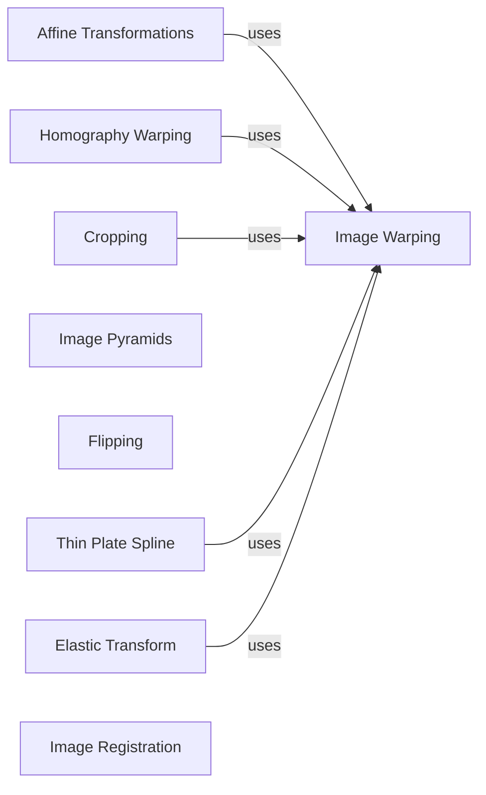

## Component Details

The Geometric Transformations component in Kornia provides a comprehensive suite of functionalities for manipulating images through various geometric transformations. It encompasses affine transformations (rotation, translation, scaling, shear), perspective transformations, cropping, flipping, and more advanced techniques like thin plate splines and elastic transformations. The core of this component relies on computing transformation matrices and applying them to images using warping techniques, primarily leveraging `torch.nn.functional.grid_sample` for efficient image resampling. This component is essential for tasks such as image registration, object tracking, augmented reality, and other computer vision applications requiring geometric manipulation of images.

### Affine Transformations
This component focuses on affine transformations, providing functions to compute transformation matrices for rotation, translation, scaling, and shear. It also includes functions and classes to apply these transformations to images using affine warping. The `affine` and `affine3d` functions are central to applying the transformations, while helper functions like `_compute_rotation_matrix` and `_compute_translation_matrix` generate the transformation matrices.
- **Related Classes/Methods**: `kornia.geometry.transform.affwarp:_compute_rotation_matrix`, `kornia.geometry.transform.affwarp:_compute_rotation_matrix3d`, `kornia.geometry.transform.affwarp:_compute_translation_matrix`, `kornia.geometry.transform.affwarp:_compute_scaling_matrix`, `kornia.geometry.transform.affwarp:_compute_shear_matrix`, `kornia.geometry.transform.affwarp:affine`, `kornia.geometry.transform.affwarp:affine3d`, `kornia.geometry.transform.affwarp:rotate`, `kornia.geometry.transform.affwarp:rotate3d`, `kornia.geometry.transform.affwarp:translate`, `kornia.geometry.transform.affwarp:scale`, `kornia.geometry.transform.affwarp:shear`, `kornia.geometry.transform.affwarp:resize`, `kornia.geometry.transform.affwarp:resize_to_be_divisible`, `kornia.geometry.transform.affwarp:rescale`, `kornia.geometry.transform.affwarp.Resize:__init__`, `kornia.geometry.transform.affwarp.Resize:forward`, `kornia.geometry.transform.affwarp.Affine:__init__`, `kornia.geometry.transform.affwarp.Affine:forward`, `kornia.geometry.transform.affwarp.Rescale:__init__`, `kornia.geometry.transform.affwarp.Rescale:forward`, `kornia.geometry.transform.affwarp.Rotate:__init__`, `kornia.geometry.transform.affwarp.Rotate:forward`, `kornia.geometry.transform.affwarp.Translate:__init__`, `kornia.geometry.transform.affwarp.Translate:forward`, `kornia.geometry.transform.affwarp.Scale:__init__`, `kornia.geometry.transform.affwarp.Scale:forward`, `kornia.geometry.transform.affwarp.Shear:__init__`, `kornia.geometry.transform.affwarp.Shear:forward`

### Image Warping
This component provides core image warping functionalities, including perspective and affine warping. It offers functions to warp images and grids based on transformation matrices. Functions like `warp_perspective` and `warp_affine` are used to apply the transformations, while `get_perspective_transform` and `get_rotation_matrix2d` generate the necessary transformation matrices. It relies on `kornia.core.grid_generator` to generate the grid and `torch.nn.functional.grid_sample` to perform the warping.
- **Related Classes/Methods**: `kornia.geometry.transform.imgwarp:warp_perspective`, `kornia.geometry.transform.imgwarp:warp_affine`, `kornia.geometry.transform.imgwarp:warp_grid`, `kornia.geometry.transform.imgwarp:warp_grid3d`, `kornia.geometry.transform.imgwarp:get_perspective_transform`, `kornia.geometry.transform.imgwarp:get_rotation_matrix2d`, `kornia.geometry.transform.imgwarp:remap`, `kornia.geometry.transform.imgwarp:invert_affine_transform`, `kornia.geometry.transform.imgwarp:get_affine_matrix2d`, `kornia.geometry.transform.imgwarp:get_translation_matrix2d`, `kornia.geometry.transform.imgwarp:get_shear_matrix2d`, `kornia.geometry.transform.imgwarp:get_affine_matrix3d`, `kornia.geometry.transform.imgwarp:get_shear_matrix3d`, `kornia.geometry.transform.imgwarp:warp_affine3d`, `kornia.geometry.transform.imgwarp:get_projective_transform`, `kornia.geometry.transform.imgwarp:get_perspective_transform3d`, `kornia.geometry.transform.imgwarp:warp_perspective3d`, `kornia.geometry.transform.imgwarp:homography_warp`, `kornia.geometry.transform.imgwarp:_transform_warp_impl3d`, `kornia.geometry.transform.imgwarp:homography_warp3d`

### Homography Warping
This component provides the `HomographyWarper` class, which is responsible for warping images based on homography transformations. It includes methods for precomputing warp grids and applying the homography warp. It uses `kornia.core.grid_generator` to generate the grid and `torch.nn.functional.grid_sample` to perform the warping.
- **Related Classes/Methods**: `kornia.geometry.transform.homography_warper.HomographyWarper:__init__`, `kornia.geometry.transform.homography_warper.HomographyWarper:precompute_warp_grid`, `kornia.geometry.transform.homography_warper.HomographyWarper:forward`

### Cropping
This component provides functions for cropping images, including center cropping, cropping by boxes, cropping by transformation matrices, and cropping by indices. It includes both 2D and 3D cropping functionalities. It uses `torch.nn.functional.grid_sample` for the actual warping.
- **Related Classes/Methods**: `kornia.geometry.transform.crop2d:crop_and_resize`, `kornia.geometry.transform.crop2d:center_crop`, `kornia.geometry.transform.crop2d:crop_by_boxes`, `kornia.geometry.transform.crop2d:crop_by_transform_mat`, `kornia.geometry.transform.crop2d:crop_by_indices`, `kornia.geometry.transform.crop3d:crop_and_resize3d`, `kornia.geometry.transform.crop3d:center_crop3d`, `kornia.geometry.transform.crop3d:crop_by_boxes3d`, `kornia.geometry.transform.crop3d:crop_by_transform_mat3d`

### Image Pyramids
This component provides functions and classes for generating image pyramids, including Gaussian and Laplacian pyramids. It includes functions for downsampling and upsampling images, as well as building pyramids. It uses `torch.nn.functional.interpolate` for upsampling and downsampling.
- **Related Classes/Methods**: `kornia.geometry.transform.pyramid.PyrDown:forward`, `kornia.geometry.transform.pyramid.PyrUp:forward`, `kornia.geometry.transform.pyramid.ScalePyramid:get_first_level`, `kornia.geometry.transform.pyramid.ScalePyramid:forward`, `kornia.geometry.transform.pyramid:pyrdown`, `kornia.geometry.transform.pyramid:pyrup`, `kornia.geometry.transform.pyramid:build_pyramid`, `kornia.geometry.transform.pyramid:build_laplacian_pyramid`, `kornia.geometry.transform.pyramid:upscale_double`

### Flipping
This component provides functions for flipping images horizontally, vertically, and by 180 degrees. It uses `torch.flip` for the actual flipping.
- **Related Classes/Methods**: `kornia.geometry.transform.flips.Vflip:forward`, `kornia.geometry.transform.flips.Hflip:forward`, `kornia.geometry.transform.flips.Rot180:forward`

### Thin Plate Spline
This component implements thin plate spline (TPS) transformations for image warping and point warping. It uses `torch.nn.functional.grid_sample` for the actual warping.
- **Related Classes/Methods**: `kornia.geometry.transform.thin_plate_spline:get_tps_transform`, `kornia.geometry.transform.thin_plate_spline:warp_points_tps`, `kornia.geometry.transform.thin_plate_spline:warp_image_tps`

### Elastic Transform
This component implements elastic transformations for image warping. It uses `torch.nn.functional.grid_sample` for the actual warping.
- **Related Classes/Methods**: `kornia.geometry.transform.elastic_transform:elastic_transform2d`

### Image Registration
This component provides classes for image registration, including similarity and homography registration. It includes classes for defining the transformation and registering images.
- **Related Classes/Methods**: `kornia.geometry.transform.image_registrator.Homography:__init__`, `kornia.geometry.transform.image_registrator.Similarity:__init__`, `kornia.geometry.transform.image_registrator.Similarity:forward`, `kornia.geometry.transform.image_registrator.Similarity:forward_inverse`, `kornia.geometry.transform.image_registrator.ImageRegistrator:__init__`, `kornia.geometry.transform.image_registrator.ImageRegistrator:register`
