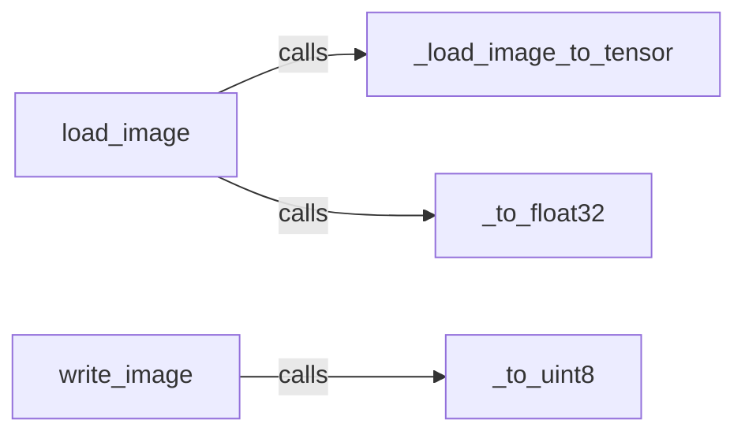

## Component Details

The `kornia.io` module provides functionalities for reading and writing image data to and from PyTorch tensors. It supports loading images from various file formats into tensors and saving tensors back to image files. The module handles data type conversions between tensors and image formats, ensuring compatibility with Kornia's image processing operations. It relies on external libraries like PIL or OpenCV for the actual image loading and saving.

### load_image
Loads an image from a specified file path and converts it into a PyTorch tensor. It uses `_load_image_to_tensor` to handle the actual image loading and then converts the tensor to `float32` if necessary, ensuring that the image data is in a format suitable for further processing within Kornia.
- **Related Classes/Methods**: `kornia.io.io:load_image`

### _load_image_to_tensor
Loads an image from a file path into a PyTorch tensor. This function handles the low-level image loading using a library like PIL or OpenCV. It determines the appropriate library to use based on the file extension or other criteria.
- **Related Classes/Methods**: `kornia.io.io:_load_image_to_tensor`

### _to_float32
Converts a PyTorch tensor to `float32` data type. This ensures that the image data is in a format suitable for further processing within Kornia, as many Kornia operations expect `float32` tensors.
- **Related Classes/Methods**: `kornia.io.io:_to_float32`

### write_image
Writes a PyTorch tensor to an image file. It first converts the tensor to `uint8` using `_to_uint8` before saving the image. This function handles the actual image writing using a library like PIL or OpenCV.
- **Related Classes/Methods**: `kornia.io.io:write_image`

### _to_uint8
Converts a PyTorch tensor to `uint8` data type. This is necessary for saving the image to a standard image format, as most image formats use 8-bit unsigned integers to represent pixel values.
- **Related Classes/Methods**: `kornia.io.io:_to_uint8`
