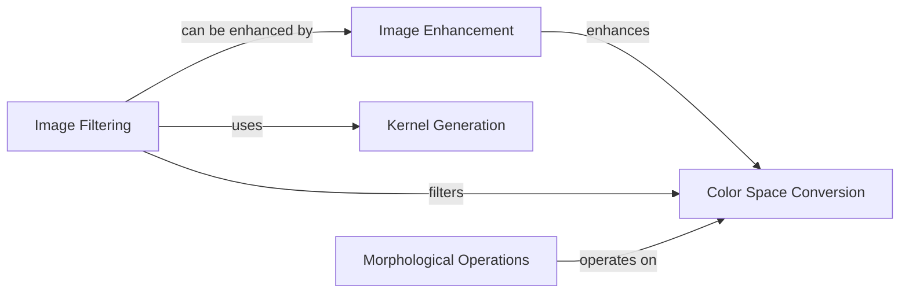

## Component Details

The Image Processing component in Kornia provides a comprehensive suite of tools for manipulating and analyzing images represented as PyTorch tensors. It encompasses functionalities for color space conversion, image enhancement, filtering, and morphological operations. The component is designed to be differentiable, enabling its integration into deep learning pipelines for tasks such as image recognition, segmentation, and generation. The core of the component lies in its ability to perform a wide range of image transformations, offering both functional and class-based interfaces for ease of use and flexibility.

### Color Space Conversion
This component focuses on converting images between different color spaces, including RGB, Grayscale, HSV, YCbCr, and Lab. It provides functions for both forward and backward transformations, ensuring seamless integration into differentiable image processing workflows. The conversions are implemented to be compatible with PyTorch tensors, allowing for efficient processing on GPUs.
- **Related Classes/Methods**: `kornia.color.gray`, `kornia.color.rgb`, `kornia.color.hsv`, `kornia.color.ycbcr`, `kornia.color.lab`

### Image Enhancement
The Image Enhancement component offers a variety of techniques to improve image quality by adjusting properties such as brightness, contrast, saturation, and sharpness. It includes methods for histogram equalization, ZCA whitening, and adaptive histogram equalization, allowing users to enhance specific aspects of an image. These enhancement techniques are designed to be differentiable and compatible with PyTorch tensors.
- **Related Classes/Methods**: `kornia.enhance.adjust`, `kornia.enhance.histogram`, `kornia.enhance.zca`

### Image Filtering
This component provides a wide range of image filtering operations, including blurring (Gaussian, Box, Median, Bilateral), edge detection (Sobel, Canny, Laplacian), and unsharp masking. It offers both functional and class-based interfaces for applying these filters, allowing for flexibility in implementation. The filters are implemented using PyTorch tensors and are designed to be differentiable.
- **Related Classes/Methods**: `kornia.filters.blur`, `kornia.filters.gaussian`, `kornia.filters.median`, `kornia.filters.sobel`, `kornia.filters.canny`, `kornia.filters.laplacian`, `kornia.filters.unsharp`, `kornia.filters.bilateral`

### Kernel Generation
The Kernel Generation component provides functions for generating various kernel types used in image filtering operations, such as Gaussian, Sobel, and Box kernels. These kernels are essential for convolution-based filtering techniques and are implemented as PyTorch tensors. The component allows users to customize kernel sizes and parameters to suit specific filtering needs.
- **Related Classes/Methods**: `kornia.filters.kernels`

### Morphological Operations
This component implements morphological operations like dilation, erosion, opening, and closing, which are useful for image segmentation and noise reduction. These operations are performed using structuring elements, which can be customized to achieve specific effects. The morphological operations are implemented using PyTorch tensors and are designed to be differentiable.
- **Related Classes/Methods**: `kornia.morphology.morphology`
